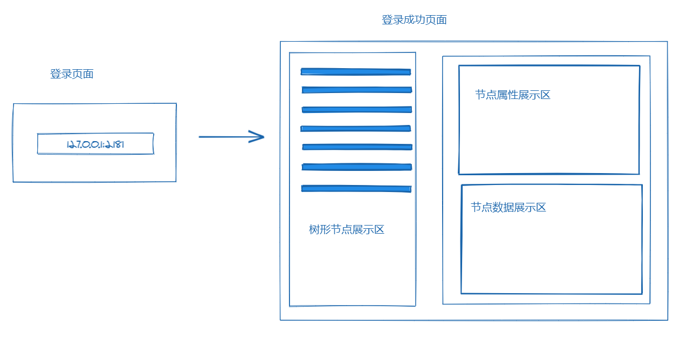
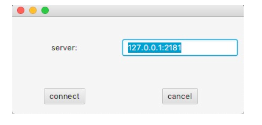
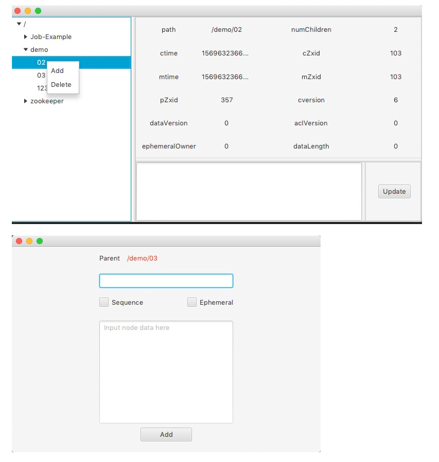
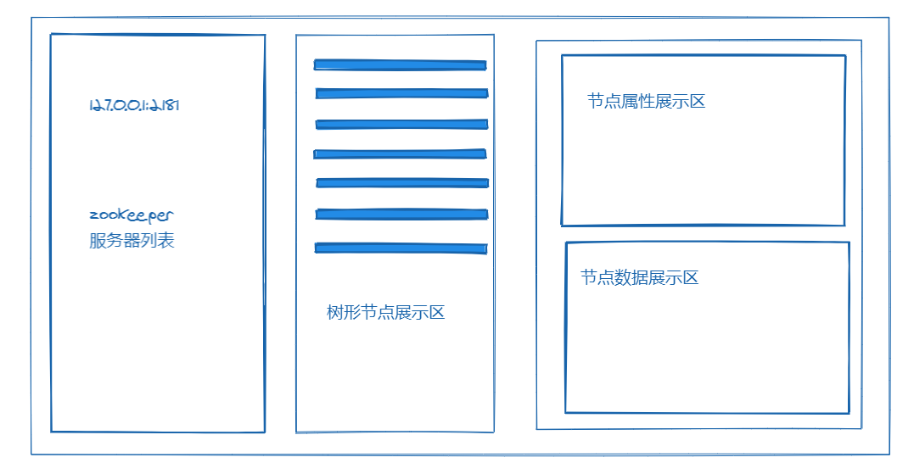
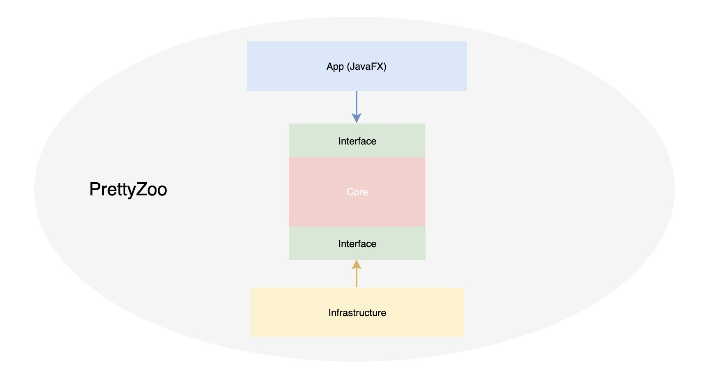
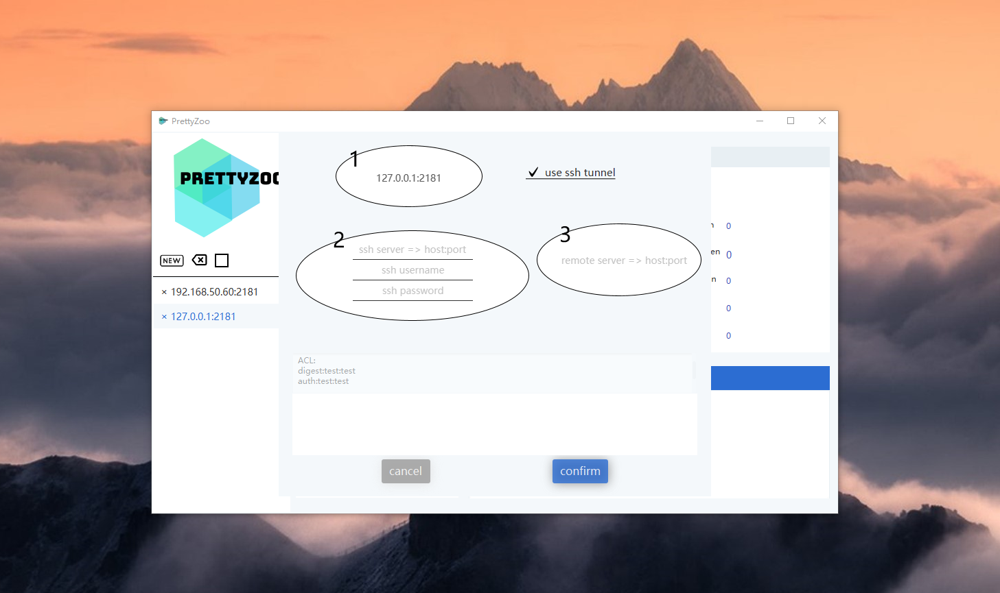
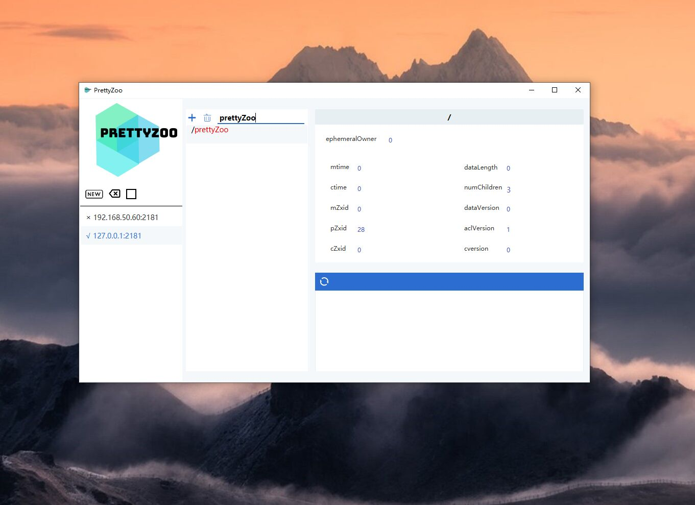

# 从 Java8 到 Java11 ： PrettyZoo 开发回顾（模块化在 GUI 中的实践）

## 起因

[elastic-job-lite]( https://github.com/elasticjob/elastic-job-lite)  是公司使用的一款定时任务调度框架，该框架将所有的任务调度信息都注册进了 [zookeeper](https://zookeeper.apache.org/) 中。

为了方便定位相关的问题，我去网上搜了 zookeeper 相关的图形化客户端，结果没有一款符合自己的需求，于是就干脆自己写一个算了。

> 该客户端是去年国庆假期写的，经历了从 Java8 到 Java11 的重构（主要是模块化），该文章主要是对整个过程的一个回顾

## 从需求分析到实现

**面向用户**：zookeeper 用户

**软件名称**：PrettyZoo

**功能**：

	1. 节点 CRUD
 	2. 节点实时同步

**交互与原型**：

交互分两部，第一步启动页面要求用户输入 zookeeper 的服务地址，连接成功后会跳到节点操作页面

​	

**技术方案**：

	- 语言采用 Java
	- UI 框架采用 Swing
	- 采用传统的分层架构
	- Zookeeper Client 采用 Apache Curator

**最终实现**：

​	

**不足**：

	- 受限于交互流程，一次只能管理一个 zookeeper server
	- 由于是 Java8，运行需要安装额外的 JRE（或 JDK），影响了受众面
	- 颜值不足
	- 工程质量方面，架构分层不清晰，导致层与层之间相互渗透，随时膨胀为一个 Big Bom

## 界面与架构的重构规划

重构主要是为了解决上一版的不足，而第一步就是分析产生这些问题的根本原因，再提出对应的解决方案

- 一次只能管理一个 server

  这是因为交互和设计上导致的，要解决该问题需要重新思考交互和软件的布局。

  经过网上的调研，最终决定采用 “三栏布局”，即解决了以前交互模式的分割感，又满足了一次性管理多个 server 的需求。

  

  

- 需要额外安装 JRE

  既然选择了 Java 作为开发语言，那么程序必然会依赖 JRE 来运行。此时再切换语言自然是不现实的，好在 Java9 的 `模块化系统`（Jigsaw）提供了另一个选择，细节就不在此深入讨论了。

  总之就是模块化改造以后，最终打包出来的程序不需要安装额外的 JRE 也可以运行，因为打包出来的程序已经提供了运行时需要的最小依赖集合。

  由于最新的 JDK LTS 版本是 11，所以跳过 9 和 10，直接升级到 Java11

- 颜值不足

  第一版的 UI 采用的是 Java Swing 技术， 相对来说过于沉重，干脆就将 UI 框架切换到了  JavaFX.

  JavaFX 是下一代的 Java 客户端技术，可以通过 CSS 来调整软件的整体样式，而且 JavaFX 对还支持数据绑定。

- 分层架构导致的模块边界不清晰

  架构的改造对用户的感知几乎没有，但依然是一个重中之重的事情，因为随着功能的增加，每次改动的成本也会成倍的增加，最终可能导致该软件无法维护下去。

  架构的整体框架依然是分层，不过加入了 `SPI` 层用于反转层与层之间的依赖关系，可以参见下图

  

  

  这样就将传统的自上而下的依赖关系改成了一个插件式的架构。

再说一个额外的问题，很多时候服务端的 zookeeper 在内网，是不能直连的，而为了应对这样的场景，这次改造也加入了 SSH 隧道的功能。

## 重构的实现

整个软件重构的难点在于从 Java8 迁移到 Java11 的模块化平台，因为 Java 的模块化平台并不是兼容的，很多依赖的库还不支持模块化。

而打包用的工具 Jlink 是只支持标准模块的，为了将第三库转为标准模块就需要用到构建插件（推荐 https://badass-jlink-plugin.beryx.org/releases/latest/）

最终重构完成后，打包出来的软件接近 60M，不需要安装 Java 运行环境就可以运行，还是相当满意的。

下图展示了布局和交互

​	

## **总结**

该软件最终的成品我开源在了 Github上，详情点击 [ https://github.com/vran-dev/PrettyZoo]( https://github.com/vran-dev/PrettyZoo)，欢迎 star 和 issue。

实际的体验下来， Java 的模块系统还是挺不错的，JavaFX 配合模块化尤其适用于桌面客户端，奈何现在已经是移动互联网的天下了......

## 参考

1. [PrettyZoo](https://github.com/vran-dev/PrettyZoo)
2. [OpenJFX](https://openjfx.io/)
3. [badass-jlink-plugin](https://badass-jlink-plugin.beryx.org/releases/latest/)