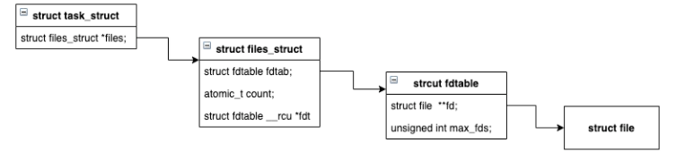

# 文件描述符了解一下
## 前言

文件描述符在unix系统中几乎无处不在， 常见的网络接口select, poll ,epoll有文件描述符， IO读写接口read, write也有文件描述符, 从形式上来看文件描述就是一个整形数，那么我们可不可以更进一步去了解一下呢？

本文打算通过一步一步实验去总结一些文件描述符的特性， 最后再通过Linux内核相关的源码去做验证实验总结是否正确。


## 一个获取文件描述符的实例

我们可以通过`open`系统调用得到一个指定文件的文件描述符

`open`需要传入一个文件路径和操作模式， 然后返回代表该文件的文件描述符， 具体方法签名如下

```c
/**
* path 代表文件路径
* oflag 代表文件的打开模式，比如读，写等
*/
int open(char *path,  int oflag, ...)
```

我们写一段简单的代码来验证一下

```c
#include <stdio.h>
#include <stdlib.h>
#include <fcntl.h>

int main(int argc, char* argv[]) {

	int fd = open("demo.txt", O_RDONLY);
	if (fd == -1) {
		perror("open demo.txt error\n");
		return EXIT_FAILURE;
	}

	printf("demo.txt fd = %d \n", fd);
	return EXIT_SUCCESS;
}

```

然后通过GCC编译再执行我们就可以得到`demo.txt`的文件描述符了， 不出意外你将得到以下的执行结果

```shell
$ echo hello>>demo.txt
$ gcc test.c -o -test
$ ./test
$ demo.txt fd = 3
```

从这个示例中我们可以看出来文件描述符的表现其实就是一个整形数字

你可以将上面编译出来的程序执行多次， 你会发现最终打印的文件描述符都是3， 那么是否代表每个文件的描述符都是固定的呢 ？


## 每个文件的描述符是固定的吗？

为了验证我们的猜想，我们连续调用两次`open`方法并打印返回的文件描述符， 代码如下

```c
#include <stdio.h>
#include <stdlib.h>
#include <fcntl.h>

int main(int argc, char* argv[]) {
	int fd_a = open("demo.txt", O_RDONLY);
	int fd_b = open("demo.txt", O_RDONLY);
	printf("fd_a = %d, fd_b = %d \n", fd_a, fd_b);
	return EXIT_SUCCESS;
}
```

下面是最终的执行结果

```shell
$ gcc test.c -o test
$ ./test
$ fd_a = 3, fd_b = 4
```

我们发现尽管是同一个文件， 多次打开得到的文件描述符却并不一样，说明每个文件的描述符并不是固定的

那么问题来了，为什么最开始的程序无论我们执行多少次都是返回的3呢 ？

熟悉UNIX系统的同学应该知道，系统创建的每个进程默认会打开3个文件，分别是标准输入(0)， 标准输出(1)， 标准错误(2)， 这也就不难解释为什么我们打开的文件描述符始终是从3开始了， 因为0，1，2都已经被占用了。


等等！文件描述符是递增的？我也不知道啊， 要不写个程序试试


## 文件描述符是递增的吗？

为了验证文件描述符是递增的， 我们设计了这样一个程序

1. 调用两次open， 分别得到两个文件描述符3， 4
2. 调用close方法将文件描述符3关闭
3. 再次调用open方法打开同一个文件

如果是递增的话最后得到的文件描述符就是5， 否则就是其他

```c
#include <stdio.h>
#include <stdlib.h>
#include <unistd.h>
#include <fcntl.h>

int main(int argc, char* argv[]) {
	int a = open("demo.txt", O_RDONLY);
	int b = open("demo.txt", O_RDONLY);

	printf("a = %d, b = %d \n", a, b);
	close(a);

	int c = open("demo.txt", O_RDONLY);
	printf("b = %d, c = %d \n", b, c);
	return EXIT_SUCCESS;
}
```

编译执行

```shell
$ gcc test.c -o test
$ ./test
$ a = 3, b = 4
	b = 4, a = 3

```

通过最终的执行结果我们发现文件 描述符并不是递增的，当一个文件描述符被回收掉后是可以再次分配的。

以上的示例都是单进程情景下的，如果多个进程同时打开一个文件返回的文件描述符也是不一样的吗？ 


## 文件描述符和多进程

我们通过系统调用`fork`函数可以创建多个进程， 该函数返回一个int值， 当返回值为0时代表当前是子进程正在执行， 我们不考虑错误情况(进程创建失败)，那么就假设非0就是父进程正在执行

程序很简单，就是父子进程各自打开同一个文件， 并打印该文件的文件描述符

```c
#include <unistd.h>
#include <stdio.h>
#include <stdlib.h>
#include <fcntl.h>

int main(int argc, char* argv[]) {

	int npid = fork();
	
	if (npid == 0 ){
	// 子进程
		int child_fd = open("demo.txt", O_RDONLY);
		pid_t child_pid = getpid();
		printf("child_pid = %d, child_fd = %d \n", child_pid, child_fd);
	} else {
	// 父进程
		int parent_fd = open("demo.txt", O_RDONLY);
		pid_t parent_pid = getpid();
		printf("parent_pid = %d, parent_fd = %d \n", parent_pid, parent_fd);
	}
	return EXIT_SUCCESS;
}

```

编译执行

```shell
$ gcc test_process.c -o test_process
$ ./test_process
$ child_pid = 28212, child_fd = 3
  parent_pid = 28210, child_fd = 3
```

最终打印的文件描述符是一样的，前面我们已经验证了每个文件的描述符并不是固定的，由此我们可以推断每个进程独自维护了一个描述符的集合

PS: 上面的代码并不规范，可能会产生僵尸进程和孤儿进程，但这并不是本文的重点......


## 先总结一下

通过以上实验我们可以得出以下几个关于文件描述符的结论

1. 文件描述符就是一个整形数字
2. 每个进程默认打开0，1，2三个文件描述符， 新的文件描述符都是从3开始分配
3. 一个文件描述符被回收后可以在下次被重新分配给另一个打开的文件 (文件描述符并不是递增的)
4. 每个进程单独维护了一个文件描述符的集合 (或者可以认为每个进程单独维护了自己打开的文件集合)


## Show me the code

> talk is cheap , show me the code 
>
> ​						By: **Linus Benedict Torvalds**

真相的最后一步就是迈进源码里面去了，我们通过Linux内核的源码来验证我们的总结是不是正确的

既然我们假设文件描述符是被进程单独维护的， 我们就直接看代表进程的结构体`task_struct`,  该结构体放在`/include/linux/sched.h`头文件中

我将这个结构的代码精简了一下， 只保留了一些分析需要关注的属性

```c
struct task_struct {
    ...
    /* Filesystem information: */
	struct fs_struct		*fs;

	/* Open file information: */
	struct files_struct		*files;
	
	...
	/* -1 unrunnable, 0 runnable, >0 stopped: */
	volatile long			state;
	pid_t				pid;
	pid_t				tgid;
	...

};
```

结合注释我们一眼就看到了 `struct files_struct *files` 这段属性， 它代表着打开的文件信息， 我们再看一下`files_struct`结构体，该结构体定义在 `/include/linux/fdtable.h`头文件中

```c
struct files_struct {
    // 打开的文件数
	atomic_t count;
	...
	// fdtable 维护着所有的文件描述符
	struct fdtable  *fdt;
	struct fdtable fdtab;
    ...
  // 下一个可用文件描述符
	unsigned int next_fd;
	...
};
```

见名知意，`fdtable`就代表着文件描述符表， 那么它是不是维护了所有的文件描述符呢

```c
struct fdtable {
  // 最大文件描述符
	unsigned int max_fds;
	// 所有打开的文件
	struct file **fd;      /* current fd array */
	...
};
```

我们没有找到文件描述符数组(int数组)， 但是却看到了一个`file`结构体数组， `file`结构体代表着该进程打开的所有文件，


最后我们用一张图来总结下这个结构



通过这个源码结构我们可以看出**每个进程确实单独维护了一个文件描述符的集合。**

可是文件描述符的规律我们还没有看出来, 既然`open`和`close`都涉及到对文件描述符，我们可以通过分析它们的源码来一探究竟， 我们选择较简单的`close`来分析

```c
SYSCALL_DEFINE1(close, unsigned int, fd)
{
	int retval = __close_fd(current->files, fd);
	...
	return retval;
}
```

从上面的源码可以看出`close`系统调用内部调用了 `__close_fd`函数,  该函数定义在`/fs/file.c`文件中， 下面是经过精简的方法源码

```c
int __close_fd(struct files_struct *files, unsigned fd)
{
	struct file *file;
	struct fdtable *fdt;
  // 获取fdtable
	fdt = files_fdtable(files);
	// * 通过文件描述符获取file结构体指针
	file = fdt->fd[fd];
	rcu_assign_pointer(fdt->fd[fd], NULL);

// 回收文件描述符
__put_unused_fd(files, fd);
	return filp_close(file, files);
}
```

注意注释标*那一行，我们可以看见文件描述符其实就是`fdtable`的数组属性`fd`的索引

从这儿我们也可以得出**文件描述符其实就是一个file结构体数组的索引**， 这也解释了它为什么是从0开始，不可能为负数的原因


## 参考

1. Linux内核源码在线查看 https://elixir.bootlin.com/linux/latest/source/kernel
2. 孤儿进程与僵尸进程总结 https://www.cnblogs.com/Anker/p/3271773.html
3. 文件描述符 https://zh.wikipedia.org/wiki/%E6%96%87%E4%BB%B6%E6%8F%8F%E8%BF%B0%E7%AC%A6
