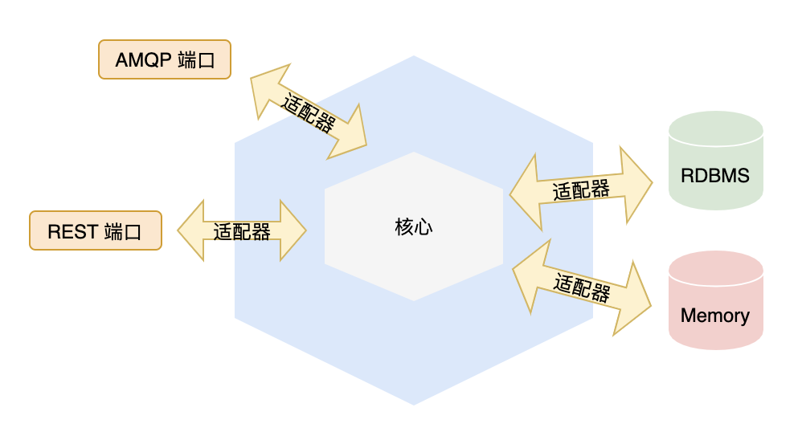

# 六边形架构

## 换个角度看分层架构

> **David Wheeler**: All problems in computer science can be solved by another level of indirection

分层架构模式被认为是所有架构的始祖，该架构将系统分为不同的层级，在严格分层模式中，上层只能依赖下层，下层不能依赖上层。

而与分层架构按层级（从上至下或从左至右）看待系统不一样，六边形架构提倡用外部和内部的视角来看待系统。

当然你也可以认为六边形架构也是一种分层架构，只不过是由内而外。

## 端口与适配器

 port 和 adapter（端口和适配器） 是六边形架构中很重要的概念。

 port 要么处理输入，要么处理输出，它提供了一种与应用交互的入口，并且每个 port 都有一个对应的 adapter。

以基于 Spring 的 Java Web 应用为例

- port 一般是 HTTP 协议（输入），而 adapter 就是 Controller

- port 也可以是 Mysql 数据传输协议（输出），而 adapter 就是 Repository

## 披着分层外衣的六边形

前面提到的 port 和 adapter 也许会让感到迷惑，我们平常使用的分层架构不就是这样子的吗？除了换了个名字，有什么区别呢？

关于这个问题 Vaughn Vernon 在其著作《实现领域驱动设计》中有过解答：

>  很多声称使用分层架构的团队实际使用的是六边形架构。
>
> 这是因为很多项目都是用了某种形式的依赖注入，并不是说依赖注入天生就是六边形架构，而是依赖注入的架构自然的就有了端口与适配器的风格。