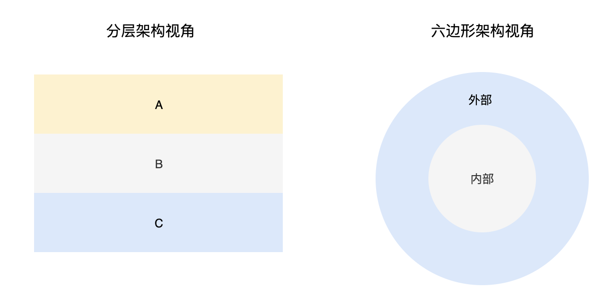
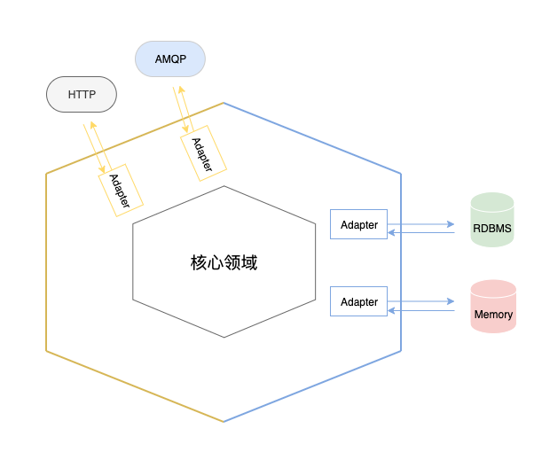

# 架构演化论：从分层到六边形

## 分层架构

分层架构模式被认为是所有架构的始祖，该架构将系统从上至下划分为不同的层级，层与层之间定义了明确的依赖限制，按照限制的强弱可以分为严格分层和松散分层两种风格。

不管是严格分层还是松散分层，最基本的规则都一样：上层可以依赖下层，而下层不能依赖上层。

严格分层相对于松散分层的不同点在于是否限制同层依赖和跨层依赖。

分层架构强调层与层之间的边界，明确的边界可以降低耦合，使得职责更加清晰。

在分层中，底层往往比上层稳定，自上而下的依赖就完全符合了**稳定依赖原则**，如果采用严格分层模式（禁止同层依赖）的话，还可以避免循环依赖。

>  **David Wheeler**: All problems in computer science can be solved by another level of indirection

然而在现实系统开发中，随着业务的变化，分层架构也不是那么好把控的，主要在于以下几点

- 分层会增加，而新加的分层边界往往又不是很明确，这样就形成了一个模糊层

- 模糊层可能会形成隐藏的循环依赖

  

## 六边形架构

六边形架构是由 Alistair Cockburn 博士提出的，与分层架构按层级（从上至下或从左至右）看待系统不一样，六边形架构提倡用外部和内部的视角来看待系统。

你可能会认为这还是一个分层架构，只不过是内层和外层，实际上这样理解也没错。

下面来看一下六边形架构的图

六边形架构中的核心概念是 port 和 adapter （端口和适配器），所以六边形架构又被称为**端口与适配器架构**。

随着该架构的发展，后人又为其增加了 Edge 的概念，根据职责又划分为 Driven Edge 和 Driving Edge。

port 要么处理输入，要么处理输出，它提供了一种与应用交互的入口，并且每个 port 都有一个对应的 adapter。

比如 HTTP、AMQP、RESP（redis 协议）等协议就是 port 。

那么核心领域为什么不直接与 port 进行交互，而需要一个 adapter 来做适配呢？

实则还是为了解耦，使得核心领域外的细节决策可以延迟，直到我们拥有更多的信息来做出合理的决策。

## 演进之路

下面以我们常见的三层架构来看看，分层是如何演进成为六边形架构的。

我想 controller => service => dao 是每个后端同学都很熟悉的架构了，这是一个很典型的分层架构，并没有什么多说的

当分层和 DIP (依赖倒置原则) 相遇时，会产生另外的化学反应。

controller  依赖于 interface，service 也依赖于 interface，从现在的眼光来看，这也是一个正常的架构风格。

当我们再将这个依赖关系平铺开，就成了这个样子了

这其实就是一个典型的六边形架构了，是不是感觉被糊弄了？

然而这就是事实，当分层架构和 DIP 结合起来的时候，我们已经再使用六边形架构的风格了。

关于这个问题 Vaughn Vernon 在其著作《实现领域驱动设计》中有过解答：

>  很多声称使用分层架构的团队实际使用的是六边形架构。
>
> 这是因为很多项目都是用了某种形式的依赖注入，并不是说依赖注入天生就是六边形架构，而是依赖注入的架构自然的就有了六边形架构风格。

