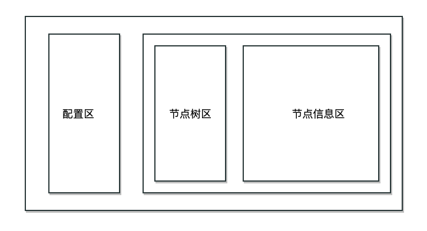
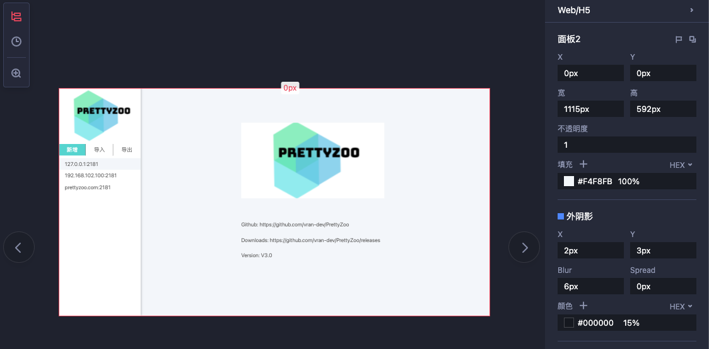
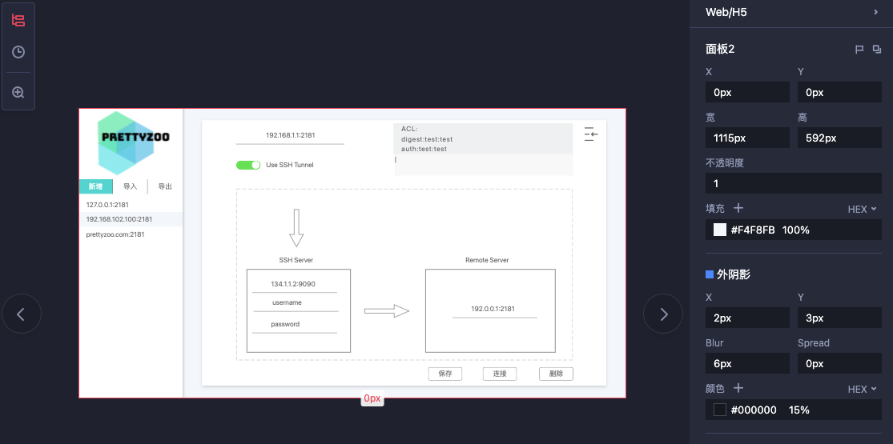
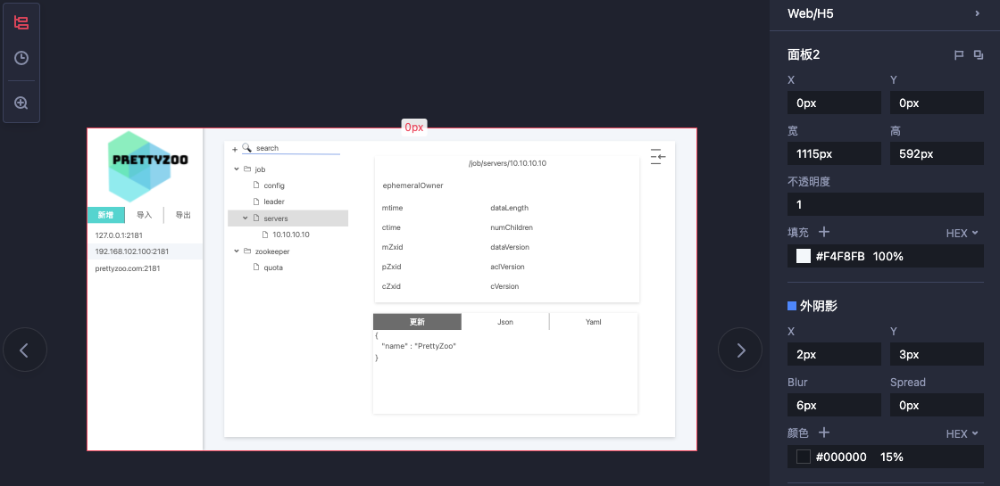
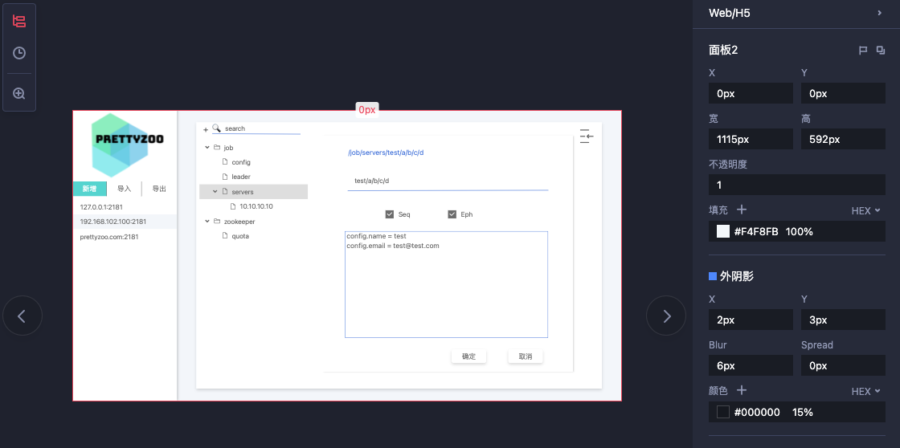
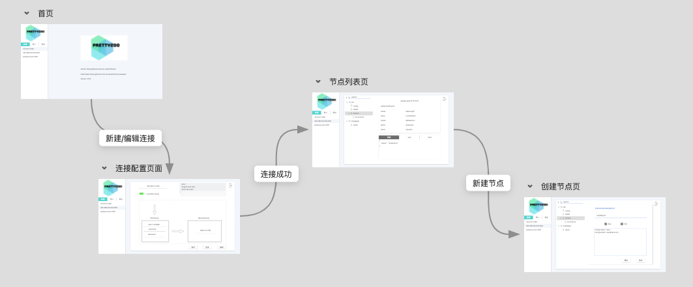
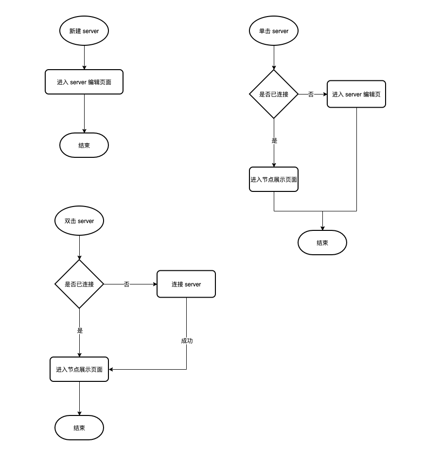
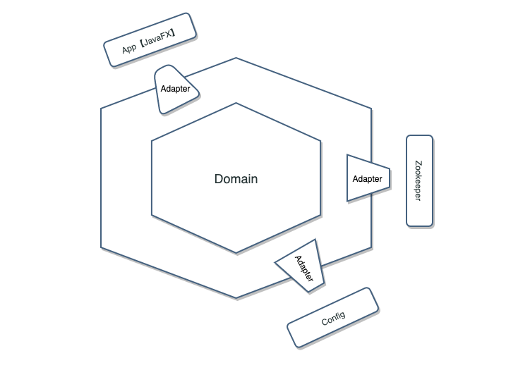
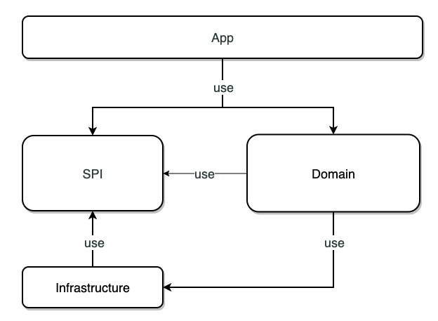
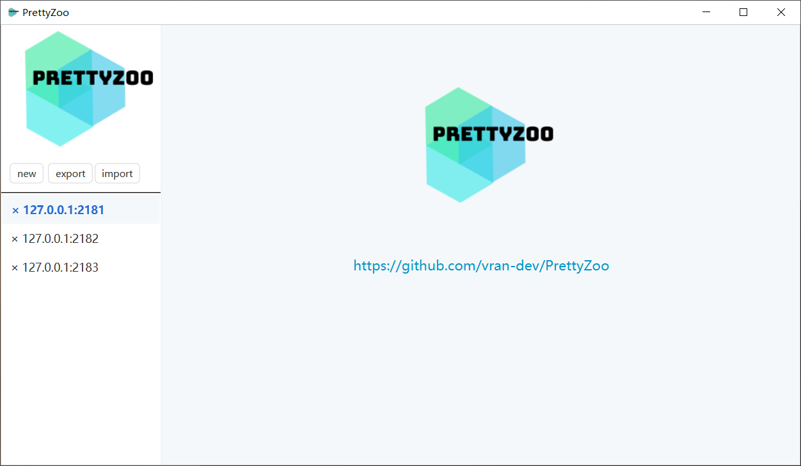

# 我是如何开发了一款“有人用”的开源软件

## 背景

[PrettyZoo](https://github.com/vran-dev/PrettyZoo)  是在去年国庆（2019 年）时开发的一个用于管理 [Zookeeper](https://zookeeper.apache.org/) 的桌面图形化工具，当时是因为在学习 Elastic-Job-Lite 框架的源码时涉及到了 Zookeeper，想着借助图形化工具去更直观的了解整个框架的设计，但在市面上却找不到一款符合自己期望的产品，那就只能自己动手丰衣足食了，这算是 PrettyZoo 诞生的初衷了。

其实我已经写过一篇文章来简单介绍过这个产品的研发历程（[从 Java8 到 Java11 ： PrettyZoo 开发回顾（模块化在 GUI 中的实践）](https://blog.cc1234.cc/articles/Java-GUI-experience/Java-GUI-experience.html)）, 不过那篇文章主要侧重于产品的技术演进过程，这一篇文章是基于国庆重构后的全新版本来写的，记录了自己在这个重构的过程中各个阶段所做的事情，主要包括以下内容

- 需求分析
- 原型设计
- 技术选型
- 架构设计
- 成品展示

## 需求分析

上一节的背景描述了我为什么要开发这样一款软件，而这一节的主要内容则是分析我想要开发的软件应该有的功能点。

该产品是用于管理 Zookeeper 数据，那么需求其实也需要围绕着 Zookeeper 的功能来分析，这就像为人作肖像画一样，得先去分析目标的特性。

我将分析后的需求整理成了下面的一个表格，并对功能的优先级、必要性做了标注

| 需求                         | 优先级 | 是否必须 |
| ---------------------------- | ------ | -------- |
| 连接创建                     | 高     | √        |
| 连接删除                     | 高     | √        |
| 节点展示                     | 高     | √        |
| 节点创建                     | 高     | √        |
| 节点删除                     | 高     | √        |
| 节点数据更新                 | 高     | √        |
| 递归操作支持                 | 中     | √        |
| 节点数据格式化（JSON、YAML） | 低     | ×        |
| SSH Tunnel 支持              | 中     | ×        |
| ACL 支持                     | 中     | √        |
| 配置导入/导出                | 中     | ×        |
|                              |        |          |

当然实际的产品开发中还会去调查类同类产品，去参考它们的功能、设计等， 这方面我就略过了。

## 原型设计

在完成了需求分析和同类产品调研以后，软件的基本雏形已经在我的脑海中形成，但此时还不是进入开阶段的时候，我需要以最小的成本来实现下面三件事

1. 具化产品形态
2. 验证产品功能
3. 快速调整、迭代

而这就需要用到**原型设计**了，这里我借助了[摹客原型](https://www.mockplus.cn)这款在线的原型工具

> 原型设计其实可以理解为就是将产品用画图的方式展现出来，不过现在的原型工具在这方面提供了更多的便利性

考虑到软件的功能并不复杂、展示的信息也并不是很多，所以我采用了桌面软件现在很流行的三栏式布局，软件的布局从左到右被划分为了三块

在设计原型的时候还要考虑到软件的配色，开发的时候就可以完全按照这个原型做参考（一般企业中会有单独的 UI 设计师来美化原型、甚至 UED 来设计交互）。

下面展示了完成后的原型图

- 首页

- 配置页面

- 节点列表页面

- 节点创建页面

每张图对应了软件的一个页面，这些页面之间的流转也需要明确下来

对于开发来说，流程图可能更友好一些

整个过程看似一气呵成，其实中间会做无数次的调整，甚至完全推翻重新设计也不在话下。

## 技术选型

经过原型阶段的验证以后基本就可以进入开发阶段了，而在这个阶段首先要明确的事情就是技术选型，如果是团队开发的话得综合考量团队人员的技术维度、技术的稳定性等，不过这个软件的开发就我一人，所以什么都是我说了算......

下面我简单列了一下几个比较重要的技术抉择。

编程语言我选择了 Java 11， 因为这是 Java 第一个支持模块化的 LTS 版本，模块化可以为 Java 桌面软件构建最小运行时。

UI 框架可选择不多，就 AWT、Swing 和 JavaFX， 本着用新不用旧的心态选择了 JavaFX，缺点就是我需要学习相关的知识。

项目构建工具我选择了 Gradle，原因很简单，就是我不喜欢写 maven 的 XML 配置，-_- 。

其他就不一一枚举了，整体的思路就是 Keep it simple and interesting。

## 架构设计

选型以后就是整个产品的技术架构设计了，架构设计的思路就是预留更多的「可选项」，保证系统能以低成本的方式持续演进。

项目的架构设计采用了整洁架构的模式，参见下图

项目整体被划分为 App、SPI、Infrastructure 和 Domain 四个模块，与上图的对应关系如下

- SPI 对应 Adapter
- Domain 对应 Domain
- Infrustructure 对应 Config、Zookeeper 等
- App 对应 App【JavaFX】

模块之间的依赖关系如下（遵循无依赖环原则、稳定依赖原则）

## 成品

具体的实现过程我就跳过了，中间其实也踩了不少坑，整体还是挺顺畅的，下面就是成品的展示了

> 最新版本的软件可以在 Github 发布页进行下载（https://github.com/vran-dev/PrettyZoo/releases）

