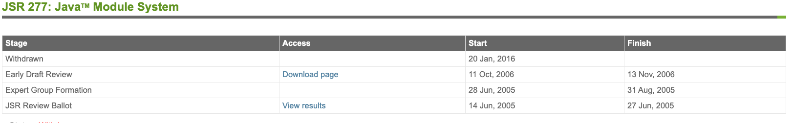
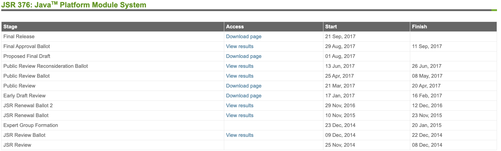
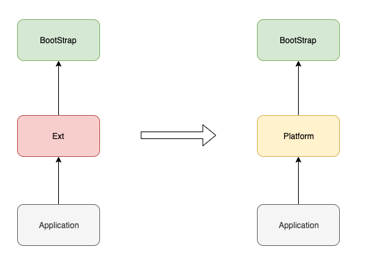

# Java 模块化系统 Jigsaw 一览

## 历史

Java9 在 2017年9月21日 发布，其中最大的变化就是引入了模块化系统（Java Platform Module System，简称 JPMS）， 该项目代号为 Jigsaw。

实际上 Java 的模块化在 2005年 (Java7) 的提案 [JSR277](https://jcp.org/en/jsr/detail?id=277) 就已经提出来了，该提案因为种种原因，在一年多后被取消掉了，Java 的模块化进程自然也就被搁置了。



直到 2014年 [JSR376](https://jcp.org/en/jsr/detail?id=376) 被提出，Java 的模块化系统才得以再次被提上日程，本来原计划于 Java8 发布，后因为种种原因推迟到了 Java9 才得以正式发布。

下图展示了从 JSR376 被提出到实现的各个阶段：




## 目标

在 [JSR376](https://www.jcp.org/en/jsr/detail?id=376) 中，对模块化系统的目标是有非常明确的描述的：

- 使用更可靠的配置来描述程序组件之间的依赖关系，并以此来替代经常出问题的 class-path 
- 程序组件可以控制其 API 被其他组件的访问性，提供一个更强的封装能力
- 增加 JavaSE 平台的扩展性，开发人员可以只将他需要的功能模块组装到一个自定义的配置中去
- 增强平台的完整性，确保平台内部 API 不会被访问
- 性能提升

实际上最核心的目标是最前面的两点，替代 class-path 和 增强封装性。

> 上面说的可能比较官方，在  [Project Jigsaw: Goals & Requirements **DRAFT 3**](http://openjdk.java.net/projects/jigsaw/goals-reqs/03) 里对于实现目标的描述可能更加通俗易懂一些。

在使用 Java9 的模块化系统时，会不自觉的和 Maven、Gradle 等构建工具进行对比，但是实际上两者关注的核心点是不一样的。

模块化系统更注重模块之间的封装性，而构建工具更注重的是依赖管理和项目构建。

也就是说构建工具可以决定依赖某个第三方库，而模块系统则决定你能使用该第三方库的哪些包或类。

这也是为什么版本管理并没有成为 Java模块系统 的目标的原因。


## 语法

Java 的模块是在 package 之上提供的一层抽象，所以通常一个模块是由多个 package 聚合而成的。

那么如何定义一个模块呢？

只需要在项目下创建一个 module-info.java 的文件就可以描述一个模块了，module-info.java 文件所在包及其子包就组成了一个模块。

module-info.java 用来描述模块的基本信息，包括：

- 模块名称

- 模块依赖关系

- 该模块下的类访问权限

- 该模块下的反射访问权限

- 该模块下的服务提供者和服务消费者信息

  

具体的语法规则在 《 Java 语言规范 》中有详细的描述：

```java
{Annotation} [open] module Identifier {. Identifier} { 
  
  {ModuleDirective}
  
}

ModuleDirective:
  requires {RequiresModifier} ModuleName ;
  exports PackageName [to ModuleName {, ModuleName}] ;
  opens PackageName [to ModuleName {, ModuleName}] ;
  uses TypeName ;
  provides TypeName with TypeName {, TypeName} ;

RequiresModifier:
  (one of)
  transitive static
```

> - 以大括号标注的是占位符
>
> - 以中括号标注的是可选项
>
> -  module, requires, exports, opens, provides..with, transitive, static 等都是关键字


### Module

 `module` 用来来定义一个模块，与 `class` ，`interface` 类似。

```java
// 定义一个名称为 MyModule 的模块
module MyModule {
  
}
```

注意，一个 module-info.java 文件中只能出现一次 module 的定义， 它并不能像 Java 类一样做嵌套的定义。

`ElementType` 在 Java9 时新增了一个新的 **MODULE** 类型，从而使得注解也可以定义在 `module` 之上。  

```java
public enum ElementType {
  
    /**
     * Module declaration.
     *
     * @since 9
     */
    MODULE
}
```

除了注解之外， `module` 还可以被 `open` 关键字修饰：

```java
open module MyModule {
  //......
}
```

在《Java 语言规范》中，将被 open 修饰的模块定义为 **开放模块**，反之则为 **标准模块**。

正常情况下，**标准模块**的代码是不能直接被访问的（包括 public / protected 的类），反射也不行。

>  开发者可以通过 exports 或者 opens 来控制这些访问权限。

而**开放模块**内的 public类型（包括其 public/protected 成员）在运行时都是可以访问的， 并且该模块下的类都可以通过反射进行访问。


### **Exports**

前面提到在默认情况下，模块下的代码是不可以直接被访问的（即使是 public），而 `exports` 就可以开放某个包下的 public 类的访问权限。

```java
module MyExportsModule {
  exports com.sample;
}
```

 `exports` 还可以通过 `to` 关键字来将访问权限限定到某一个具体的模块。

如下面这一段代码， **com.sample** 下的类只能被**模块B**访问。

```java
module A {
  exports com.sample to B;
}
```


### Opens

`opens` 的语法和作用与 `exports` 类似，不同点在于 opens 更侧重于对**运行时**的访问权限控制。

在 Java9 以前，我们可以通过反射获取类的所有信息（包括 private 成员），这就导致了没有真正意义的封装。

在 Java9 的模块化系统中，只有 `opens` 的包下的类才可以通过反射访问，除此之外还提供了**运行时**的访问权限

> 如果整个 module 是 open 的话， 就不需要在每个 package 前指定 opens 了

```java
module MyOpensModule {
  opens com.sample
}
```

与 `exports` 一样， `opens` 也可以通过 `to`  关键字指定具体的模块粒度：

```java
module A {
	opens com.sample to B;
}
```

 `exports` 和 `opens` 都是在指定模块内 package 的封装性。


### Requires

`requires` 用于指定依赖的第三方模块，类似于 maven 的 <dependency> 标签。

`requires` 后面可以跟 **transitive** 或 **static** 关键字

- transitive  代表依赖可以被传递（默认依赖是不传递的， 官方也不推荐使用 transitive）
- static 代表依赖的模块在编译期是必须的，在运行时是可选的 （ 比如 [lombok](https://projectlombok.org/) ）

如下面一段代码：

- A 依赖 B
- B 依赖 C，并且依赖关系是 transitive，这样的话 A 就隐式依赖了 C
- C 依赖 lombok，并且依赖关系是 static 的

```java
module A {
  requires B;
}

module B {
  requires transitive C;
  exports B.sample
}

mobule C {
  requires static lombok;
  opens C.sample
}
```

JDK 本身已经模块化了，为了使用方便， 用户定义的模块都会会默认 `requires java.base`，当然你也可以显示的覆盖它。


### Uses & Provides...with

`uses` 和 `provides..with` 主要是和 Java 的 [SPI](https://docs.oracle.com/javase/9/docs/api/java/util/ServiceLoader.html) 机制有关 ， SPI 可以解耦**服务消费者**和**服务提供者**。

在 Java9 的模块化系统中定义一个服务提供者需要使用 `uses` 关键字。

如下，`com.sample.Serializer` 是一个接口，是对序列化的一个抽象，具体实现可以是 Hessian，Java 等。

```java
public interface Serializer {
  void serialize(Object target);
}
```

通过 Java 的 SPI 加载实现类

```java
public class SerializerFactory {
  public static List<Serializer> getProviders() {
        final ServiceLoader<Serializer> loader = ServiceLoader.load(Serializer.class);
        return loader.stream()
          .map(ServiceLoader.Provider::get)
          .collect(Collectors.toList());
    }
}
```

在 Java9 中，` ServiceLoader` 会检查模块的权限，如果在 **module-info.java** 中没有使用 `uses` 定义服务提供者的话，调用 **load** 时会抛出异常:

```shell
java.util.ServiceConfigurationError: com.sample.SerializerFactory: module A does not declare `uses`
```

 `uses` 的使用也很简单，记住 `uses` 后面跟的是 **interface** :

```java
module MySPIModule {
  use com.sample.Serializer;
  exports com.sample;
}
```

在 Java9 以前服务的实现是定义在 class-path 下的  `META-INF/services` 下， 在该目录创建一个文件（名称为接口的全限定名），在文件写入实现类名即可。

在 Java9  的模块化系统中，可以不再需要创建该约定的目录和文件了，直接在 **module-info.java** 中通过 `provides...with`  就可以指定服务的实现（一般称之为**服务消费者**）。


```java
module MySPIImplModule {
  requires MySPIModule;
  provides Serializer with HessianSerializer, JdkSerializer;
}

```


## 类加载器

为了支持模块化系统，Java9 对类加载器也做了一定的调整。

**ExtClassLoader** 更名为 **PlatformClassLoader**，并且 **ApplicationClassLoader** 除了可以加载 class-path 的类以外，还支持 module-path 的类路径加载。




## 示例

下面通过一个简单的示例来展示新的模块化系统的使用。

该项目的目录如下，module-A 和 module-B 分别代表两个模块，mods 是用来存放编译输出的目录。

```shell
module-sample/module-A/src
module-sample/module-B/src
module-sample/mods
```


- 模块 A

模块 A 的目录结构如下

```shell
module-A/src/com/sample/Test.java
module-A/src/module-info.java
```


```java
pakcage com.sample;

public class Test {
	public void say(String word) {
    System.out.println(word);
  }  
}

```


```java
module A {
  exports com.sample;
}
```


编译模块 A

```shell
javac -d mods/A module-a/src/module-info.java module-a/src/com/sample/Test.java
```


- 模块 B

  

```shell
module-B/src/com/test/MyTest.java
module-B/src/module-info.java
```


```java
package com.test;

public class MyTest {
  
  public static void main(String[] args) {
    System.out.println("hello world");
  }
  
}
```


```java
module B {
  requires A;
}
```


编译模块 B ，由于当前模块依赖了模块 A，所以需要指定 module-path，从而使得编译期可以找到 模块A。

> `-d` 参数指定编译文件的输出目录
>
> `-p` 指定 module-path

```shell
javac -p mods -d mods/B module-b/src/module-info.java module-b/src/com/b/MyTest.java
```

运行 main 方法

```shell
java --module-path mods -m B/com.b.MyTest
```


## 兼容性

为了实现向后兼容，当 module-path 下同时存在有 module-info.java 定义的模块 jar 和没有该文件定义的非模块 jar 时，Java 会将非模块 jar自动转换成模块， 即 automatic-module。

- Automatic-module 默认 exports 所有包
- Automatic-module 默认 opens 所有包
- Automatic-module 的的模块名会根据 manifest文件的定义 或 jar名称来决定

当然，Automatic-module 是不可靠的，因为依赖的库迁移到模块化系统后，它的模块名和封装性都可能会改变。

>  Jlink 不支持 automatic-module。


## 其他

Jigsaw 项目中还有 [jlink](https://docs.oracle.com/javase/10/tools/jlink.htm)， [jmod](https://docs.oracle.com/javase/10/tools/jmod.htm)，[jdeps](https://docs.oracle.com/javase/10/tools/jdeps.htm#GUID-A543FEBE-908A-49BF-996C-39499367ADB4) 等工具。

尤其是 Jlink， 通过该工具你可以对 JRE 或 JDK 进行 “ 裁剪 ”，从而构建出拥有最小依赖的运行时环境。

我在 [PrettyZoo](https://github.com/vran-dev/PrettyZoo) 项目中使用 Jlink 构建了一个最小运行镜像，总共 44M 左右，效果还是非常不错的（项目本身依赖就占了10M+）。

> PrettyZoo 是一个 zookeeper  的 GUI，基于 JavaFx11 实现的，欢迎 start 或 issue。


## 参考

1. [Understanding Java 9 Modules](https://www.oracle.com/corporate/features/understanding-java-9-modules.html)
2. [Project Jigsaw: Goals & Requirements](http://openjdk.java.net/projects/jigsaw/goals-reqs/03)
3. [Java Platform Module System: Requirements](https://openjdk.java.net/projects/jigsaw/spec/reqs/)
4. [JSR 277: Java Module System](https://jcp.org/en/jsr/detail?id=277)
5. [JSR 376: Java Platform Module System](https://www.jcp.org/en/jsr/detail?id=376)
6. [Java9 语言规范](http://cr.openjdk.java.net/~mr/jigsaw/spec/java-se-9-jls-diffs.pdf)
7. [ClassLoader](https://docs.oracle.com/javase/9/docs/api/java/lang/ClassLoader.html#getPlatformClassLoader--)
8. [Module System Quick-Start Guide](https://openjdk.java.net/projects/jigsaw/quick-start)
9. [Java Platform, Standard Edition Tools Reference](https://docs.oracle.com/javase/10/tools/toc.htm)
