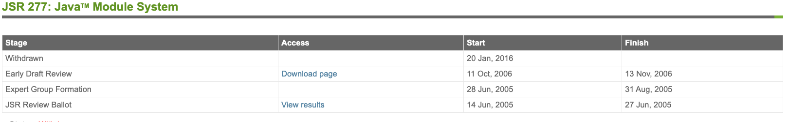
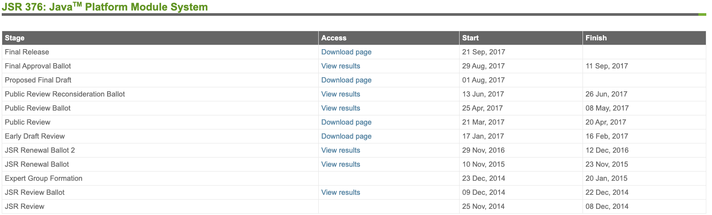
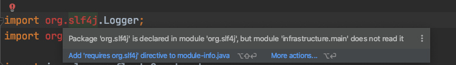
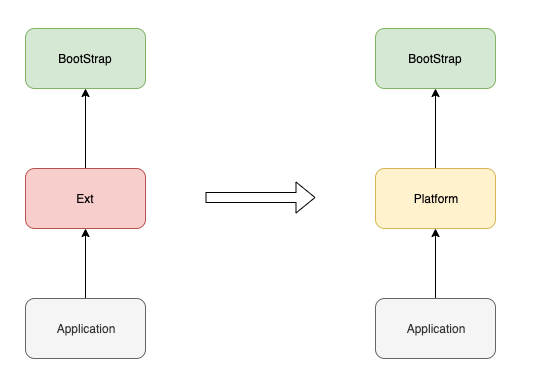

# Java 模块化系统 Jigsaw 一览

## 历史

2017年9月21日  Java9  正式发布，其中最大的变化就是引入了代号为 Jigsaw 的模块化系统（Java Platform Module System，简称 JPMS）。

Java 的模块化系统可以说是一波三折，在 2005 年（Java7） 就已经有提案了（ [JSR277](https://jcp.org/en/jsr/detail?id=277) ），但是因为种种历史原因，在一年多后该提案又被取消掉了



直到 2014年，新的提案 [JSR376](https://jcp.org/en/jsr/detail?id=376) 被提出，Java 的模块化系统才得以重新步入正轨，虽然它迟到了（原计划于 Java8 发布），但并没有缺席。

下图展示了从 JSR376 被提出到实现的各个阶段：




## 目标

在 [JSR376](https://www.jcp.org/en/jsr/detail?id=376) 中，对模块化系统的目标是有非常明确的描述的：

- 使用更可靠的配置来描述程序组件之间的依赖关系，并以此替代问题频出的 class-path 
- 组件可以控制其 API 被其他组件的访问性，提供一个更强的封装能力
- 增加 JavaSE 平台的扩展性，开发人员可以只将他需要的功能模块组装到一个自定义的配置中去
- 增强平台的完整性，确保平台内部 API 不会被访问
- 性能提升

实际上最核心的目标是最前面的两点，替代 class-path 和 增强封装性。

> 在  [Project Jigsaw: Goals & Requirements **DRAFT 3**](http://openjdk.java.net/projects/jigsaw/goals-reqs/03) 里对于实现目标的描述可能更加通俗易懂一些。

初次接触 Java9 的模块化系统时，会不自觉的和 Maven、Gradle 等构建工具进行对比，但是实际上两者关注的核心点是不一样的。

模块化系统更注重模块之间的封装性，而构建工具更注重的是依赖管理和项目构建。

也就是说构建工具可以决定依赖某个第三方库，而模块系统则决定你能使用该第三方库的哪些包或类，两者并不是对立的。

这也恰好解释了为什么 Java 的模块化系统没有版本管理

## 语法

Java 的模块是在 package 之上提供的一层抽象，所以通常一个模块是由多个 package 聚合而成的。

那么如何定义一个模块呢？

只需要在项目下创建一个 **module-info.java** 的文件，该文件所在包及其子包就组成了一个模块。

**module-info.java**  描述了模块的以下信息：

- 模块名称

- 依赖的其他模块

- 该模块下的封装信息（类的访问，反射权限）

- 该模块下的服务提供者和服务消费者信息（SPI）

  

下面是摘自 `《 Java 语言规范 》` 的 模块定义语法：

```java
// 以大括号标注的是占位符
// 以中括号标注的是可选项
// module, requires, exports, opens, provides..with, transitive, static 等都是关键字
    
{Annotation} [open] module Identifier {. Identifier} { 
  
  {ModuleDirective}
  
}

ModuleDirective:
  requires {RequiresModifier} ModuleName ;
  exports PackageName [to ModuleName {, ModuleName}] ;
  opens PackageName [to ModuleName {, ModuleName}] ;
  uses TypeName ;
  provides TypeName with TypeName {, TypeName} ;

RequiresModifier:
  (one of)
  transitive static
```

下面来简单的过一遍


### Module

 **module**  与 `class` 、`interface` 等关键词类似，只不过它是专门用来定义模块的

```java
// 定义一个名称为 MyModule 的模块
module MyModule {
  
}
```

注意，一个 **module-info.java** 文件中只能出现一次 **module** 的定义， 它并不能像 class 或 interface 一样能在单个文件中多次定义。

为了让注解能作用于 **module** 之上，Java 9 特地为 `ElementType` 扩展了一个 **MODULE** 类型

 ```java
/**
* 一个可以修饰 module 的注解
*/
@Target({ElementType.MODULE})
@Retention(RetentionPolicy.RUNTIME)
@interface ModuleAnnotation {

}
 ```

**module** 前有一个可选关键字 open

```java
open module MyModule {
  //......
}
```

在 `《Java 语言规范》` 中，将被 **open** 修饰的模块定义为 **开放模块**，否则就是 **标准模块**。

两种模块之间的区别主要在于类的访问性上

- **开放模块**：其他组件在**编译时**只能访问该模块明确 exports 的包下的类，但是在**运行时**可以访问该模块下所有的类
- **标准模块**：其他组件在**编译时和运行时**只能访问该模块明确 exoprts 的包下的类

exports 关键字会在后面谈到

>  更多信息可以参考《Java 语言规范》 7.7 Module Declarations


### **Exports**

前面说开放模块和标准模块的区别时提到了 **exports** 关键字，**exports ** 是 module 结构体内的一个指令，后面会跟上一个包名，表示该包下的所有类可以在编译期和运行时被其他模块访问。

 比如下面的代码就是开放 **MyExportModule** 下 **com.sample** 包下所有的类的访问权限给第三方模块

```java
module MyExportsModule {
  exports com.sample;
}
```

有时候我们还想更细粒度的 **exports**，就可以通过  ` exports...to...`  明确指定允许访问的第三方组件， 相当于从群聊变成了私聊。

如下， **com.sample** 下的类只能被模块 **B** 访问。

```java
module A {
  exports com.sample to B;
}
```


### Opens

**opens** 与 **exports** 类似，主要区别在于 **opens** 是只针对于**运行时访问能力**的一个指令。

**opens** 后面仍然是指定包名，该包下的类第三方组件是不可以直接引用的（即无法通过 import 使用），但是却可以通过反射进行调用。

```java
module MyOpensModule {
  opens com.sample
}
```

与 **exports** 一样， **opens** 也可以通过  **to** 关键字指定具体的模块：

```java
module A {
	opens com.sample to B;
}
```

需要注意一点就是，如果你的模块是开放模块，就不需要再使用 **opens** 了，用了也会产生编译错误的。


### Requires

前面说的 **exports** 和 **opens** 都是控制模块内部的访问权限的，那么如何依赖第三方模块呢？

这就轮到 **requires** 上场 了，它的作用类似于 maven 的 <dependency> 标签，不过两者的含义可不同。

maven 和 gradle 这样的构建工具会从网络或本地将依赖导入到工作目录的 class-path 中，而模块化系统并不会从远程下载依赖，它更多是控制你是否有访问其他模块下相关类的能力。

比如我现在通过 maven 导入了 slf4j 的依赖，当我通过 import 引用 slf4j 包下的类时就会报错



IDEA 很友好的提示了需要先 requires 该组件

```java
module Sample {
  requires org.slf4j;
}
```

为了使用方便， 用户定义的模块都会默认 `requires java.base`，我们自己也可以显示的去覆盖它。

**requires** 后面还可以跟 **transitive** 或 **static** 关键字

- transitive  代表依赖可以被传递（默认依赖是不传递的， 官方也不推荐使用 transitive）
- static 代表依赖的模块在编译期是必须的，在运行时是可选的 （ 比如 [lombok](https://projectlombok.org/) ）

下面用一段具体的实例来展示依赖传递

(1)、A 依赖 B

(2)、B 依赖 C，并且依赖关系是 transitive，这样的话 A 就隐式依赖了 C

(3)、C 依赖 lombok，并且依赖关系是 static 的

```java
module A {
  requires B;
}

module B {
  requires transitive C;
  exports B.sample
}

mobule C {
  requires static lombok;
  opens C.sample
}
```

如果没有使用 transitive，但是模块 A 又需要 模块 C 的话，就必须要再模块 A 中显示的指定依赖关系，否则的话会有编译错误

```java
module A {
  requires B;
  required C;
}
```


### Uses & Provides...with

模块化系统对 JAVA 的 [SPI](https://docs.oracle.com/javase/9/docs/api/java/util/ServiceLoader.html) 机制也做出了巨大的改变，而 Uses 和 Provides..with 就是针对 SPI 的关键字。

>SPI 本质上就是运行时动态的在 class-path 路径下加载对应的实现类的一种技术，它可以解耦**服务消费者**和**服务提供者**

我在组件 A 中定义了一个接口 **Serializer**，并创建了一个工厂 **SerializerFactory** 通过 SPI 机制加载接口的实现类

```java
public interface Serializer {
  byte[] serialize(Object target);
}
```

```java
public class SerializerFactory {
  public static List<Serializer> getSerializers() {
        final ServiceLoader<Serializer> loader = ServiceLoader.load(Serializer.class);
        return loader.stream()
          .map(ServiceLoader.Provider::get)
          .collect(Collectors.toList());
    }
}
```

在组件 B 中定义了定义了实现类 **JdkSerializer** ，并根据 SPI 的规则创建配置文件 com.sample.Serializer 并写入 **JdkSerializer** 的全限定名

```shell
- resources
	- META-INF
		- services
			com.sample.Serializer
```

这样就完成了 SPI 的整个配置， 但是在模块化系统中接口和实现的配置全部转到了 module-info.java 文件中。

首先在组件 A 中要用 **uses** 明确指定 Serializer 为服务提供者

```java
module A {
  // Serializer 和 SerializerFactory 都在该包下
	exports com.sample;
  uses com.sample.Serializer;
}
```

如果不适用 uses 指定的话，SerializerFactory.getSerializers() 就会抛出异常

```shell
java.util.ServiceConfigurationError: com.sample.SerializerFactory: module A does not declare `uses`
```


模块 B 依赖模块 A，并为 Serializer 提供实现类，同样需要通过 **provides...with**  来指定服务的实现类（不再需要创建 com.sample.Serializer 文件了）

```java
module B {
  requires A;
  provides Serializer with HessianSerializer, JdkSerializer;
}
```


`provides A with B` 可以这样去理解， 为接口 A 提供实现类 B。

## 类加载器

谈完了语法，再来看看模块化系统为**类加载器**带来的变化。

双亲委派模型没有变， 但是**ExtClassLoader** 更名为 **PlatformClassLoader**，还有 **ApplicationClassLoader** 除了可以加载 class-path 的类以外，还支持 module-path 的类路径加载。




## 实例

在只有 class-path 的时代，我们用 `javac` 命令编译时会通过 classpath 参数指定依赖类路径， 使用 `java` 命令运行时也会通过 cp 参数指定类路径

```shell
javac --classpath

java -cp
```

下面通过一个简单的示例来展示这两个命令在模块化系统中的应用

在项目 module-sample 下，module-A 和 module-B 分别代表两个模块，mods 是用来存放编译输出的目录。

```shell
module-sample/module-A/src
module-sample/module-B/src
module-sample/mods
```


模块 A 的目录结构如下

```shell
module-A/src/com/sample/Test.java
module-A/src/module-info.java
```


```java
pakcage com.sample;

public class Test {
	public void say(String word) {
    	System.out.println(word);
    }  
}

```


```java
module A {
  exports com.sample;
}
```


编译模块 A

```shell
javac -d mods/A module-a/src/module-info.java module-a/src/com/sample/Test.java
```


模块 B 的解构如下

```shell
module-B/src/com/test/MyTest.java
module-B/src/module-info.java
```


```java
package com.test;

public class MyTest {
  
  public static void main(String[] args) {
    System.out.println("hello world");
  }
  
}
```


```java
module B {
  requires A;
}
```


编译模块 B ，由于当前模块依赖了模块 A，所以需要指定 module-path，从而使得编译期可以找到 模块A。

> `-d` 参数指定编译文件的输出目录
>
> `-p` 指定 module-path

```shell
javac -p mods -d mods/B module-b/src/module-info.java module-b/src/com/b/MyTest.java
```

运行 main 方法

```shell
java --module-path mods -m B/com.b.MyTest
```


## 兼容性

虽然 Java9 发布已经有一段时间了，但即使是现在很多第三方库也还没有模块化，为了保证兼容性，当 module-path 下存在没有定义 module-info.java 文件的依赖时，JAVA 会自动将其转为 **automatic-module**

- Automatic-module 的的模块名会根据 manifest文件的定义 或 jar名称来决定

- Automatic-module 默认 exports 组件内所有包
- Automatic-module 默认 opens 组件内所有包

Automatic-module 只是权宜之计，因为依赖的库迁移到模块化系统后，它的模块名和封装性都可能会改变。


## 最后

Jigsaw 项目中还有 [jlink](https://docs.oracle.com/javase/10/tools/jlink.htm)， [jmod](https://docs.oracle.com/javase/10/tools/jmod.htm)，[jdeps](https://docs.oracle.com/javase/10/tools/jdeps.htm#GUID-A543FEBE-908A-49BF-996C-39499367ADB4) 等工具，它们都是应用于模块之上的工具。

尤其是 Jlink， 通过该工具你可以对 JDK 进行 “ 裁剪 ”，从而构建出拥有最小依赖集合的运行时环境。

> 如果你的项目中有 automatic-module 的话，是无法通过 jlink 进行裁剪的

这个裁剪对于 GUI 项目来说有着不小的诱惑，因为以后就不必要求客户端安装 JRE 了，分发出来的包就是可以直接运行的。

我在 [PrettyZoo](https://github.com/vran-dev/PrettyZoo) 项目中使用 Jlink 构建了一个最小运行镜像，总共 44M 左右，效果还是非常不错的（通过插件解决了 jlink 不支持 automatic-module 的限制）。

> PrettyZoo 是一个 zookeeper  的 GUI，基于 JavaFx11 实现的，欢迎 start 或 issue。

该项目最开始时基于 Java8 开发的，后面才迁移到了 Java11，也算是完整的踩了一遍迁移的各种坑，迁移相关的内容会在后续单独再写一篇文章。


## 参考

1. [Understanding Java 9 Modules](https://www.oracle.com/corporate/features/understanding-java-9-modules.html)
2. [Project Jigsaw: Goals & Requirements](http://openjdk.java.net/projects/jigsaw/goals-reqs/03)
3. [Java Platform Module System: Requirements](https://openjdk.java.net/projects/jigsaw/spec/reqs/)
4. [JSR 277: Java Module System](https://jcp.org/en/jsr/detail?id=277)
5. [JSR 376: Java Platform Module System](https://www.jcp.org/en/jsr/detail?id=376)
6. [Java9 语言规范](http://cr.openjdk.java.net/~mr/jigsaw/spec/java-se-9-jls-diffs.pdf)
7. [ClassLoader](https://docs.oracle.com/javase/9/docs/api/java/lang/ClassLoader.html#getPlatformClassLoader--)
8. [Module System Quick-Start Guide](https://openjdk.java.net/projects/jigsaw/quick-start)
9. [Java Platform, Standard Edition Tools Reference](https://docs.oracle.com/javase/10/tools/toc.htm)
10. [PrettyZoo](https://github.com/vran-dev/PrettyZoo)

