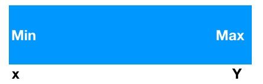
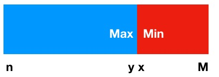
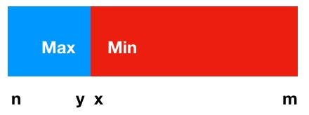

## LeetCode-33-Search in rotated sorted array

### 题意

假设有一个按升序排列的数组， 现在将其从中间某个位置（未知）将其分成两部分，并交换位置

```java
原数组：[0,1,3,5,6,7,8] 
将其分为两部分，索引<4 算一部分， 剩余的为第二部分
将其旋转后得到
[6,7,8,0,1,3,5]
```

现在你需要在这个旋转后的数组种找寻是否有输入的一个目标值， 如果有就返回它在数组中的索引位置，否则返回-1.

**约束条件：**

1. 数组中的值都是不重复的
2. 算法的时间复杂度必须是O(logN)

### 思路

注意理解两个约束条件（很重要）， 第二个条件要求时间复杂度必须是O(logN), 而在数组查找问题中看见O(logN)我们一般会想到**二分查找法**（又叫折半查找法）

但是**二分查找**要求整个输入必须是有序的， 而我们这个输入明显不符合要求。

**二分查找**一次排除一半的结果集，这是因为能确定结果不在其中，根据这个思路我们还是有希望用**二分查找**解决这个问题的。

但是我们得先分析旋转后的数组情况， 以便找出一定的规律每次去排除一半的结果集

首先根据题意， 我们得知输入数组最开始是升序的， 只不过要经历一次旋转， 而旋转的位置是未知的。

如果我们给定的旋转位置比0还小的话， 这样数组就不会变化，结构如下图，即 x~y 为升序, 这种情况用正常的**二分查找**就能解决问题了。



## 分析

如果给定的旋转位置>=0并且合法，那么数组会被我们分成A,B两部分， 这就会存在以下两种情况

- A.length > B.length 
- A.length <= B.length

下面用图来说明这两种情况， 在图中蓝色区域为**A**, 红色区域为**B**

先看**第一种情况**: A.length > B.length

这种情况下 

```
x < m, n < y, m < n, x < y;
```



这种情况下使用**二分查找**计算得到的中间位置`midle`就落在蓝色区域内

如果 `array[midle] < target` : 红色部分肯定小于`array[midle]` , 而`midle～y`为升序， 我们就能确定值在 middle + 1 ~ y之间

如果`array[midle] > target` : 红色部分肯定小于`array[midle]`, 并且`array[n] ~ array[midle-1]` 也小于`array[midle`], 那么target 就可能在 `n ~ midle` 或`x ~ m`之间

如果 `array[midle] == target` : 直接返回midle就可以了


再看**第二种情况**：A.length <= B.length (我们把A.length == B.length算作同一种情况)

这种情况下数据大小关系和上面是一样的：

```
x < m, n < y, m < n, x < y;
```




这种情况下使用**二分查找**计算得到的中间位置`midle`就落在红色区域内，下面的分析就和第一种情况类似了

如果 `array[midle] < target` :  蓝色部分大于 `array[midle]`, 并且`array[midle + 1] ~ array[m]` 也大于 `array[midle]`, 所以target就在 `midle + 1 ~ m` 或 `n ~ y`之间

如果 `array[midle] > target` : 蓝色部分大于array[midle],  那么target 就只可能在 `x ~ midle` 之间

如果 `array[midle] == target` : 直接返回midle

### 解题

```java
public Class Solution {
    
    public int search(int[] nums, int target) {
        // 输入校验
        if (nums == null || nums.length == 0) return -1;
        
        // 二分查找
        int l = 0, r = nums.length - 1;
        while (l <= r) {
            int m = (r - l)/2 + l;
            if (target > nums[m]) {
                if (nums[l] < nums[r]) {
                    l = m + 1;
                } else {
                    // A.length < B.length
                    if (nums[m] < nums[r]) {
                        if (target > nums[r]) {
                            r = m - 1;
                        } else if(target < nums[r]) {
                            l = m + 1;
                        } else {
                            return r;
                        }
                    } 
                    // A.length >= B.length
                    else {
                        l = m + 1;
                    }
                }
            } else if (target < nums[m]) {
                if (nums[l] < nums[r]) {
                    r = m - 1;
                } else {
                    // A.length < B.length
                    if (nums[m] < nums[r]) {
                        r = m - 1;
                    } 
                    // A.length >= B.length
                    else {
                        if (target > nums[l]) {
                        	r = m - 1;
                        } else if(target < nums[l]) {
                            l = m + 1;
                        } else {
                            return l;
                        }
                    }
                }
            } else {
                return m;
            }
        }
        
        // 未找到值
        return -1;
    }
    
}
```

