# 从30分钟到1分钟 - SBT的update耗时优化记录

# 前言

公司有项目是基于 Scala 编写的，与之配套的构建工具是 SBT , 它是 **Simple Build Tool** 的缩写，虽然我觉得它一点也不简单。

这个项目有一个很大的痛点就是刷新依赖 （对应 SBT 的 update）非常之耗时，可以参见下图：

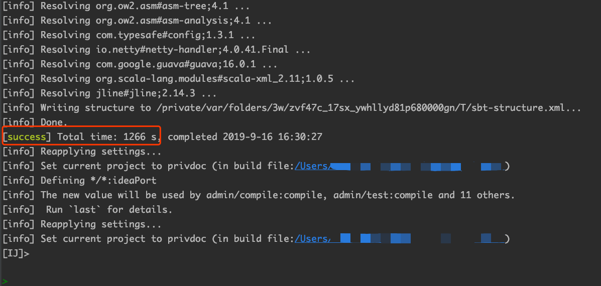

注意图中红框部分，耗时1266秒，近半个小时。在刷新期间资源占用也很高，导致电脑很卡 （风扇还呼呼呼的转，温度蹭蹭蹭的长）。

最关键的是由于依赖的很多服务升级很快 （几乎每天都有升级），所以这个操作每天也会持续很多次，难以想象耗费在这方面的时间是何其之多。

人生苦短，在刷新了几次之后，我再也受不了这漫长的等待时间，于是开始了这漫漫的优化之路。

> 正所谓工欲善其事必先利其器


## Round 1: 十八般武艺齐上阵

不知道大家碰见这种问题会怎么做，我反正是二话不说打开 Google 直接搜： **SBT 依赖下载慢**。

还别说，有共鸣的人还不少， 总结了下几乎都是以下的解决方案

> 1. 添加代理
> 2. 添加国内镜像源

我这肯定不是源的问题啊，我司用的私有仓库，既然私有jar都下载下来了，肯定是走的私有仓库啊。

翻了几页，没有满意的答案，也试了几个方案，也没啥用。

看来还是得自己从问题的根源开始找起啊......

为了保险起见， 我还是先排查一下是不是镜像问题， 项目的 `build.sbt` 配置文件中是有私有仓库的相关配置项的：

```java

lazy val commonSettings = Seq(
	//....

  // ... 私有仓库
  resolvers := {Resolver.url("xr-ivy-releasez", new URL("http://nexus.xxxx.com/repository/ivy-releases/"))(Resolver.ivyStylePatterns) +: resolvers.value},
  resolvers := { {"xr-maven-public" at "http://nexus.xxxx.com/repository/public/"} +: resolvers.value},
  // ....
)

```

此时我忽然想到一种情况：难道是默认走的公共库，在公共库找不到依赖才会走私有库 ？

为了验证猜想，我使用 wireshark 抓包进行分析，过滤器指定协议 http (因为仓库是走的http)

> 还可以指定 ip.src 和 ip.dst 从而使得数据包更加符合我们的要求

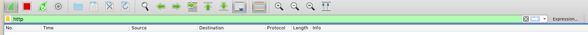


然后打开 sbt shell 进行 update 操作

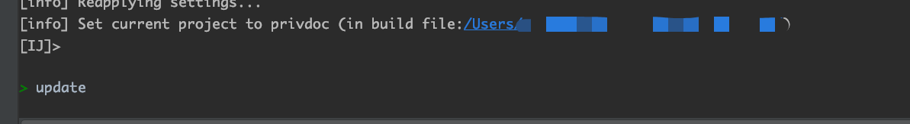


观察抓包结果

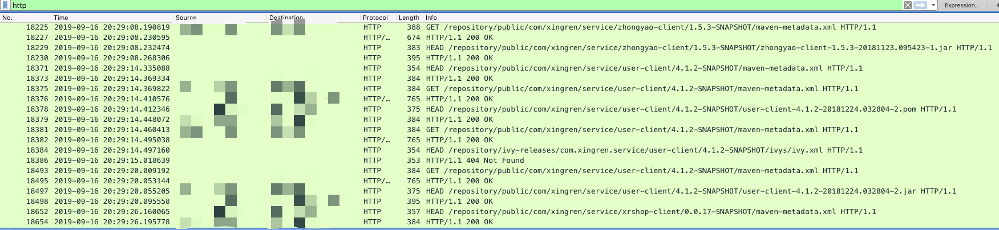

发现访问的都是 `/repository/public/***` 的请求，对应的 Host 也是我司的私有库，这说明配置是生效了的，而且都是从私有仓库进行下载。

但是我也发现了一些404的请求

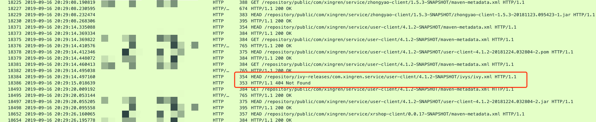

好吧，是我司的私有库没有 `/repository/ivy-release` ，果断将对应的仓库配置去掉，省去没必要的请求。

虽然走了私有库，但是我每次刷新都会请求仓库，这就不符合道理了，难道 SBT 连基本的依赖缓存都没有 ？


## Round 2: 从半小时到五分钟

对抓到的数据包进行再次过滤，只看 `Http Request`，发现请求的都是 `SNAPSHOT` 版本的依赖库, 参见下图

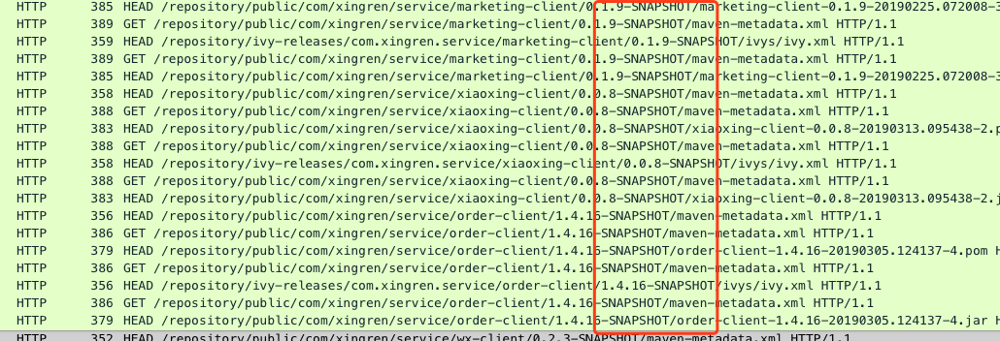

这说明 SBT 是有缓存的，因为正式版都没有请求仓库，可是为什么 `SNAPSHOT` 每次都去请求远程仓库呢？ 难道是 `SNAPSHOT` 被区别对待，不会被缓存？

既然 SBT 是基于 Ivy 的，那就从 Ivy下手。

我在Ivy 的官网（http://ant.apache.org/ivy/history/2.0.0/settings/caches.html）找到了下面的一个关于**缓存**的表格：

| Attribute           | Description                                                  | Required                                                     |
| ------------------- | ------------------------------------------------------------ | ------------------------------------------------------------ |
| default             | the name of the default cache to use on all resolvers not defining the cache instance to use | No, defaults to a default cache manager instance named 'default-cache' |
| **defaultCacheDir** | a path to a directory to use as default basedir for both resolution and repository cache(s) | No, defaults to **.ivy2/cache** in the user's home directory |
| resolutionCacheDir  | the path of the directory to use for all resolution cache data | No, defaults to defaultCacheDir                              |
| repositoryCacheDir  | the path of the default directory to use for repository cache data. **This should not point to a directory used as a repository!** | No, defaults to defaultCacheDir                              |

注意关键字 `defaultCacheDir`， 这个就是 Ivy 的缓存目录，对应路径为用户目录下的 `.ivy2/cache`。

我的是 mac， 对应目录就是 `~/.ivy/cache` , 果不其然，进入该目录查看一下：

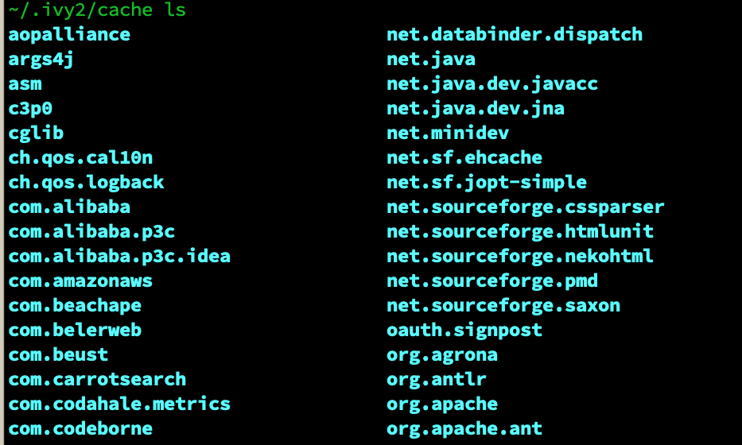

在 `~/.ivy/cache` 下发现了很多依赖库的目录， 下面就需要验证一下有没有缓存 `SNAPSHOT` 的版本了， 以我司的 `user-client 4.1.2-SNAPSHOT` 为目标进行查找：


从图中显示，目录中明明有缓存 `SNAPSHOT` 的啊，可为什么不走本地缓存呢 ？

这没办法了，只能去 SBT 官网找答案了，在官网文档找到了 [Dependency Management](https://www.scala-sbt.org/1.x/docs/Dependency-Management-Index.html) ，看名字似乎和依赖管理有关， 

其中的 [Cached-Resolution](https://www.scala-sbt.org/1.x/docs/Cached-Resolution.html) 似乎和缓存相关， 而且开头就是下面这段话

> To set up Cached Resolution include the following setting in your project’s build:
>
> updateOptions := updateOptions.value.withCachedResolution(true)

说的是要配置缓存解析，那就得加上 `updateOptions := updateOptions.value.withCachedResolution(true)` 的配置， 这也太简单了吧？

不管啦，先加上试试。

加配置，刷新，抓包一气呵成, 然而结果惨不忍睹

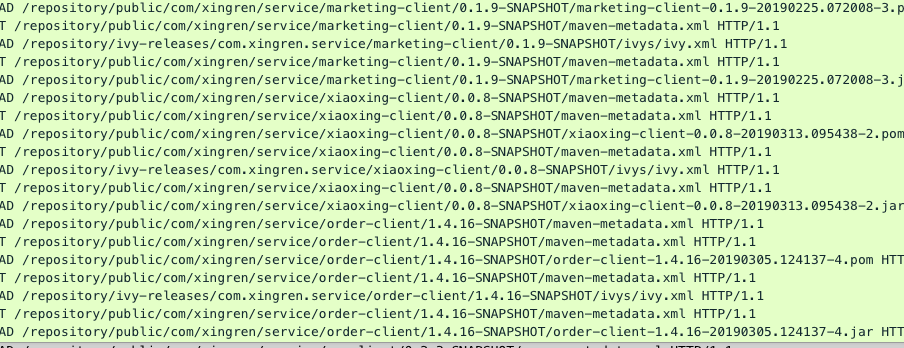

看着一页页的请求发出去，此刻我是奔溃的！贼子安敢欺我！

正在我想静静之际，SBT 刷新完成，我一不小心瞄了一眼，耗时居然只有以前的1/4 了？

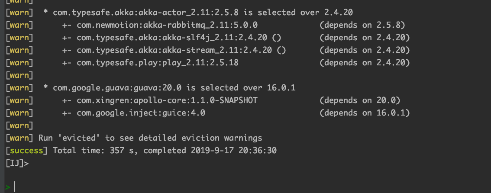

我靠，怎么肥四（回事）？不是没生效吗，怎么时间缩短了这么多？

为了确保不是眼花，我又**重启刷新**了几次，发现耗时相差无几，而且我发现如果不重启直接update，一般耗时都只有几秒，我的天啦。

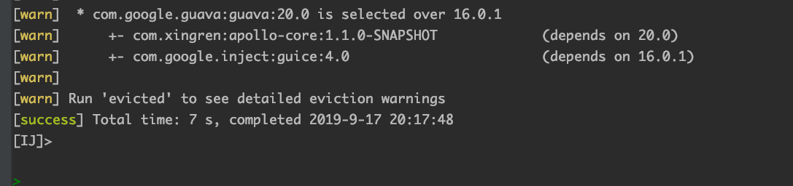

不死心的我又去看了下文档，原来是我对这个配置理解错了，这个配置的意思并不是说 `SNAPSHOT` 就不请求远程仓库了。

这里的缓存指的是sbt启动后第一次执行update后，会缓存所有的依赖解析信息， 也就是说缓存是和进程相关的。

而我的项目是有4个子项目，每个子项目都共同依赖了 `service `模块， 该模块维护着几乎所有的依赖。

当第一个项目 update 后，其他三个项目 update 时都会直接走缓存了，这也是为什么耗时只有最开始1/4。

真实无心插柳柳成荫啊......


## Round 3：从五分钟到一分钟

虽然现在时间只要以前的1/4了，可还是要5分钟啊，这绝对不是一个可以将就的数字！

而且还有另外一个非常重要的原因，因为穷！

此话怎讲？因为 SBT 一直启动着太耗内存了，我这可怜的 8G 可得省着点儿。可是停掉 SBT，缓存就得重新构建了，所以是穷激发了我的进一步探索......

再次思考一下：为什么 `SNAPSHOT` 依赖每次启动都要去远程仓库拉取呢 ？ 能不能只在依赖的版本有更新的时候再去拉取呢 ？

在文档 [Cached-Resolution](https://www.scala-sbt.org/1.x/docs/Cached-Resolution.html)中,  发现了关键词 **SNAPSHOT and dynamic dependencies**，其中对 `SNAPSHOTR` 和缓存做了一些描述：

> When a minigraph contains either a SNAPSHOT or dynamic dependency, the graph is considered dynamic, and it will be invalidated after a single task execution. Therefore, if you have any SNAPSHOT in your graph, your experience may degrade. 

说的是依赖关系中如果有 `SNAPSHOT` 版本，会导致某个子依赖关系缓存失效， 而这个子依赖就是动态的，反正就是不会走缓存的意思。

既然得知问题的根源是因为使用了 `SNAPSHOT`,  如果不使用 `SNAPSHO` 不就没这个问题了嘛。

然而现实是骨感的，公司内部几十个服务大多数都用的 `SNAPSHOT` 作为版本号，而且各种互相依赖，短时间内是不可能直接过渡的了，所以直接PASS该方案了。

只能继续在文档中摸索，发现一个相关配置

> ​	**updateOptions := updateOptions.value.withLatestSnapshots(false)**

这个配置的作用是什么呢？

因为 SBT 可以配置多个远程仓库源（通过 Resolver），默认情况下 SBT 会从所有的远程仓库去拉取指定版本的 `SNAPSHOT` 依赖， 然后比对它们的发布时间，取最新的那一个。

通过配置 `withLatestSnapshots(false)` 可以禁用该策略， 这样 SBT 就直接使用从远程仓库拉取到的第一个 `SNAPSHOT` 依赖。

加上配置然后测试，发现网络请求数确实少了，整体update耗时减少了一分钟左右，但是这个会导致无法拉取到同版本的最新`SNAPSHOT`

> 因为快照在不改变版本的情况下是可以重复发布的，区分同版本不同快照就只能按照时间戳来了。
>
> SBT 无法确定本地的快照是最新的，所以每次启动都会去仓库拉取最新快照。
>
> 使用 withLatestSnapshots(false) 后就不会取最新的，而是直接取第一个。

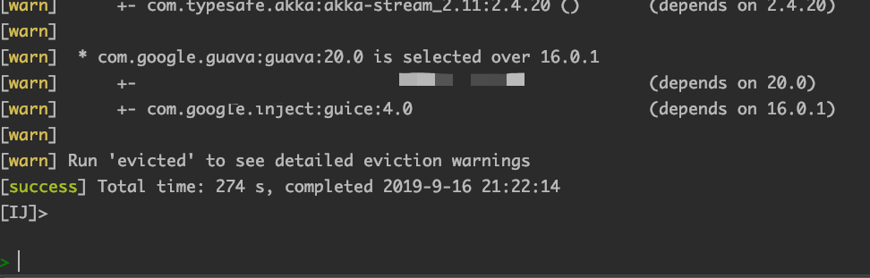

不取最新的 `SNAPSHOT` 对我们影响不大， 因为我们内部的服务如果有改动，基本就会升级版本号（就算是 `SNAPSHOT`）, 很少有一直重复发同版本的`SNAPSHOT`的情况。

> 这么一说，似乎我们连用 `SNAPSHOT` 的意义都不大了，然而历史原因......

虽然有所提升，但是最关键的问题，`SNAPSHOT` 每次 update 都会走网络请求的问题还是没解决。

只能继续在文档中挣扎，还好黄天不负有心人啊， 在官方文档 [Cache And Configuration](https://www.scala-sbt.org/1.x/docs/Dependency-Management-Flow.html#Caching+and+Configuration) 一节找到了相关内容

> When `offline := true`, remote SNAPSHOTs will not be updated by a resolution, even an explicitly requested update. This should effectively support working without a connection to remote repositories. Reproducible examples demonstrating otherwise are appreciated. Obviously, update must have successfully run before going offline.

文档说如果配置了`offline :=  true`,  是不会从远程仓库更新 `SNAPSHOT` 的依赖了，这不正是我们要的东西吗？

但是后面又说了，更新必须在进入离线模式之前就完成，这句话的意思是不是离线模式下我连版本升级也做不到呢？

只有自己动手了才知道，在不升级版本的情况下，加上配置再次进行 update 并抓包， 没有任何的请求到达仓库了

再来看看最终的更新时间

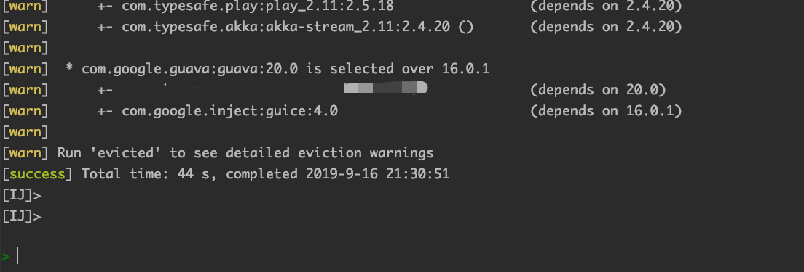

只需要一分钟不到，此刻我得先压制内心的狂喜，再验证一下在 `offline := true `的情况下，升级版本是否会从远程仓库请求？

随意修改了一个库的版本，然后重启 sbt 执行 update， 发现是成功从远程仓库拉取到了的，哈哈，一切都不是问题！


## 新的问题

意外总是伴随着惊喜同时到来，在我随后的使用中却又发现了另外的问题：如果 SBT 的第一次update完成以后， 我随后修改依赖的版本，在不重启SBT的情况下再次执行update，是读不到最新的依赖版本的。

初步猜测是和缓存有关系的，但是问题也不大了，就算更新依赖版本然后重启 SBT 进行 update， 耗时也不过1分钟左右 ，比最开始的半小时已经好多了。

要不，我把这个问题留给你们了？


## 写在最后

最后从30分钟到1分钟实际上就是在 `build.sbt` 加了两行配置

```scala
offline := true,
updateOptions := updateOptions.value.withCachedResolution(true).withLatestSnapshots(false)
```

整个分析问题的思路也很简单，就是先找到问题根源，再去找解决方案。

在寻找解决方案的时候一般都是搜索引擎，文档或者源码，正常情况下文档应该都能解决问题了，这期间我就绕了不少弯路，我甚至曾去看了 SBT 的  **Resolver** 的源码， 现在看来，绝对是跑偏了。

整个解决过程并没有多么高深莫测甚至可以说是无聊至极，因为大部分时间都是看文档并验证其配置。

不过还是那句话：**工欲善其事必先利其器**

## 参考

1. [sbt Reference Manua](https://www.scala-sbt.org/1.x/docs/)
2. [sbt 源码](https://www.scala-sbt.org/0.13/sxr/)
3. [Wireshark User’s Guide](https://www.wireshark.org/docs/wsug_html_chunked/)
4. [Apache Ivy Documentation (2.0.0)](http://ant.apache.org/ivy/history/2.0.0/index.html)
5. [Offline mode and Dependency Locking](https://github.com/sbt/sbt/wiki/User-Stories:--Offline-mode-and-Dependency-Locking)