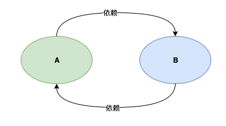
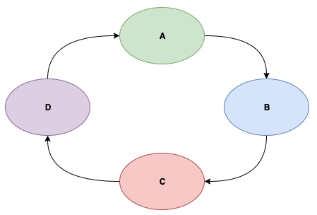
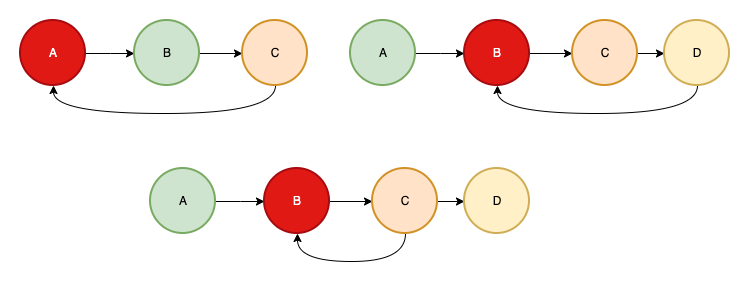
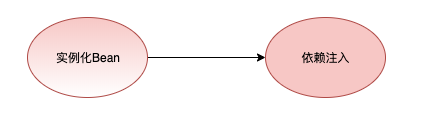
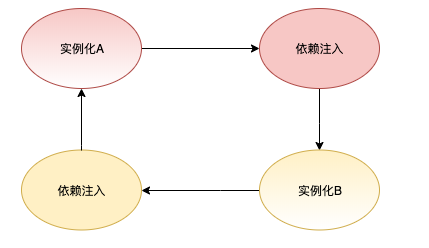
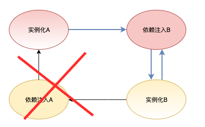
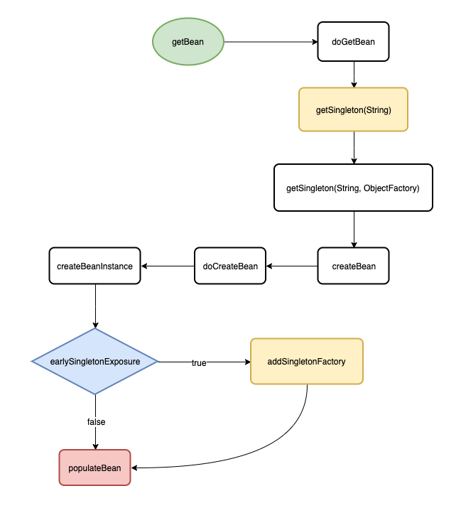
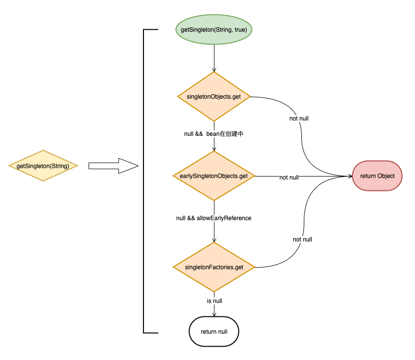
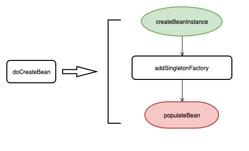
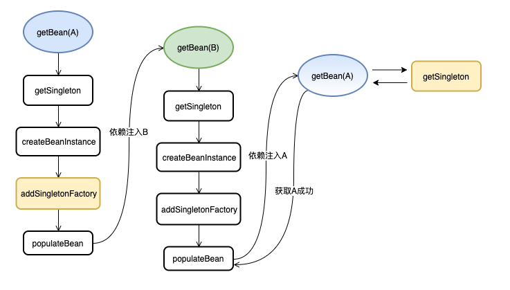

# Spring的循环依赖

## 前言

> 本文最耗时间的点就在于想一个好的标题， 既要灿烂夺目，又要光华内敛，事实证明这比砍需求还要难！

由于对象之间的依赖关系经常是错综复杂，使用不当会引发很多意向不到的问题， 一个很典型的问题就是**循环依赖** （也可以称之为**循环引用**）。

Spring为我们提供了依赖注入，并且在某些情景（单例Bean的注入）下支持循环依赖的注入

本文的主要目的是分析Spring在Bean的创建中是如何处理循环依赖的，我会从循环依赖是什么，以及它的坏处，到最后通过Spring的源码来看它是如何处理这个问题的

> 循环依赖不仅仅是Spring的Bean之间会产生， 往大了看，系统模块之间会产生循环依赖， 系统与系统之间也会产生循环依赖，这是一个典型的坏味道，我们应该尽量避免

## 什么是循环依赖

循环依赖指的是**多个对象之间的依赖关系形成一个闭环**

下图展示了两个对象A和B形成的一个循环依赖



下图展示了多个对象形成的一个循环依赖




现实中由于依赖层次深，关系复杂， 循环依赖可能是在你看不见的地方产生的。

## 为什么要避免循环依赖

循环依赖会为系统带来很多意想不到的问题，下面我们来简单讨论一下


> 循环依赖会产生多米诺骨牌效应

换句话说就是牵一发而动全身，想象一下平静的湖面落入一颗石子，涟漪会瞬间向周围扩散。

循环依赖形成了一个环状依赖关系， 这个环中的某一点产生不稳定变化，都会导致整个环产生不稳定变化

实际的体验就是

- 难以为代码编写测试，因为易变导致写的测试也不稳定
- 难以重构，因为互相依赖，你改动一个自然会影响其他依赖对象
- 难以维护，你根本不敢想象你的改动会造成什么样的后果
- ......


> 循环依赖会导致内存溢出

参考下面的代码

```java
public class AService {
  private BService bService = new BService();
}

public class BService {
  private AService aService = new AService();
}
```

当你通过`new AService()`创建一个对象时你会获得一个栈溢出的错误。 如果你了解Java的初始化顺序就应该知道为什么会出现这样的问题

因为调用 `new AService()`时会先去执行属性bService的初始化, 而bService的初始化又会去执行AService的初始化， 这样就形成了一个循环，最终导致调用栈内存溢出

## Spring的循环依赖示例

下面我们通过简单的示例来展示Spring中的循环依赖注入， 我分别展示了一个构造器注入和Field注入的循环依赖示例

- 构造器注入

  ```java
  @Service
  public class AService {
    
    private final BService bService;
    
    @Autowired
    public AService(BService bService) {
      this.BService = bService
    }
    
  }
  ```

  ```java
  @Service
  public class BService {
    
    private final AService aService;
    
    @Autowired
    public BService(AService aService) {
      this.aService = aService;
    }
    
  }
  ```

- Field注入

  ```java
  @Service
  public class AService {
    
    @Autowired
    private BService bService;
    
  }
  ```

  ```java
  @Service
  public class BService {
    
    @Autowired
    private AService aService;
    
  }
  ```

  `Setter`注入和Feild注入类似

如果你启动Spring容器的话， 构造器注入的方式会抛出异常BeanCreationException, 提示你出现了循环依赖

但是Field注入的方式就会正常启动，并注入成功。

这说明Spring虽然能够处理循环依赖，但前提条件时你得按照它能够处理的方式去做才行

比如prototype的Bean也不能处理循环依赖的注入，这点我们需要注意

## 一个检测循环依赖的方法

在我们具体分析Spring的Field注入是如何解决循环依赖时， 我们来看看如何到检测循环依赖

在一个循环依赖的场景中，我们可以确定以下约束

1. 依赖关系是一个图的结构
2. 依赖是有向的
3. 循环依赖说明依赖关系产生了环

明确后，我们就能知道检测循环依赖本质就是在检测一个图中是否出现了环， 这是一个很简单的算法问题

利用一个`set`依次记录这个依赖关系方向中出现的元素， 当出现重复元素时就说明产生了`环`， 而且这个重复元素就是环的起点

参考下图， 红色的节点就代表是循环出现的点



以第一个图为例，依赖方向为 A->B->C->A, 很容易检测到A就是环状点

## Spring是如何处理循环依赖的

Spring能够处理**单例Bean**的循环依赖（**Field注入方式**)，本节我们就通过纸上谈兵的方式来看看它是如何做到的

首先，我们将Spring创建Bean的生命周期简化为两个步骤：实例化 -> 依赖注入， 如下图所示



**实例化**就相当于通过`new`创建了一个具体的对象， 而**依赖注入**就相当于为对象的属性进行赋值操作

我们再将这个过程扩展到两个相互依赖Bean的创建过程上去,  如下图所示



A在执行依赖注入时需要实例化B， 而B在执行依赖注入时又会实例化A，形成了一个很典型的依赖环

产生环的节点就是B在执行依赖注入的阶段， 如果我们将其"砍”掉， 就没有环了， 如下图所示



这样做确实没有循环依赖了，但却带来了另一个问题，B是没有经过依赖注入的， 也就是说B是不完整的， 这怎么办呢？

此时A已经创建完成并维护在Spring容器内，A持有B的引用， 并且Spring维护着未进行依赖注入的B的引用

当Spring**主动创建**B时可以直接取得B的引用 （省去了实例化的过程）， 当执行依赖注入时， 也可以直接从容器内取得A的引用， 这样B就创建完成了


A持有的未进行依赖注入的B，和后面单独创建B流程里面是同一个引用对象， 当B执行完依赖注入后，A持有的B也就是一个完整的Bean了。

## Show me the code

>  没有代码的泛泛而谈是没有灵魂的

我画了一个简化的流程图来展示一个Bean的创建（省略了Spring的BeanPostProcessor, Aware等事件）过程， 希望你过一遍，然后我们再去看源码。

入口直接从`getBean(String)`方法开始， 以`populateBean`结束， 用于分析循环依赖的处理是足够的了



`getBean(String)`是**AbstractBeanFactory**的方法,  它内部调用了 `doGetBean`方法， 下面是源码

```java
public abstract class AbstractBeanFactory extends FactoryBeanRegistrySupport implements ConfigurableBeanFactory {
 	@Override
	public Object getBean(String name) throws BeansException {
		return doGetBean(name, null, null, false);
	}
  
  protected <T> T doGetBean(final String name, final Class<T> requiredType, final Object[] args, boolean typeCheckOnly){
    ...
    // #1
    Object sharedInstance = getSingleton(beanName);
    ...
    final RootBeanDefinition mbd = getMergedLocalBeanDefinition(beanName);
    if (mbd.isSingleton()) {
      // #2
    	sharedInstance = getSingleton(beanName, new ObjectFactory<Object>() {
						@Override
						public Object getObject() throws BeansException {
              	// #3
								return createBean(beanName, mbd, args);
						}
					});
    }
    ...
    return (T)bean;
  }
}
```

我简化了`doGetBean`的方法体，与流程图对应起来，使得我们可以轻松找到下面的调用流程

```java
doGetBean -> getSingleton(String) -> getSingleton(String, ObjectFactory)
```


`getSingleton`是**DefaultSingletonBeanRegistry**的重载方法

**DefaultSingletonBeanRegistry**维护了三个**Map**用于缓存不同状态的Bean,  稍后我们分析`getSingleton`时会用到

```java
/** 维护着所有创建完成的Bean */
private final Map<String, Object> singletonObjects = new ConcurrentHashMap<String, Object>(256);

/** 维护着创建中Bean的ObjectFactory */
private final Map<String, ObjectFactory<?>> singletonFactories = new HashMap<String, ObjectFactory<?>>(16);

/** 维护着所有半成品的Bean */
private final Map<String, Object> earlySingletonObjects = new HashMap<String, Object>(16);
```

`getSingleton(String)` 调用了重载方法 `getSingleton(String, boolean)`， 而该方法实际就是一个查询Bean的实现， 先看图再看代码




从图中我们可以看见如下查询层次

```java
singletonObjects =>  earlySingletonObjects => singletonFactories
```

再结合源码

```java
public class DefaultSingletonBeanRegistry extends SimpleAliasRegistry implements SingletonBeanRegistry {
  @Override
	public Object getSingleton(String beanName) {
		return getSingleton(beanName, true);
	}
  
  protected Object getSingleton(String beanName, boolean allowEarlyReference) {
    // 从singletonObjects获取已创建的Bean
		Object singletonObject = this.singletonObjects.get(beanName);
    
    // 如果没有已创建的Bean， 但是该Bean正在创建中
		if (singletonObject == null && isSingletonCurrentlyInCreation(beanName)) {
        // 从earlySingletonObjects获取已经实例化的Bean
				singletonObject = this.earlySingletonObjects.get(beanName);
      
      	// 如果没有实例化的Bean， 但是参数allowEarlyReference为true
				if (singletonObject == null && allowEarlyReference) {
          // 从singletonFactories获取ObjectFactory
					ObjectFactory<?> singletonFactory = this.singletonFactories.get(beanName);
					if (singletonFactory != null) {
            // 使用ObjectFactory获取Bean实例
						singletonObject = singletonFactory.getObject();
            
            // 保存实例， 并清理ObjectFactory
						this.earlySingletonObjects.put(beanName, singletonObject);
						this.singletonFactories.remove(beanName);
					}
				}
		}
		return (singletonObject != NULL_OBJECT ? singletonObject : null);
	}
  
}

```


通过`getSingleton(String)`没有找到Bean的话就会继续往下调用 `getSingleton(String, ObjectFactory)`,  这也是个重载方法， 源码如下


```java
public Object getSingleton(String beanName, ObjectFactory<?> singletonFactory) {
		...	
    // 获取缓存的Bean
    Object singletonObject = this.singletonObjects.get(beanName);
			if (singletonObject == null) {
				...
        // 标记Bean在创建中
        beforeSingletonCreation(beanName);
				boolean newSingleton = false;
				...
        // 创建新的Bean， 实际就是调用createBean方法
        singletonObject = singletonFactory.getObject();
        newSingleton = true;
				...
				if (newSingleton) {
          // 缓存bean
					addSingleton(beanName, singletonObject);
				}
			}
			return (singletonObject != NULL_OBJECT ? singletonObject : null);
	}
```

流程很清晰，就没必要再画图了，简单来说就是根据beanName找不到Bean的话就使用传入的ObjectFactory创建一个Bean。

从最开始的代码片段我们可以知道这个ObjectFactory的getObject方法实际就是调用了`createBean`方法

```java
sharedInstance = getSingleton(beanName, new ObjectFactory<Object>() {
						@Override
						public Object getObject() throws BeansException {
              	// #3
								return createBean(beanName, mbd, args);
						}
					});
```


`createBean`是**AbstractAutowireCapableBeanFactory**实现的，内部调用了`doCreateBean`方法

`doCreateBean`承担了bean的实例化，依赖注入等职责。

参考下图



`createBeanInstance`负责实例化一个Bean对象

`addSingletonFactory`会将单例对象的引用通过ObjectFactory保存下来， 然后将该ObjectFactory缓存在**Map**中（该方法在依赖注入之前执行）

`populateBean`主要是执行依赖注入


下面是源码， 基本与上面的流程图保持一致， 细节的地方我也标了注释了

```java
public abstract class AbstractAutowireCapableBeanFactory extends AbstractBeanFactory
      implements AutowireCapableBeanFactory {
	@Override
	protected Object createBean(String beanName, RootBeanDefinition mbd, Object[] args) throws BeanCreationException {
		...
		return doCreateBean(beanName, mbdToUse, args);
	}
	
	protected Object doCreateBean(final String beanName, final RootBeanDefinition mbd, final Object[] args) {
		...
		BeanWrapper instanceWrapper = null;
		if (instanceWrapper == null) {
			// 实例化Bean
			instanceWrapper = createBeanInstance(beanName, mbd, args);
		}
		final Object bean = (instanceWrapper != null ? instanceWrapper.getWrappedInstance() : null);
		// 允许单例Bean的提前暴露
		boolean earlySingletonExposure = (mbd.isSingleton() && this.allowCircularReferences && isSingletonCurrentlyInCreation(beanName));
		if (earlySingletonExposure) {
			// 新建并缓存ObjectFactory
			addSingletonFactory(beanName, new ObjectFactory<Object>() {
				@Override
				public Object getObject() throws BeansException {
					// 如果忽略BeanPostProcessor逻辑， 该方法实际就是直接返回bean对象
					// 而这里的bean对象就是前面实例化的对象
					return getEarlyBeanReference(beanName, mbd, bean);
				}
			});
		}

		...
		// 依赖注入
    populateBean(beanName, mbd, instanceWrapper);
		...
	}
}
```


如果你仔细看了上面的代码片段，相信你已经找到Spring处理循环依赖的关键点了

我们以A, B循环依赖注入为例，画了一个完整的注入流程图




注意上图的**黄色节点**， 我们再来过一下这个流程

1. 在创建A的时候，会将**实例化的A** 通过 `addSingleFactory`（黄色节点）方法缓存, 然后执行依赖注入B。
2. 注入B会走创建流程， 最后B又会执行依赖注入A
3. 由于第一步已经缓存了A的引用， 再次创建A时可以通过`getSingleton`方法得到这个A的提前引用（拿到最开始缓存的objectFactory, 通过它取得对象引用）， 这样B的依赖注入就完成了
4. B创建完成后， 代表A的依赖注入也完成了，那么A也创建成功了 （实际上Spring还有initial等步骤，不过与我们这次的讨论主题相关性不大）

这样整个依赖注入的流程就完成了

## 总结

又到了总结的时候了，虽然全文铺的有点长，但是Spring处理单例Bean的循环依赖却并不复杂，而且稍微扩展一下，我们还可以将这样的处理思路借鉴一下从而处理类似的问题。

不可避免的文章还是留下了不少坑，比如

- 我没有详细解释构造器注入为什么不能处理循环依赖
- 我没有详细说明Spring如何检测循环依赖的细节
- 我也没有说明prototype的Bean为什么不能处理循环依赖
- .....

当然这些都能在Spring创建Bean的流程里面找到（getBean(String)方法），细节的东西就留给读者自己去源码里面发现了哦


## 参考

1. Circular_dependency https://en.wikipedia.org/wiki/Circular_dependency