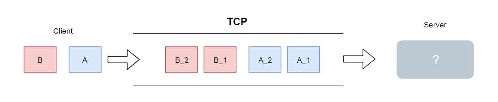

# TCP之TCP_NODELAY

## 0X00 前言

我们在使用socket（TCP）进行编程时会有很多配置选项, 而`TCP_NODEPLAY`也正是其中之一， 本文的目的就是研究`TCP_NODELAY`产生的效果以及其背后的原理。

## 0X01 TCP_DELAY与Nagle

`TCP_NODELAY`的值为0或1（在有的语言中为true或false）， 当设置为1（true)时即代表着关闭**Nagle**算法， 反之则代表打开**Nagle**算法。

Nagle算法由John Nagle发明， 该算法旨在通过减少发送网络包的数量从而提升网络的性能。

那么它是如何减少发送的包数量的呢， 这又得了解作者描述的一个问题 -- “小数据包问题”：

> 应用不断的提交小单为的数据， 经常只有**1byte**大小，而为了发送这**1byte**的数据， 还需要传输**40byte**的数据首部包(TCP首部 20byte + IPV4首部 20byte),  从而对网络造成了巨大的开销

为了解决这个问题，Nagle算法就应运而生了， 下面是该算法的伪码

```shell
# MSS代表最大分段大小， 可以理解为TCP愿意接受的数据的字节数最大值
# the window size代表接收窗口的大小

if there is new data to send
  if the window size >= MSS and available data is >= MSS
    send complete MSS segment now
  else
    # 如果存在未被确认的数据
    if there is unconfirmed data still in the pipe
      # 将该数据加入缓冲， 当接收方一个确认保文返回时就发送该缓冲内的数据
      enqueue data in the buffer until an acknowledge is received
    else
      send data immediately
    end if
  end if
end if
```

我们主要关注Nagle算法对数据合并的方式和时机，以及发送合并数据的时机， 参考下图


该算法还是很容易理解的， 根据上面的图可能有人会提出疑问

> 如果seq=0的数据在发送途中丢失， server就永远不会返回ack了， 而client却会一直将数据放入缓冲并等待下次ack才发送，这不就永远也不会发送了吗？

其实这个并不是Nagle算法的范畴了，TCP本身有一个定时器，如果在一定时间内发送的数据没有收到ack的话会再次重发丢失的数据的。

## 0X02 Nagle与延迟确认

前面我们了解到没有ack的话，Nagle算法合并的数据时不会被发送出去的，而这个特性就与TCP的另一个特性相冲了，那就是**延迟确认(ACK)**, 延迟确认也是提升TCP性能的一种方式，具体请参考[wiki](<https://zh.wikipedia.org/wiki/TCP%E5%BB%B6%E8%BF%9F%E7%A1%AE%E8%AE%A4>)。

简单来说的话就是**接收端**等待一定的时间再返回ack， 而这个一定的时间在RFC1122中规定最高可以达到500ms。没有ACK的话，Nagle算法合并的数据包就不会被发送出去， 知道**延迟ACK**超时后返回ACK， 这样就增加了往返时延，参考下图


## 0x03 Nagle与粘包

最后说一点其他与Nagle算法相关的东西，如果你在搜索引擎使用**粘包** ，**TCP_NODELAY**， **Nagle**等关键字搜索的话会看见很多文章有以下结论：

> 通过设置TCP_NODELAY=1关闭Nagle算法可以解决TCP粘包的问题

我这里直接上结论：**Nagle算法并不是造成粘包的原因， 所以通过配置TCP_NODELAY=1并不能解决这个问题。**（人在家中坐，锅从天上来， Nagle表示这锅我不背）

我们都知道**TCP**是一个基于字节流的网络传输协议，它并不关注数据的机构。

而我们所说的`粘包/半包`指的是接收的消息结构与期望不符， 既然TCP并不关注消息的结构自然也就不保证消息按结构交付了， 但是TCP会保证数据可靠，顺序的交付。

比如我们基于TCP传送消息A和消息B, 见下图



消息A由字节流中的A_1和A_2组成， 消息B由字节流中的B_1和B_2组成， 其中最右边的 **?** 表示着接收端多次(或1次)接收数据可能形成的结构， 可以参考下图


上图中消息A和消息B粘在了一起，消息A和消息B的一部分粘在了一起都是属于粘包。

到现在我们基本就明白了粘包/半包指的是应用层对接收到的不符合期望的消息结构的一种描述， 而这个问题本身就该应用层来处理。

**关闭Nagle算法只是保证小数据会被立即发送而不会被合并进缓冲， 但是并不会保证应用层最后接收到的消息结构就符合期望。**

## 参考

1. https://zh.wikipedia.org/wiki/%E4%BC%A0%E8%BE%93%E6%8E%A7%E5%88%B6%E5%8D%8F%E8%AE%AE TCP协议
2. https://en.wikipedia.org/wiki/Nagle%27s_algorithm Nagle算法
3. https://en.wikipedia.org/wiki/TCP_delayed_acknowledgment TCP延迟确认
