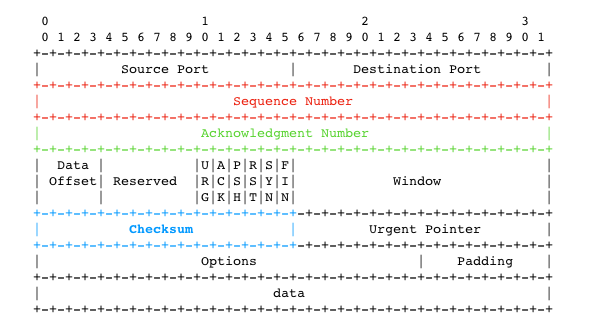
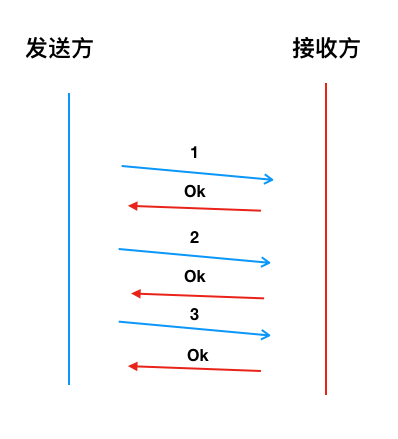
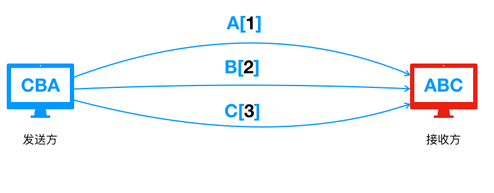

# 简单聊聊TCP的可靠性

## 前言

> 传输控制协议（缩写：TCP）是一种面向连接的、可靠的、基于[字节流](https://zh.wikipedia.org/wiki/字節流)的[传输层](https://zh.wikipedia.org/wiki/传输层)通信协议，由[IETF](https://zh.wikipedia.org/wiki/IETF)的[RFC](https://zh.wikipedia.org/wiki/RFC) [793](https://tools.ietf.org/html/rfc793)定义。

TCP在不可靠的IP协议之上实现了可靠性， 从而使得我们不必再去关注网络传输中的种种复杂性，所谓的可靠就是让我们去信任它即可

信任归信任，可我们还是的得去了解它，知道它为何值得信任，信任主要体现在哪些方面，换句话说就是

- TCP的可靠性是什么
- TCP如何实现的可靠性

上面的问题就是本文讨论的核心点

> TCP的可靠性实则是一个很大的话题，很多细节都值得深究，由于本人水平有限，文中很多描述都没有深入甚至可能有错误，读者若有不同观点，尽可提出


## 什么是可靠性

其实在[RFC 793](https://tools.ietf.org/html/rfc793)的`1.5 Operation`专门对**Reliability**（可靠性）做了说明

总结下来如下

> 确保一个进程从其接受缓存中读出的数据流是无损坏，无间隔，非冗余和按序的数据流；即字节流与连接的另一方端系统发送出的字节流是完全相同的


## 需要解决的问题

前面说到的可靠性，提到了无损坏，无间隔，非冗余和按序等几个关键词， 而在网络中要实现这些指标，我们都有对应的问题需要去解决

其中最典型的几个问题如下

- 干扰

  网络的干扰可能是因为硬件故障导致数据包受到破坏， 也有可能是网络波动导致数据包的某些bit位产生了变化

  > 题外话：这里不的干扰并不包含恶意攻击，恶意攻击是属于传输安全的范畴了，比如我们熟知的SSL/TLS就是一个成熟的网络传输安全问题的解决方案
  
  如下图，发送的`111` 由于干扰变成了`101`


- 乱序

  发送方连续先后发送两个数据包， 后发送的数据包可能先到达接收方，如果接收方按接收顺序处理数据包，这就会导致接收的数据包与发送的数据包不一致。

  造成这样的原因是因为每一个数据包都会根据当时的网络情况选择不同的路由进行传输， 就像从开车从上海到北京有很多路线可选，不一定你先出发就能先到（我没去过北京，请不要杠我......）

  如下图，发送方顺序发送了` A -> B -> C`三个数据包， 然而接收方可能是以`A -> C -> B`这样的顺序接收的报文，很明显 B 和 C两个个报文的顺序不符合期望，产生了乱序

  

- 丢包

  网络丢包是一个很常见的现象，造成的原因也多种多样，比较常见的有

  1. 接收方由于缓存溢出，导致无法再处理到来的数据包了，直接丢弃从而造成丢包

  2. 网络拥塞导致数据包丢包

  3. 数据包被检测到损坏了，被接收方丢弃造成了丢包

  4. ......

    
    
    下图展示了这种情况，发送的数据`CBA`由于`A`产生了丢包，导致接收方只收到了`CB`
    
    
    
     

- 冗余

  发送方可能因为某些原因重复发送了同一个数据包，接收方要有能力处理这种冗余数据包

  比如发送方发送的一个数据包因为网络拥塞迟迟没有被接收方收到， 发送方认为产生了丢包就又重发了一次，结果最终接收方收到了两个同样的数据包，产生了数据冗余


在继续往下看之前，可以先思考一下: 你会如何去解决这些问题？

## 0x01 解决干扰

为了能够检测到数据包在传输过程中是否发生了差错，TCP引入了**checksum**。

> checksum的具体细节可以查阅[RFC1071](https://tools.ietf.org/html/rfc1071)

下图是TCP的报文结构，蓝色部分就是checksum



**checksum**是一个16bit长的字段，发送方在计算checksum时会先将报文中的**Checksum**置零，然后基于整个报文（头部 + 数据部分）计算出checksum

> 实际上还会加上96bit的伪头部，可以参考[RFC 793](https://tools.ietf.org/html/rfc793) Header Format 一节

接收方在收到报文后也会计算checksum

- 如果计算结果符合期望值，说明数据包没有收到干扰/损坏
- 如果不符合期望，一般会直接丢弃该数据包

> TCP的校验和也有一定的限制，并不一定100%能检测到数据包产生的错误

这就和我们平常做API开发时的签名一样

## 0x02 解决乱序和冗余

请先回顾以下前面谈到乱序时的一个示例图

乱序有多个解决方案，比如发送一个数据后，我确认该发送的数据被接收方接收了我再发下一个，这样肯定是有序的， 但是这样的方案对网络利用率实在是太低了



另一个很朴实的解决方案就是为每个报文标上序号， 这样接收方在收到报文后只需要按序号对报文排序就可以得到有序的报文了，过程如下图所示




实际上TCP协议采用的就是为报文加上序号这样的方法

TCP的报文结构上维护着一个`Sequence Number`（下面简称`seq`），如下图的红色区域所示


TCP的发送端和接收端各自独立维护一个`seq`, `seq`的初始值是在创建连接时初始化的（值是随机的）

有一个控制位`SYN`就是专门用来在发送方和接收方同步`seq`的 （这里的同步指的是让对方知道自己的seq初始值是多少）

>详细内容参考RFC 793 的 3.3. Sequence Numbers

建立连接后的每一个报文都会携带`seq`

如下图所示，假设初始`seq=1`，发送的第一个报文**A**的长度为12， 那么发送第二个报文**B**的`seq=1+12=13`


接收方接收到多个报文后，可以基于seq多数据包进行升序排序，并且通过检查`seq`的值，可以判断接收的数据是否有间隔，以及数据是否是有序的。

除此之外，`seq`使得TCP有能力处理重复数据包的问题，因为接收方可以根据`seq`判断出该数据包是不是已经被接收了，这样顺带还解决了数据冗余的问题


## 0x03 解决丢包

丢包的原因可能各式各样，我们从一个简单的场景开始开始分析

>  假设没有丢包的情况下，如何让发送方知道接收方已成功接收到数据包了呢？

这就像人与人之间交谈，你如何判断对方听见了呢？

现实生活中我们靠的是对方的响应来做出判断


TCP也采用类似的机制，我们一般称之为`ACK`(Acknowledgment)：接收方在收到数据包以后会对发送方响应一个特定的数据包.

还是继续看一下TCP的结构图，注意绿色区域的`Acknowledgment Number`（后面简称`ack`）

> 注意大写ACK和小写ack是有区别的
>
> 大写ACK一般指的是报文的类型
>
> 小写ack指的就是这个32bit长的号码


`ack`与`seq`都是32bit长，前面我们说到TCP建立连接后发送的报文都会带上`seq`， 接收方在收到报文后，会响应一个类型为ACK的报文

报文的`acknowledgment number`的值是接收方下次期望收到的报文的`seq`值

> 实际上ack的值会受很多情况影响， 比如TCP的累积确认机制， 选择重传机制等等都会影响响应的ack值，细节可以参考[RFC 793](https://tools.ietf.org/html/rfc793)

有了`ACK`后， 发送方就可以知道报文有没有被正确接收了

请看下图，这是一个简单的交互， 发送方发送数据，接收方确认数据后做出响应


前面我们都是基于没有丢包的情况进行分析的，`ACK`并没有解决丢包的问题，如下图所示，发送的数据如果丢包了就没有`ACK`， `ACK`如果丢包了就不知道数据是否被正确接收。


此时我们引入**超时**和**重传**， 结合`ACK`机制一起来应对丢包的问题

- 发送方发送一个未被确认的数据包后就启动一个计时器
- 如果在指定时间内没有收到`ACK`， 发送方可以重传该报文


**超时重传** + **ACK**也有一个小问题，就是最开始提到的数据冗余问题

重传数据包可能导致接收方接收到多个重复的数据包， 如果你还没忘记的话，这个可以通过前面一节说到的`seq`去解决

> 实际上TCP的**拥塞控制**也是处理丢包的有效机制之一，有兴趣的同学可以去了解


## 0x04 基本可靠

在回顾一下我们最开始对可靠的要求

> 确保一个进程从其接受缓存中读出的数据流是无损坏，无间隔，非冗余和按序的数据流......

前面我们通过checksum, seq，ack，超时重传等机制，算是达到了一个可靠性的基本要求， 为什么说是基本可靠呢？

因为到目前为止我们的场景还都相对简单，所以会忽略掉很多变量和细节问题。

比如我们都没有提到很重要的`滑动窗口`，`拥塞控制算法`等， 但实际上这些也是TCP在复杂的网络环境中实现可靠性不可获取的东西


## 0x05 番外篇

本节作为番外篇，可以认为是对前面内容的一些补充，补充主要也是针对一些细节的地方，以FAQ的方式进行表述


1. 每个`seq`都需要一个`ack`吗？

   当然不是

   发送方可以直接发送多个报文， 接收方在接收到报文后先不急着响应`ack`，因为后续报文可能马上到达， 这就是`ACK延迟确认`

   延迟确认可以让我们同时对多个接受的报文进行一次确认，这个又称之为`累计确认`

   这样接收方就不必对每个报文都进行确认，接收到多个报文后如果延迟时间内没有报文到来，就发送下一个期望接收报文的`ack`， 如下图所示

   

2. 上图中，如果同时发送多个seq报文，若中间某一个丢包，ack如何响应呢？

一般接收方会有一个接收缓冲，会缓存接收到的报文，这些报文按seq值排序, 如果中间缺少某段报文，那么接收方就会响应这段报文的seq值

如下图所示，发送方发送了`seq=1,seq=2,seq=3`的报文， `seq=2`丢包， 但是接收方缓存了1和3，

所以知道这部分报文不连续，中间缺少2，所以响应了一个`ack=2` (一般叫做最小ack)

发送方重发seq=2的报文， 接收方发现`1,2,3`已经完整接收了，就响应下一个期望值, 即响应`ack=4`


3. 每发送一个报文就启动一个定时器吗？

为了保证可靠性，TCP增加了**超时重传**机制， 使得每个**未被确认**（ACK）的报文在一定时间后可以被重新发送

一种实现方式就为每个未被确认的报文都单独配置一个计时器，可是这样做的话开销太大了

在[RFC 6298](https://tools.ietf.org/html/rfc6298) 的`Managing the RTO Timer`中提及了一种**单一计时器**的管理方式（具体细节请参考文档）

> 每个已发送但未确认数据包都会被放进队列里， 这个队列持有一个单独的计时器
>
> 当第一个数据包进入队列时，计时器启动了
>
> 如果计时器超时，队列头部的数据包会被重发，并且计时器重新计时
>
> 当收到ACK时，计时器也会重启
>
> 队列的所有数据都被确认了的话，就关闭定时器


4. 超时时间怎么设置呢？ 

重传超时时间（Retransmission TimeOut）， 一般简称**RTO**， 这个时间既不能太长也不能太短。

- 太长可能会出现数据包已经丢了，但还要等待无谓的时间才能重传

- 太短可能数据包尚未到达，此时发生重传，浪费了资源

往返时延 [RTT](https://baike.baidu.com/item/RTT) （Round Trip Time）是配置RTO的一个重要指标， 但是由于网络间端到端的RTT并不是固定的，所以TCP采用了一种自适应的方法来计算RTT， 并且根据计算的值来配置RTO

整个过程是动态的，也就是说当RTT变化时，RTO也能相应的做出调整

具体的细节可以参考[RFC 6298](https://tools.ietf.org/html/rfc6298)的`The Basic Algorithm`


5. 一定要超时了才重传吗？

TCP有一个**快速重传**机制， 当一个接收方收到三个以上的重复`ack`时，接收方就会直接根据`ack`的值重传对应的报文而无需等待超时

下图展示了一个简单的示例


```markdown
1. 发送方发送了seq=1, seq=2, seq=3, seq=4的报文

2. seq=1的报文发送了丢包

3. 接收方分别接受到了`2,3,4`的报文，接收方缓存收到的报文，然后检查seq知道报文不连续，缺少`seq=1`的报文， 所以每次都响应`ack=2`
（为了简化描述，我们不考虑延迟确认和缓冲区大小）

4. 接收方连续收到了3个`ack=2`的报文，所以认为`seq=1`的报文丢包了，重传`seq=1`

5. 接收方收到`seq=1`的报文后，发现seq=2，seq=3,seq=4已经接收过了，直接响应`ack=5`
```


## 总结

我们看见TCP在实现**可靠性**上做出了很多精妙的设计，这些设计在大的方面追求至简，而在细节又追求极致，绝对是非常值得学习和思考的

TCP的这些设计你也可以在现在的软件系统中看到它的影子

- 比如消息队列有类似的ack机制去确保消息已经被投递
- 比如为了保证异步消息的有序性也会有类似`seq`的机制

正如前言所说，`可靠性`实则是一个很大的话题，不可避免的我还是留下了很多坑，如果有错误的地方，还望指出。


## 参考

1. James F.Kurose， Keith W.Ross 著 陈鸣译。《计算机网络 自顶向下方法》 (第六版)
2. [维基百科 TCP](https://en.wikipedia.org/wiki/Transmission_Control_Protocol)
3. [RFC 793](https://tools.ietf.org/html/rfc793)
4. [RFC 1071]( https://tools.ietf.org/html/rfc1071)
5. [RFC 6298](https://tools.ietf.org/html/rfc6298)
6. [一的补数](https://zh.wikipedia.org/wiki/一補數)
7. [二的补数](https://zh.wikipedia.org/wiki/二補數)
8. [往返时延]( https://en.wikipedia.org/wiki/Round-trip_delay_time)
9. [TCP超时重传机制](https://baike.baidu.com/item/TCP超时重传机制)
10. [拥塞控制](https://zh.wikipedia.org/wiki/拥塞控制)
