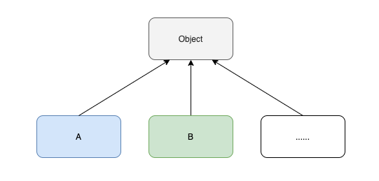
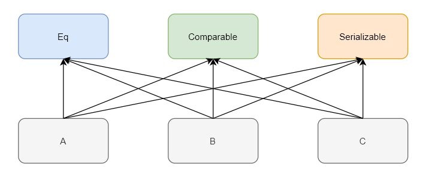
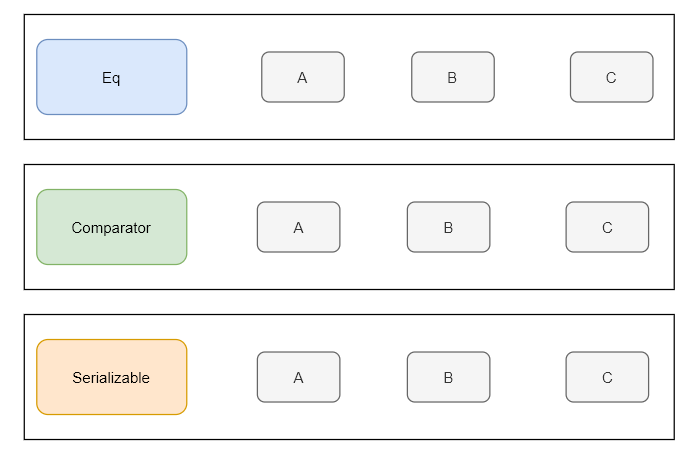

# 真的学不动了： 除了 class , 也该了解 Type classes 了

## 前言

作为一个 Java 开发者， `class` 的概念肯定是耳熟能详了，可是在山的另一边还有拥有别样风情的 `type classes`，但不翻过 Java 这座山，它就始终隔着一层纱。


## 一个经典的问题

在编程中，经常需要判断两个值是否相等，这就是**判等问题**， 然而在很长的一段时间内这个问题都没有一个标准的解决方案。

> 我这里统一使用  “值” 来代替对象、基本类型等等概念，以便于简化沟通

在 Java 中，我们可以用 `==` ，也可以用 `equals` 来判断值是否相等

```java
public void test() {
    boolean res = "hello" == "world";

    boolean res2 = "hello".equals("hello");

    boolean res3 = 3 == 3;

    boolean res4 = 5 == 9;
}
```

熟悉  Java 的同学都知道对于非基础类型，  `==` 操作实际比较的是对象的 hashCode，而 `equals` 方法的默认实现其实就是调用的  `==`  操作符

```java
public class Object {
  // ......
  
  public boolean equals(Object obj) {
  	return (this == obj);
  }
  
  // ......
}
```

所有类都会有 `equals` 方法，这是因为在 Java 中默认所有类型都是 Object 的子类，而 `equals` 方法的默认实现就被定义在了 Object 类中。

其实这也是 Java 语言处理**判等问题**的解决方案，即**统一从 Object 中继承判等方法**。



可是对于纯函数式的语言，比如 Haskell 来说，它没有 OOP 中的继承、类等概念，它又该如何优雅的解决判等的问题呢？

如果你对 Haskell 比较陌生，我们就换一种提问的方式：**还有其它通用的设计方案可以解决这类判等问题吗**？

当然有，**Type classes** 就是一种方案，不过要了解 Type classes， 还得先从多态开始。


## Type classes 与多态

Type classes 结合了 ad-hoc polymorphism（特设多态）和 Parametric polymorphism （参数化多态），实现了一种更通用的重载。

问题来了，什么是特设多态、参数化多态呢？

> 关于多态的更多内容 ，还可以参考我的前一篇文章《多态都不知道，谈什么对象》

- `ad-hoc polymorphism` （特设多态） 指的是函数应用不同类型的参数时，会有不同的行为（或者说实现）

  最典型的就是算术重载

  ```scala
  3 * 3  // 代表两个整形的乘法
  
  3.14 * 3.14 // 代表两个浮点数的乘法
  ```

  

- `Parametric polymorphism` （参数化多态） 指的是函数被定义在**某一些类型**之上，对于这些类型来说函数的实现都是一样的。

  比如 List[T] 的 `size()` 函数，无论 T 的类型是 String、还是 Int,  `size()` 的实现都一样

  ```scala
  List[String].size()
  List[Int].size()
  ```

虽然 Type classes 结合了两种多态类型，但它本身却被归到特设多态（ad-hoc polymorphism）这一分类下。

如果你想了解更多 type classes 的思想，非常推荐阅读 [《How to make ad-hoc polymorphism less ad hoc》](https://www.cse.iitk.ac.in/users/karkare/oldcourses/2010/cs653/Papers/ad-hoc-polymorphism.pdf) 这篇论文，它也算是 Type classes 的开篇作。


## Haskell 与 Type classes

**Type classes** 一般译作类型类，最开始是由 haskell 引入并实现，所以我们很有必要先了解一下 haskell 中的 Type classes。

以最开始提到的判等问题为例，来看看在 Haskell 中怎么用 Type classes 去解决。

首先我们得用关键字 `class` 定义一个 Type class，千万不要和 Java 的 class 混为一谈。

```haskell
class Eq a where
	(==) :: a -> a -> Bool
	(/=) :: a -> a -> Bool
```

注：/= 其实就是 !=


haskell 的 Type class 与 Java 的 Interface 类似，上面的 Eq 类型类就定义了 `==` 和 `/=` 两个抽象函数，其中的 a 是类型变量，类似于 Java 中的 List<T> 中的 T。

由此看来，Type classes 只是抽象了一些共同的行为，而这些行为的具体实现会根据类型的不同而不同，具体的实现会由**类型类实例**来定义。

通过 `instance` 关键字可以创建类型类实例，下面展示了针对于于 Float  和 Int 的 Eq 类型类实例

``` haskell
instance Eq Int where
	(==) = eqInt
	(/=) = neInt
	
instance Eq Float where
	(==) = eqFloat
	(/=) = neFloat

```

注：我们假设 eqInt、neInt、eqFloat、neFloat 都已经由标准库实现了


这样就可以直接用 `==` 和`/=` 函数对 Int 和 Float 进行判等了

```haskell
-- 判断 Int 的相等性
== 1 2
/= 2 4

-- 判断 Float 的相等性
== 1.2 1.2
/= 2.4 2.1
```

在调用 `==` 或 `/=` 函数时，编译器会根据参数类型自动找到类型类实例，然后调用类型类实例的函数执行调用。

如果用户需要自定义判等函数，只需要实现自己的类型类实例即可。


此时你可能会不自觉的和最开始提到的继承方案做一个对比，我画了两个图，可以参考一下

- 继承方案中，结构是一个层次型的




- Type classes 方案，结构是线性的



这样的差别就像是 Java 中 `Comparable` 和 `Comparator` 的区别一样。


## Scala 与 Type classes Pattern 

目前在 Java 中是无法实现 Type classes 的，但同为 JVM 的语言，多范式的 Scala 却可以实现。

但 Type classes 在 Scala 中其实也不是一等公民，也就是没有直接的语法支持，但借助于强大的**隐式系统**我们也能实现 Type classes，由于实现的步骤比较公式化，也就被称之为 Type classes Pattern (类型类模式)。

在 Scala 中实现 Type classes Pattern 大致分为 3 个步骤

1. 定义 Type class
2. 实现 Type class 实例
3. 定义包含**隐式参数**的函数


还是以前面提到的判等问题为需求，按照前面总结的模式步骤来实现一个 Scala 版的 Type classes 解决方案。

第一步定义 Type class，实际就是定义一个带泛型参数的 `trait`

> trait 也类似于 Java 的 interface，不过更加强大


```scala
trait Eq[T] {
  def eq(a: T, b: T): Boolean
}
```


接着我们针对 String、Int 来实现两个类型类实例

```scala
object EqInstances {
  // 处理 Int 类型的类型类实例
  implicit val intEq = new Eq[Int] {
    override def eq(a: Int, b: Int) = a == b
  }
  
  // 处理 String 类型的类型类实例
  implicit val stringEq = instance[String]((a, b) => a.equals(b))

  def instance[T](func: (T, T) => Boolean): Eq[T] = new Eq[T] {
    override def eq(a: T, b: T): Boolean = func(a, b)
  }
}
```

stringEq 和 intEq 采用了不同的构造方式

- stringEq 实例我采用的是类似于 Java 的匿名类进行构造
- intEq 实例则采用了高阶函数来实现

两个实例都被 `implicit` 关键字修饰，一般称之为**隐式值**，作用会在后面讲到。


最后一步，来实现一个带隐式参数的 `same` 函数，就是调用类型类实例来判断两个值是否相等

```scala
object Same {
  def same[T](a: T, b: T)(implicit eq: Eq[T]): Boolean = eq.eq(a, b)
}

```

- `implicit eq: Eq[T]`  就是隐式参数， **调用方可以不用主动传入，编译器会在作用域内查找匹配的隐式值传入**（这就是为什么前面的实例需要被 implicit 修饰）


通过实际的调用来验证一下，在调用时我们需要先在当前作用域内通过 `import` 关键字导入**类型类实例**（主要是为了让编译器能找到这些实例）

```scala

import EqInstances._

Same.same(1, 2)

Same.same("ok", "ok")

// 编译错误：no implicits found for parameter eq: Eq[Float]
Same.same(1.0F, 2.4F)
```

可以看见，针对 Int 和 String 类型的 `same` 函数调用能通过编译， 而当参数是 Float 时调用就会提示编译错误，这就是因为编译器在作用域内没有找到可以处理 Float 类型的 Eq 实例。

> 关于 Scala 隐式查找的更多规则可以查看  https://docs.scala-lang.org/tutorials/FAQ/finding-implicits.html


到这儿其实就差不多了，但是这样的写法在 Scala 里其实不是很优雅，我们可以再通过一些小技巧优化一下

- 将 `same` 函数改为 `apply` 函数，可以简化调用

- 使用 context bound 优化隐式参数，别慌，context bound 实际就是个语法糖而已

  

```scala
object Same {
  def apply[T: Eq](a: T, b: T): Boolean = implicitly[Eq[T]].eq(a, b)
}

// 使用 apply 作为函数， 调用时可以不用写函数名
Same(1, 1)
Same("hello", "world")
```

简单说一下  context bund，首先泛型的定义 由 `T` 变成了 `[T: Eq]`，这样就可以用 `implicitly`[Eq[T]] 让编译器在作用域内找到一个 Eq[T]  的隐式实例，context bound 可以让函数的签名更加简洁。

在 Scala 中，类型类的设计其实随处可见，典型的就有 `Ordered` 。


## 回望 Java

以判等问题引出 Type classes 有一些不足，我们只意识到了与 OOP 的继承是一个不一样的判等解决方案，不妨再回到 Java 做一些其他的比较。

以 `Comparator[T]` 接口为例，在 Java 中我们经常在集合框架中这样使用

```java
List<Integer> list = new ArrayList<>();
list.sort(Comparator.naturalOrder())
```

如果将其改造成为 Type classes 的话

```scala
trait Comparator[T] {
  def compare(o1: T, o2: T): Int
}

object Instances { 
  implicit val intComprator = new Comparator[T] {
    def compare(o1: Int, o2: Int) = o1.compareTo(o2)
	}
  
  //... other instances
}
```


List 的 sort 方法也需要改为带隐式参数的方法前面，这样我们就不需要显示的传 Compartor 实例了

```scala
// 编译期会自动找到 Comparator[Integer] 实例
List[Integer] list = new ArrayList<>();
list.sort()
```

> 可以认为上面的 Type classes 是基于 Scala 语法的伪代码


相信你也看出来了，与 Type classes 方案相比，最大的差别就是 Java 需要手动传入 Comparator 实例，也许你会疑惑：就这？

不要小看这两者的区别，这两者的区别就像用 var 定义类型一样

```java
// Java8
Map<String, String> map2 = new HashMap<>();

// Java10
var map = new HashMap<String, String>();
```


如果类型系统能帮你完成的事情，就让它帮你做吧！


## 总结一下

看了 Haskell 和 Scala 的例子，还是得总结一下：**Type classes 就是抽象了某一些类型的共同行为，当某个类型需要用到这些行为时，由类型系统去找到这些行为的具体实现**。

在 Scala 中基于隐式系统实现 Type classes Pattern 并不是很直观，好在 Scala3 中， Type classes 得到了足够的重视，直接提供了语法层面的支持，再也不用写一大堆的模板代码， 从此可以叫做 **Type classes without Pattern**。

不过为了避免“长篇大论”，相关的内容就留给下一篇文章了（学不动了 ing，但还得学）。


## 参考

1. [《How to make ad-hoc polymorphism less ad hoc》](https://www.cse.iitk.ac.in/users/karkare/oldcourses/2010/cs653/Papers/ad-hoc-polymorphism.pdf)
2. [Of Scala Type Classes](https://medium.com/se-notes-by-alexey-novakov/of-scala-type-classes-6647c48e39d9)
3. [Where does Scala look for implicits?](https://docs.scala-lang.org/tutorials/FAQ/finding-implicits.html) 
4. [Scala 隐式参数](https://docs.scala-lang.org/tour/implicit-parameters.html)
5. [Type classes for the Java Engineer](https://engineering.sharethrough.com/blog/2015/05/18/type-classes-for-the-java-engineer/)
6. [OOP vs type classes](https://wiki.haskell.org/OOP_vs_type_classes)
7. [Cats: Type classes](https://typelevel.org/cats/typeclasses.html)


