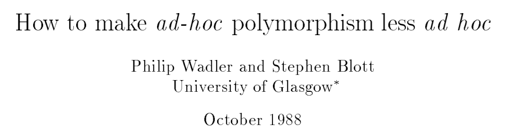

# 真的学不动了：除了 class，你该了解 type classes 了

## 前言

作为一个 Java 开发者， `class` 的概念肯定是耳熟能详了，可是在山的另一边还有 `type classes`，有着别样的风情，但不翻过 Java 这座山，它就始终隔着一层纱。


## Type classes 与多态

Type classes 一般译作**类型类**，最开始由 Haskell 实现，它结合了 ad-hoc polymorphism（特设多态）和 Parametric polymorphism （参数化多态），实现了一种更通用的重载。

那么特设多台和参数化多态是什么呢？简单了解一下

> 关于多态的更多内容 ，还可以参考我的前一篇文章《多态都不知道，谈什么对象》

- `ad-hoc polymorphism` （特设多态） 指的是函数应用不同类型的参数时，会有不同的行为（或者说实现）

  最典型的就是算术重载

  ```scala
  3 * 3  // 代表两个整形的乘法
  
  3.14 * 3.14 // 代表两个浮点数的乘法
  ```

  

- `Parametric polymorphism` （参数化多态） 指的是函数被定义在**某些类型**之上，对于这些类型来说函数的实现都是一样的。

  比如 List[T] 的 `size()` 函数，无论 T 的类型是 String、还是 Int,  `size()` 的实现都一样
  
  ```scala
  List[String].size()
  List[Int].size()
  ```
  

虽然 Type classes 结合了两种多态类型，但它本身却被归到特设多态这一分类下。

如果你想了解更多关于 Type classes 的内容，我非常推荐阅读 [《How to make ad-hoc polymorphism less ad hoc》](https://www.cse.iitk.ac.in/users/karkare/oldcourses/2010/cs653/Papers/ad-hoc-polymorphism.pdf) 这篇论文




## Type classes 与 Subtyping

Subtyping（子类型） 描述的是一种类型之间的关系，最典型的就是 OOP 中的继承。

在 Subtyping 中，类型之间的关系有着明显的层次结构


而在 Type classes 中，类型之间的关系则更像是一个线性结构


下面将分别从 Haskell 和 Scala 来看看 Type classes 的具体实例。


## Haskell 与 Type classes

为了更好的理解 Type  classes， 我们先来看看 Type classes 在 Haskell 中是怎么体现的吧。

> 该实例来自于《How to make ad-hoc polymorphism less and hoc》 

```haskell
class Num a where
	(+) :: a -> a -> a
	(*) :: a -> a -> a
	negate :: a -> a

instance Num Int where
	(+) = addInt
	(*) = mulInt
	negate = negInt

instance Num Float where
	(+) = addFloat
	(*) = mulFloat
	negate = negFloat
```

我们通过 `class` 关键字定义一个**类型类** Num，并定义了 +、*、negate 三个函数，这和 Java 中的接口很像。

后续通过  `instance` 关键字定义了**类型类实例**，其实就是实现了针对于 Int 和 Float 的 +、*、negate 函数， 我们假设 addInt， mulInt，negInt 等都是标准库已经实现的函数。

调用就很简单了

```haskell
+ 1 2 -- 输出 3

+ 1.5 2.5 -- 输出 4

negate 1

negate 1.2
```

在调用 `+ 1 2` 时编译器会根据参数类型，自动找到 `instance Num Int` 对应的 + 函数。


## Scala 与 Type classes Pattern

与 Haskell 不一样， Type classes 在 Scala 并不是一等公民，也就是说没有语法关键字来直接支持，但借助于隐式参数我们也能实现 Type classes，由于实现的步骤比较公式化，所以就被称之为 Type classes Pattern (类型类模式)。

步骤一般分为 3 步

1. 定义 Type class
2. 实现 Type class 实例
3. 定义包含**隐式参数**的函数

我们以大家熟悉的  `Comparator[T]` 接口来实现一个 Type class Pattern。

按照模式的步骤，我们先定义 Type class，实际就是一个参数化 trait，接口的语义我就不再解释了

> trait 类似于 Java 的 interface，不过更加强大

```scala
trait Comparator[T] {
    def compare(o1: T, o2: T): Int
}
```


接着我们针对 String、Int 来实现两个类型类实例

```scala
object ComparatorInstance {
  implicit val stringComparator = new Comparator[String] {
    override def compare(o1: String, o2: String): Int = o1.compareTo(o2)
  }

  implicit val intComparator = instance[Int]((o1, o2) => o1.compareTo(o2))

  def instance[T](func: (T, T) => Int): Comparator[T] = new Comparator[T] {
    override def compare(o1: T, o2: T): Int = func(o1, o2)
  }
}
```

- `stringComparator` 实例我采用的是和 Java 一样的匿名类写法
- `intComparator`  则采用了高阶函数来实现，不过最终都是得到的 `Comparator[T]` 实例

两个实例都被 `implicit` 关键字修饰，一般称之为隐式值，作用会在后面讲到。

最后一步，来实现一个带隐式参数的 `max` 函数：比较两个元素，并返回较大的元素。

```scala
object Max {
  def max[T](a: T, b: T)(implicit cmp: Comparator[T]): T = {
    cmp.compare(a, b) match {
      case -1 => b
      case _ => a
    }
  }
}
```

- `implicit cmp: Comparator[T]` 就是隐式参数， 调用方可以不用主动传入，编译器会在**作用域**内查找匹配的隐式值传入（可以查看最后的参考资料了解更多）

  

最后来进行调用，在调用时我们需要先在当前作用域内导入**类型类实例**

```scala
import ComparatorInstance._

Max.max(1, 2)

Max.max("hello", " world")

// 编译错误，找不到  Comparator[Float] 实例
Max.max(1.0F, 2.4F)
```

可以看见，针对 Int 和 String 类型的 `max` 函数调用能通过编译， 而对 Float 调用就会提示编译错误，这就是因为编译器没有找到可以处理 Float 类型的 Comparator 实例。

有没有发现，就这样我们就实现了 Haskell 中的类型类？

对了，上面的 Max 还可以通过 `apply` 和  **context bound** 再优化一下。

- 将 max 函数改名为 apply 以后，我们就可以直接通过 `Max(1, 2)` 进行调用了
- context bound 则是针对于隐式参数的一个语法糖，提供了直接的关键字 `implicitly`

```scala
object Max {
   
  /**
   *  implicitly[Comprator[T]] 就是让编译器在作用域内找到一个 Comprator[T] 的隐式值
   */
  def apply[T: Comparator](a: T, b: T): T =
    implicitly[Comparator[T]].compare(a, b) match {
      case -1 => b
      case _ => a
    }
 
}

// 测试
Max(1, 2)

Max("hello", "world")
```


## 回望 Java

作为 Java 开发者，肯定会不自觉的去比对 Java 版的 Comparator 实现，最后看到的唯一差别就是一个需要手动传参，一个不需要。

心里默念：就这？

不要小看这两者的区别，传参和不传参的区别就像下面用 var 和不用 var 一样

```java
var map = new HashMap<String, String>();

Map<String, String> map2 = new HashMap<>();
```

换句话说，能自动化的，就别手动。

再从 haskell 等纯函数式编程语言的的角度来看， Type classes 甚至是不可或缺的，就以判断两个值相等为例：

Java 默认所有类都是 Object 的子类，所以都有默认的 equals 方法用于判断。而Haskell 则没有 OOP 中继承的概念，这样一来类型类反而是最佳的解决方案了，


## 未完待续

Scala 的开发者们也关注到了 Type classes Pattern 的重要性，所以再 Scala3 中它也得到了足够的重视，提供了语法层面的支持，避免再写一大堆的模板代码。

当然，为了避免“长篇”大论，这些内容就留在下一篇文章了（欲知后事如何，【关注】下回分解）

还学的动吗？


## 参考

1. [Of Scala Type Classes](https://medium.com/se-notes-by-alexey-novakov/of-scala-type-classes-6647c48e39d9)
2. [Where does Scala look for implicits?](https://docs.scala-lang.org/tutorials/FAQ/finding-implicits.html) 
3. [Scala 隐式参数](https://docs.scala-lang.org/tour/implicit-parameters.html)
4. [Type classes for the Java Engineer](https://engineering.sharethrough.com/blog/2015/05/18/type-classes-for-the-java-engineer/)
5. [OOP vs type classes](https://wiki.haskell.org/OOP_vs_type_classes)
6. [Cats: Type classes](https://typelevel.org/cats/typeclasses.html)

