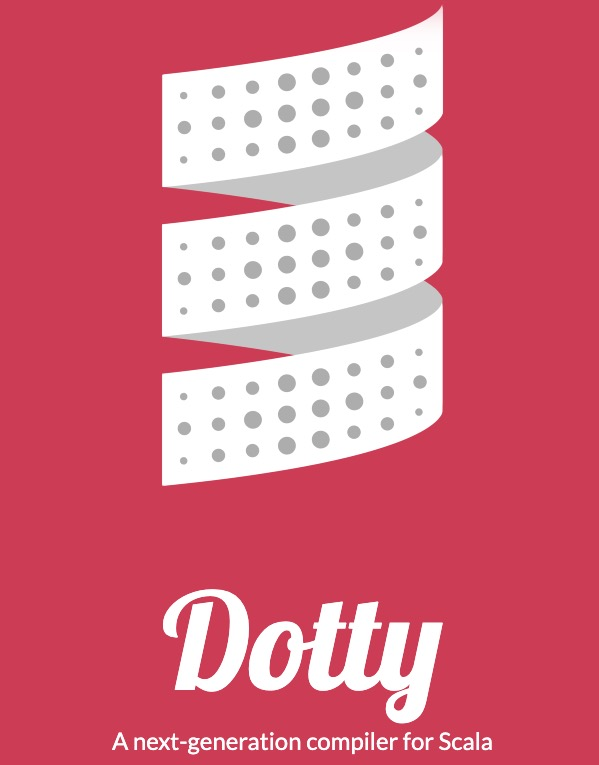

# 真的学不动了：Scala3 与 Type classes


## 引言

Type classes 源自 Haskell，在 Scala 中并没有直接的语法和概念，但却可以借助于强大的**隐式系统**间接实现，一般称之为 Type classes Pattern。

Type classes pattern 可谓是 Scala 中的屠龙技之一，然而这一招式随着 Scala3 的发布也产生了巨大的变化......

> 关于 Type classes 更多内容，可以参考 [《真的学不动了: 除了 class , 也该了解 Type classes 了》](https://blog.cc1234.cc/articles/typeclasses-1/typeclasses-1.html)。


## 回顾 Scala2 与 Type classes

Scala2 中 Type classes Pattern 有个固定的套路

1. 基于 trait 和泛型定义 Type class
2. 实现 Type class 实例
3. 定义包含**隐式参数**的函数

下面用 Scala2 中的 Type classes Pattern 来改造一下经典的  `Comparator` 接口，相比于上一篇文章，这里的实现会多一些细节。

```scala
trait Comparator[T] {
  def compare(a: T, b: T): Int
}

object ComparatorInstances {
  implicit val intComparator = new Comparator[Int] {
    override def compare(a: Int, b: Int) = a.compareTo(b)
  }
  
  implicit def listComparator[T](implicit cmp: Comparator[T]) = new Comparator[List[T]] {
    override def compare(a: List[T], b: List[T]): Int = {
      (a, b) match {
        // 连个都为空
        case (Nil, Nil) => 0
        // 某一个为空
        case (Nil, _) => 1
        case (_, Nil) => -1
        // 两个都不为空，
        case (l, r) =>
          // 比较头结点
          cmp.compare(l.head, r.head) match {
            // List.tail 表示除了头结点以外的结点
            case 0 => compare(l.tail, r.tail)
            case num => num
          }
      }
    }
  }
}

object Same {
  def apply[T](a: T, b: T)(implicit cmp: Comparator[T]) = cmp.compare(a, b) == 0
}
```

稍微要说一下的就是  `listComparator`  这个函数了，这种用 `implicit def` 定义的方法一般称之为「隐式转换方法」。

隐式转换方法就是由编译器把参数的类型转换为返回值的类型（不需要显示的调用该方法）。

而   `listComparator`   函数的作用就是当你需要 Comparator[List[T]] 的实例时，编译器会在作用域内找到 Comparator[T] 的实例，然后将其转换为 Comparator[List[T]] 的实例。

如果没有这个方法

- 处理 List[Int] 时需要定义一个 Comparator[List[Int]] 类型类实例
- 处理 List[String] 时需要定义一个 Comparator[List[String]]  类型类实例
- ......

有了该隐式方法以后

- 处理 List[Int] 时，编译器会找到  Comparator[Int] 的实例， 然后根据该方法得到 Comparator[List[Int]] 实例进行处理
- 处理 List[String] 时， 编译器会找到  Comparator[String] 的实例， 然后根据该方法得到 Comparator[List[String]] 实例进行处理
- ......

其实最主要的作用就是在处理高阶类型时能复用已有的 Type class 实例。

最后再来测试一下， 调用前需要先将 Type class 实例都导入（正常的 import 语法）到作用域内

```scala
import ComparatorInstances._
Same(1, 2)
Same(List(1, 2), List(1, 2))
```


在 Scala 中实现 type classes，很多时候还会使用**函数扩展**来简化调用，Scala 中的函数扩展是基于隐式类来实现的。

比如下面的代码就是在不修改 T 类型的情况下为 其扩展了 `<` 、 `>` 和 `isSameTo`  三个个函数

```scala
object ComparatorInstances {
  // ...

  implicit class Ops[T](a: T)(implicit cmp: Comparator[T]) {
    
    def isSameTo(b: T) = cmp.compare(a, b) == 0
    
    def <(b: T) = cmp.compare(a, b) < 0

    def >(b: T) = cmp.compare(a, b) > 0
  }

}
```

结合 Type classes Pattern 和函数扩展，使得调用更加自然（中缀式表示）

```scala
import ComparatorInstances._
Same(List(1, 2), List(1, 2))
// 函数扩展为 List 扩展了 < 函数
List(1,2).<(List(1, 3))
// 也可以省略 . 和参数括号
List(1, 2) < List(1, 3)
// 函数扩展
List(1,2).isSameTo(List(2, 3))
List(1, 2) isSameTo List(2, 3)

```


虽然借助于隐式系统实现了 Type classes, 但还是有刺可以挑的

- 语言层面的支持不友好

  引入了晦涩的隐式转换等概念，而这也是导致 Scala 的 Type classes 难以掌握的原因之一。

  难道就不能有更友好的语法支持吗？

- 实例导入冲突

  我明明只是导入了某些依赖，但这个依赖里面却有 type class 实例，它覆盖了我期望调用的实例，造成了非常隐秘的 BUG。

  （从另一个角度来说，这个**实例可覆盖**又是一个灵活性的体现）

  难道就不能区分普通的 import 和 type class 实例的 import 吗？

> 对于使用隐式系统实现 Type classes 的缺点，还可以参考  《[The Limitations of Type Classes as Subtyped Implicits》](https://www.adelbertc.com/publications/typeclasses-scala17.pdf)


## 探秘 Scala3 与 Type classes

在 Scala 2 中，隐式系统是造成  Type classes Pattern 难以掌握的原因之一。

而在  Scala3 中，将再也不用为 纠结 implicit 该怎么用了， 它被全新的 `Given`、`Using` 、`Extension Method` 等特性所替代。

> 要使用 Scala3 的语法的话，需要到 https://dotty.epfl.ch/ 下载 Dotty 编译器



Talk is Cheap，我们用 Scala3 的语法再次改造一遍 Comparator 。


### Given 与 Type class 实例

首先是 Type class 的定义，这一块和以前没有区别，还是基于 trait 和泛型。

```scala
trait Comparator[T] {
  def compare[T](a: T, b: T): Int
}
```


然后就是实现 Type class 实例了，用全新的语法 `given...as` 来实现。

```scala
given intCompare as Comparator[Int] {
  override def compare(a: Int, b: Int) = a.compareTo(b)
}
```

given 后面跟实例名称， as 可以指定类型，实际体验和「匿名类」的构造很相似。

given 支持命名构造和匿名构造，当使用匿名构造时编译器会为实例自动生成一个可读的名称，下面展示了具体的代码：

```scala
object ComparatorInstances {

  // 命名构造
  given intComparator as  Comparator[Int] {
    override def compare(a: Int, b: Int) = a.compareTo(b)
  }
  
  // 匿名构造 自动生成可读的实例名称： given_Comparator_String
  given Comparator[String] {
    override def compare(a: String, b: String) = a.compareTo(b) 
  }

  // 高阶函数命名构造
  given doubleComparator as Comparator[Double] = instance[Double]((a, b) => a.compareTo(b))
  
  // 高阶函数匿名构造
  given Comparator[Float] = instance[Float]((a, b) => a.compareTo(b))
  
  private def instance[T](func: (T, T) => Int) = new Comparator[T] {
    override def compare(a: T, b: T) = func(a, b)
  }
}
```


### Using 与 Given

前面通过 `given` 实现了类型类实例，可是什么时候使用这些实例呢？

这就轮到好基友 `using` 出场 了， `using`  用于修饰参数。

被 using 修饰的参数称之为**上下文参数**，该参数可以不用手动传入，编译器会在作用域内寻找匹配的 given 实例传入（类似于 Scala2 的隐式参数）。

```scala
object Same {
  // 命名上下文参数
  def apply[T](a: T, b: T)(using cmp: Comparator[T]) = cmp.compare(a, b) == 0
}
```


### Given Import

前面提到『编译器会在作用域自动寻找匹配的 given 实例』，在 Scala2 以前主要是通过 Import 导入，也就是 `import ComparatorInstances._` 。

在 Scala3 中即使这样导入了，编译仍然报错：提示找不到对应的实例。

这是因为针对 given 实例的导入也有了单独的语法，特意用于区分普通的依赖导入。

Scala3 中，given 实例的导入称之为  `given import， 它的语法也很简单

```scala
// 导入单个实例
import xxx.{given aInstance}
// 通配符 导入所有实例
import xxx.{given _}
```


通过 ComparatorInstances 验证一下

```scala
// 导入所有 given 实例就用占位符 _
// 也可以只导入某一个实例
import ComparatorInstances.{given _}

Same(1, 2)
Same(1.2F, 2.2F)
Same(1.2D, 2.2D)
Same("ok", "ok")

```


这样，一个  Scala3 版的 Type classes Pattern 就完成了，一个 implicit 也看不见了。

相较于 Scala2 版，并没有减少多少代码量，但更直接的语法支持却是大大增强了可读性。

下面是自创的一个新版 Type classes Pattern「记忆语法」

> [使用]编译器在[作用域内]找到的[给定实例]
>
> [using].............[given import]......[given instance]


### Extension Method

在 Scala2 中药实现**函数扩展**得基于 `implicit class`，但是光看名字很难将这两者关联起来。

好在 Scala3 也注意到了这个问题，索性就之间新增了一个`extension method` 的特性，实际就是**函数扩展**。

`Extension method`  是一种新的**函数定义语法**（忘记 implicit class 吧），参考下面的代码

```scala
trait Comparator[T] {
  def compare[T](a: T, b: T): Int
  
  def (a: T) >(b: T) = compare(a, b) > 0
  def (a: T) <(b: T) = compare(a, b) < 0
}
```

 `>` 和 `<` 就是全新的函数扩展语法

- `a: T` 就是需要扩展函数的类型
- `b: T` 就是函数的实际参数

假设 T 为 String 类型，那么我们就可以直接写出下面的中缀式调用语法

```scala
// 为字符串扩展了 > 函数
"ok".>("hello")

// 也可以省略 . 和括号
"ok"  > "hello"
```


除了为类型扩展函数外，该语法也可以实现 Scala2 的隐式方法的功能。

我们将 Scala2 中 `implicit def listComparator` 实例用 `extension method` 的语法在实现一遍（还需要借助 using）

```scala
object ComparatorInstances {
  
  // ......
  
  def [T](a: List[T]) listInstance(using cmp: Comparator[T]): Comparator[List[T]] = new Comparator[List[T]] {
    override def compare(a: List[T], b: List[T]): Int = {
      (a, b) match {
        case (Nil, Nil) => 0
        case (Nil, _) => 1
        case (_, Nil) => -1
        case (l, r) =>
          cmp.compare(l.head, r.head) match {
            case 0 => compare(l.tail, r.tail)
            case num => num
          }
      }
    }
  }
}
```


### 旧瓶装新酒？

如果你已经跨过了隐式系统那道门槛，这样的语法改变可能并不会给你带来多大的惊喜，感觉就像酒瓶装新酒一样，似乎没多大的新意？

而在我看来这样的「旧瓶装新酒」却是 Scala 提升亲和力的体现，当然 Scala3 也不止这些改变，更多特性可以参考 https://dotty.epfl.ch/docs/reference/overview.html。


## 比较 Scala2 与 Scala3

 `given`、`using`、`extension method`  等特性在 Scala3 被统一称之为**抽象上下文**（Contextual Abstractions），前面已经或多或少拿它们与  Scala2 的隐式系统做过参照了。

不过这里还是打算单独拿出来对比一下，就相当于一个简单的总结吧。

1、 `given` 可以当做无参的 `implicit object` 或 `implicit val`

```scala
given intComparator as Comparator[INT] { ... }
```

```scala
implicit object intComparator Comparator Ord[Int] { ... }

implicit val intComparator = new Comparator[Int] { ... }
```


2、using 可以当做以前的**隐式参数**

```scala
def same[T](a: T, b: T)(using cmp: Comparator[T]) {...}
```

```scala
def same[T](a: T, b: T)(implicit cmp: Comparator[T]) {...}
```


3、extension method 可以当做以前的**隐式类**

```scala
trait Comparator[T] {
  def compare(a: T, b: T): Int

  def (a: T) >(b: T) = compare(a, b) > 0
  def (a: T) <(b: T) = compare(a, b) < 0
}
```

```scala
implicit class ComparatorOps[T](a: T)(implicit cmp: Comparator[T]) {
    def <(b: T) = cmp.compare(a, b) < 0

    def >(b: T) = cmp.compare(a, b) > 0
}
```


## 一些期待

开发者们一直喜欢拿 Scala 和 Haskell、Java 作比较，甚至在对应社区一直有这样的声音

- A worse Haskell for the JVM
- A better Java

造成这些印象的原因是 Scala 融合了 OOP 和 FP 两种编程范式，但这也恰好是 Scala 一直坚持的方向。

随着 Scala3 的发布，是不是会带来不一样的惊喜呢？有点期待


## 参考

1. [Dotty: A next-generation compiler for Scala](https://dotty.epfl.ch/)
2. [The Limitations of Type Classes as Subtyped Implicits](https://www.adelbertc.com/publications/typeclasses-scala17.pdf)
3. [Scala Type Classes comparison](https://medium.com/se-notes-by-alexey-novakov/scala-type-classes-comparison-28b76ce1f37a)
4. [真的学不动了: 除了 class , 也该了解 Type classes 了](https://blog.cc1234.cc/articles/typeclasses-1/typeclasses-1.html)
5. [preparing_for_scala_3_PPT](https://www.slidestalk.com/u39/preparing_for_scala_3_light_bend_vsjjhm)