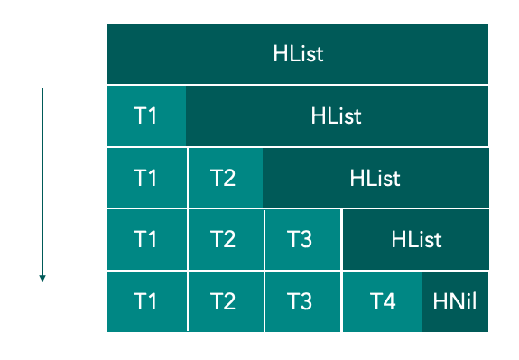
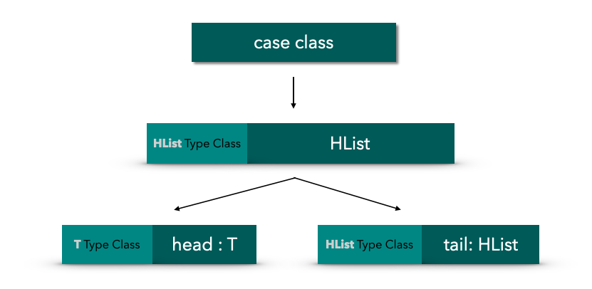

# 使用 Shapeless 实现 Type class 派生

## 前言

本文主要是讨论在 Scala 中自动为 case class 派生 Type class，如果你不知道什么是 Type class 的话，建议先阅读我的上一篇文章。

> *[《真的学不动了： 除了 class , 也该了解 Type classes 了》](https://blog.cc1234.cc/articles/typeclasses-1/typeclasses-1.html)*


## 为什么要实现 Type class 派生

假设现在有一个可以将类转为字符串的 Type class，如下：

```scala
trait Show[T] {
  def show(t: T): String
}

object Show {
  def apply[T](t: T)(implicit show: Show[T]): String = show.show(t)
}
```


正常情况下，针对每一个待处理的类型都需要有一个匹配的 Type class 实例。

比如下面的 User 和 Product 两个 case class 就需要两个 Type class 实例。

```scala
case class User(name: String, age: Int, weight: Double)

case class Product(name: String, price: Long)
```


它们对应的 Type class 实例

```scala
implicit val userShow = new Show[User] {
  override def show(t: User): String = s"${t.name} ${t.age}岁 ${t.weight}kg"
}

implicit val productShow = new Show[Product] {
  override def show(t: Product): String = s"${t.name} ${t.price} 分"
}
```


当我们调用 Show 时，编译器就会为自动找到匹配的 Type class  实例传入

```scala
Show(User("Jack", 18, 50))
Show(Product("Cat", 1000))
```


这样每新增一个 case class，都需要手动实现一个 Type class 实例，必然会产生很多样板代码。

那么有没有一种方式能够自动派生 Type class 实例呢？

当然有，而且方案不止一个，本文主要讨论 Shapeless 的实现方案


## Shapeless

[Shapeless](https://github.com/milessabin/shapeless) 是一个为 Scala 编写的通用的类型级编程库，它提供了很多有用的类型，比如 HList 和 Generic，这两个类型也是实现  Type class 自动派生的基础。

下面先来简单了解一下 HList 和 Generic


### HList

`HList` 是 **Heterogenous lists** 的简写，一般叫做**异类列表**，这里的异类指的是 HList 中的元素可以是不同的类型（就像 Tuple 一样）。

`HList` 本身是一个特质（类似于接口），有着 `HNil` 和 `::` 两个实现类

注：`::` 是类名，Scala 支持使用符号作为类型名称

```scala
sealed trait HList

// HNil 代表空元素的 HList
sealed trait HNil extends HList 
case object HNil extends HNil


// 第二个参数 tail 也是 `HList` 类型的，也就是递归定义的。
final case class ::[+H, +T <: HList](head : H, tail : T) extends HList
```


下面展示了一个简单的 `::` 类的构造

```scala
val hListObject = ::("String", ::(1, ::(2.2F, HNil)))
```


shapeless 还提供了很多隐式转换方法，可以更便捷的构造 HList

```scala
import shapeless._

// 这里的 :: 是 case class 构造器
val jack = ::("Jack", ::(18, ::(50.5d, HNil)))

// 下面的 :: 是一个隐式转换方法
val tom = "Tom" :: 18 :: 50.5d :: HNil
```


对比一下 HList 和 case class，会发现它们的结构非常相似。

```scala
case class User(name: String, age: Int, weight: Double)

val jack = User("jack", 18, 50.5d)      // case class
val tom = "Tom" :: 18 :: 50.5d :: HNil  // HList
```


正因为 HList 和 case class 的结构类似，所以它们也可以互相转换，而转换的方式就是使用  Generic。


### Generic

Shapeless 提供的 Generic 可以实现 HList 和 case class 之间的转换。

其实 Generic 的接口定义并不限于 HList 和 case class 的转换，只是定义了 **T** 和 **Repr** 两个泛型，所以理论上是可以基于 Generic 去实现任意两种类型的转换的。

```scala
trait Generic[T] {
  type Repr
  
  def to(t : T) : Repr
  
  def from(r : Repr) : T
}

```


通过 Generic 的伴生对象可以很轻松的构建一个 Generic 实例，Generic 的实现使用了一个称之为 [Aux Pattern](http://gigiigig.github.io/posts/2015/09/13/aux-pattern.html) 的手段，主要是为了绕过编译器的限制，这里可以不用深究。

```scala
object Generic {
  type Aux[T, Repr0] = Generic[T] { type Repr = Repr0 }
  
  def apply[T](implicit gen: Generic[T]): Aux[T, gen.Repr] = gen
}
```


下面的代码展示了如何使用 Generic 在 `case class User` 和 `HList` 之间进行转换

```scala
val generic = Generic[User]

// case class => HList
val userHList: ::[String, ::[Int, ::[Double, HNil]]] = generic.to(User("Jack", 18, 50))

// HList => case class
val userClass: User = generic.from(userHList)
```


Shapeless 已经在隐式作用域内提供了能转换 case class 和 HList 的 Generic 实例，可以向下面这样直接使用

```scala
import shapeless._

// 定义 case class
case class Demo()

// 接受一个 case class，返回一个 HList。
// Generic.Aux[C, HL] 的实例在 Shapeless 库中已经有了
def genericTest[C, HL <: HList](t: C)(implicit gen: Generic.Aux[C, HL]): HList = {
  gen.to(t)
}

genericTest(Demo())  // 转为了 HNil
```


## 思路

那么如何借助 Shapeless 来为 case class 自动派生 Type class 实例呢？

其实思路很简单，既然 case class 都可以转为 HList，那么只需要定义 HList 的 Type class 实例，然后复用该实例就可以了，这样问题就变成了如何实现 HList 的 Type class 实例了。

如下图所示，HList 可以被递归的分解为 「头节点 + 尾列表」



这样实现 HList 的 Type class 实例又被分解成了

- 实现单个元素类型（如 T1、T2、T3、T4等）的 Type class 实例
- 实现 HNil 的 Type class 实例

整个分解的步骤如下图




好了，Talk is Cheap，Show me the code

## 实现

下面就基于 Shapeless 将 Show 扩展成为一个可以支持 case class 的 Type class。

```scala
trait Show[T] {
  def show[T](t: T): String
}

object Show {
	def apply[T](t: T)(implicit showInstance: Show[T]): String = showInstance.show(t)
}
```


先提供一个隐式转换方法，该方法**返回一个可以处理 case class 类型的 Show 实例**。

方法逻辑很简单，其实就是将 case class 转为 HList， 然后调用 HList 的 Show 实例将 HList 转为字符串。

其实就是组合 Generic.Aux[C, HL] 和 Show[HList] 两个 Type class 实例

注：Generic.Aux 实例由 Shapless 提供

```scala
/**
 * @tparam C   任意 case class
 * @tparam HL  任意 HList 类型
 */
implicit def caseClassShow[C, HL <: HList](implicit generic: Generic.Aux[C, HL], hListShowInstance: Show[HL]) = new Show[C] {
  override def show(a: C): String = hListShowInstance.show(generic.to(a))
}
```


那么 HList 的 Show 实例哪来呢？当然得我们自己提供了。

HList 有两个子类：`HNil` 和 `::` ，所以要实现两个 Type class 实例。

HNil 的很简单

```scala
// 针对 HNil 类型的 Type class 实例
implicit val hNilShow = new Show[HNil] {
  override def show(a: HNil): String = ""
}
```


`::` 的 Show 实例也需要组合两个类型的实例，所以又需要用到隐式方法了。

前面已经分析过了，`::` 可以拆分为 「头节点 +尾列表」，所以 `::` 的 Show 实例就是**组合头节点类型的实例和尾列表 HList  的实例**。

```scala
/**
 * 针对 :: 类型的 Type class 实例
 * @tparam T  任意类型
 * @tparam HL 任意 HList 类型
 */
implicit def hListShow[T, HL <: HList](implicit head: Show[T], hListShowInstance: Show[HL]) = new Show[::[T, HL]] {
  override def show(a: ::[T, HL]): String = s"[${head.show(a.head)}, ${hListShowInstance.show(a.tail)}]"
}
```


HList 的实例已经有了，再定义几个基本类型的 Show 实例就可以了

```scala
implicit val intShow = new Show[Int] {
  override def show(a: Int): String = s"$a"
}

implicit val doubleShow = new Show[Double] {
  override def show(a: Double): String = s"${a}d"
}

implicit val stringShow = new Show[String] {
  override def show(a: String): String = s"\'$a\'"
}

// ......
```


最后再来验证一下

```scala
import shapeless._

case class User(name: String, age: Int, weight: Double)

val jack = User("jack", 18, 55.0)
Show.show(jack) // 编译通过，输出：['jack', 18, 55.0d]
```


为了更清晰的展示整派生过程，我画了一个简单的推导图

 


## 总结

整个派生的过程利用了编译器的推导，相较于利用反射等其他运行时的技术手段来实现，这样的方式更加的巧妙，并且天然就拥有了类型的静态检查。

但是这样的推导其实也有一个不足，就是无法拿到 case class 的属性名称。

再多说一句，在 Scala3 中已经提供了原生的 Type class 派生语法了，相较于 Shapeless 方案，语言原生的支持肯定更加完备，感兴的可以到[官网文档](https://dotty.epfl.ch/docs/reference/contextual/derivation.html)查看。

## 参考

1. [Shapeless 入门指南（一）：自动派生 typeclass 实例](https://scala.cool/2017/09/shapeless-1/)，By Jilen
2. [Simple Generic Derivation with Shapeless](http://www.dreadedsoftware.com/blog/2017/1/4/simple-generic-derivation-with-shapeless)，By Marcus Henry
3. [aux pattern](http://gigiigig.github.io/posts/2015/09/13/aux-pattern.html)，By Luigi
4. [Dotty: Type Class Derivation](https://dotty.epfl.ch/docs/reference/contextual/derivation.html)
5. [Shapeless](https://github.com/milessabin/shapeless)