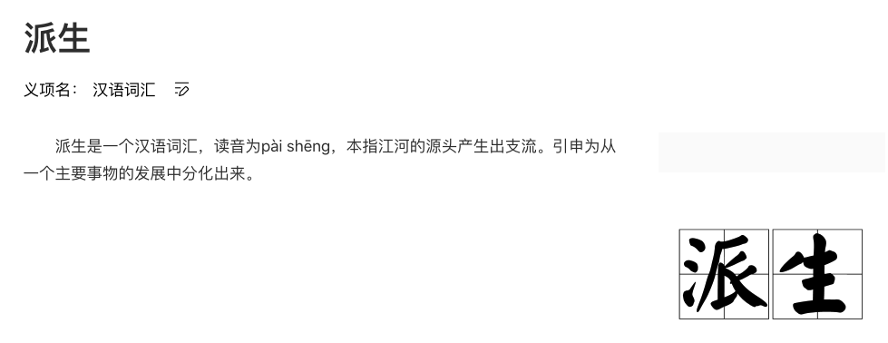

# Scala2 如何实现 Type class 派生

## 前言

本文主要是讨论在 Scala 中自动为 case class 派生 Type class 实例，如果你不知道什么是 Type class 的话，建议先阅读我的上一篇文章 *[《真的学不动了： 除了 class , 也该了解 Type classes 了》](https://blog.cc1234.cc/articles/typeclasses-1/typeclasses-1.html)*。

> 本文使用 Scala 版本为 2.13.2
>
> Shapless 版本为 2.3.3



## 提出问题

假设我现在有一个用于生成随机测试数据的 Type class

```scala
trait Random[T] {
  def random(): T
}

object Random {
  def apply[T]()(implicit random: Random[T]) = random.random()
}
```


并且已经实现了 Int， Boolean 等基本类型的 Random 实例

```scala
implicit val intRandom = new Random[Int] {
  override def random(): Int = Math.abs(scala.util.Random.nextInt(10000000))
}

implicit val stringRandom = new Random[String] {
  override def random(): String = UUID.randomUUID().toString
}

implicit val booleanRandom = new Random[Boolean] {
  override def random(): Boolean = scala.util.Random.nextBoolean()
}

// ......
```


这样就可以像下面这样生成基本类型的随机数据了

```java
val id = Random[Int]()
val name = Random[String]()
```


但在实际开发中，经常要面对很多组合类型， 比如下面的 Doctor 和 User 类型

```scala
case class Doctor(id: Int)

case class User(id: Int, name: String, isCertified: Boolean)
```


如果要使用 Random 生成这样的数据就得实现 Random[User]、Random[Product] 实例

```scala
implicit val userShow = new Random[User] {
  override def random(): User = User(scala.util.Random.nextInt(), UUID.randomUUID().toString, scala.util.Random.nextBoolean())
}

// ... 省略 Product 的实例
```


上面的实现没有复用已有的 Random[Int], Random[Boolean] 和 Random[String] 实例，为了做到复用，一般会使用隐式方法来实现

```scala
implicit def userRandom(implicit intRandom: Random[Int],
                        stringRandom: Random[String],
                        booleanRandom: Random[Boolean]): Random[User] = {
  instance(() => User(intRandom.random(), stringRandom.random(), booleanRandom.random()))
}
```


这样我们就可以生成随机数据了

```scala
val user = Random[User]()
val doctor = Random[Doctor]()
```


通过 Random\[User\]() 的调用简单说一下编译器的推导过程

- 调用 Random[User] 实际是调用的 **Random\[User\](implicit random: Random[User] )**
- 编译器没有找到 Random[User] 实例，但是发现方法 **implicit def userRandom** 会返回一个 Random[User], 于是调用该方法
- **implicit def userRandom**  有需要 Random[Int]、Random[String] 和 Random[Boolean]，编译器在作用域内找到对应实例并注入


如果按照上面的实现方式，每一个 case class 都得去实现一个 Random[T] 的实例，这样势必会写很多样板式的代码。

有没有一种实例的实现能支持任意 case class ，只有在我需要自定义的时候才自己去实现呢？

Shapeless 给了我们一个答案


## Shapeless

[Shapeless](https://github.com/milessabin/shapeless) 是一个为 Scala 编写的通用的类型级编程库，它提供的 HList 和 Generic 可以帮助我们实现 Type class 的派生。

这里的派生指的是我们的 Type class 能处理任意 case class， 就像是专门为该类型实现了一个 Type class 实例一样。

下面先来简单了解一下 HList 和 Generic。


### HList

`HList` 是 **Heterogenous lists** 的简写，一般叫做**异类列表**，这里的异类指的是 HList 中的元素可以是不同的类型（就像 Tuple 一样）。

`HList` 本身是一个特质（类似于接口），有着 `HNil` 和 `::` 两个实现类

注：`::` 是类名，Scala 支持使用符号作为类型名称

```scala
sealed trait HList

// HNil 代表空元素的 HList
sealed trait HNil extends HList 
case object HNil extends HNil


// 第二个参数 tail 也是 `HList` 类型的，也就是递归定义的。
final case class ::[+H, +T <: HList](head : H, tail : T) extends HList
```


下面展示了一个简单的 `::` 类的构造

```scala
val hListObject = ::("String", ::(1, ::(2.2F, HNil)))
```


shapeless 还提供了很多隐式转换方法，可以更便捷的构造 HList

```scala
import shapeless._

// 这里的 :: 是 case class 构造器
val jack = ::("Jack", ::(18, ::(50.5d, HNil)))

// 下面的 :: 是一个隐式转换方法
val tom = "Tom" :: 18 :: 50.5d :: HNil
```


对比一下 HList 和 case class，会发现它们的结构非常相似。

```scala
case class User(name: String, age: Int, weight: Double)

val jack = User("jack", 18, 50.5d)      // case class
val tom = "Tom" :: 18 :: 50.5d :: HNil  // HList
```


正因为 HList 和 case class 的结构类似，所以它们也可以互相转换，而转换的方式就是使用  Generic。


### Generic

其实 Generic 的接口定义并不限于 HList 和 case class 的转换，它只是定义了 **T** 和 **Repr** 两个泛型，所以理论上是可以基于 Generic 去实现任意两种类型的转换的。

```scala
trait Generic[T] {
  type Repr
  
  def to(t : T) : Repr
  
  def from(r : Repr) : T
}

```


通过 Generic 的伴生对象可以很轻松的构建一个 Generic 实例，Generic 的实现使用了一个称之为 [Aux Pattern](http://gigiigig.github.io/posts/2015/09/13/aux-pattern.html) 的手段，主要是为了绕过编译器的限制，这里可以不用深究。

```scala
object Generic {
  type Aux[T, Repr0] = Generic[T] { type Repr = Repr0 }
  
  def apply[T](implicit gen: Generic[T]): Aux[T, gen.Repr] = gen
}
```


下面的代码展示了如何使用 Generic 在 `case class User` 和 `HList` 之间进行转换

```scala
val generic = Generic[User]

// case class => HList
val userHList: ::[String, ::[Int, ::[Double, HNil]]] = generic.to(User("Jack", 18, 50))

// HList => case class
val userClass: User = generic.from(userHList)
```


因为 Shapeless 已经在隐式作用域内提供了能转换 case class 和 HList 的 Generic.Aux 实例，所以我们也可以通过下面的方式来进行转换

```scala
import shapeless._

// 定义 case class
case class Demo()

// 接受一个 case class，返回一个 HList。
// Generic.Aux[C, HL] 的实例在 Shapeless 库中已经有了
def genericTest[C, HL <: HList](t: C)(implicit gen: Generic.Aux[C, HL]): HList = {
  gen.to(t)
}

genericTest(Demo())  // Demo 转为了 HNil
```


## 思路

那么如何借助 Shapeless 来为 case class 自动派生 Type class 实例呢？

其实思路很简单：既然 case class 都能转为 HList，那么都复用 HList 的 Type class 实例不就可以了吗？

这样问题就变成了

- 自动将 case class 转为 HList 
- 实现 HList 的 type class 实例

第一个问题 Shapless 框架已经提供了解决方案，所以重点就是第二个问题的解决。

如下图所示，HList 的结构可以被递归的分解为 「头节点 + 尾列表」（递归结构），递归的终止条件就是尾列表为 HNil 时：


用代码展示就是这样

```scala
HList(T1, HList(T2, HList(T3, HList(T4, HNil))))
```


那么 HList 的 Type class 实例实际就是**组合 T 类型和 HList 类型的实例**，所以将问题又可以分解为

- 实现单个元素类型（如 T1、T2、T3、T4等）的 Type class 实例
- 实现 HNil 的 Type class 实例
- 实现 HList 的 Type class 实例


我们希望只要提供了以上 Type class 实例以后，编译器能按下图的方式自动推导（白色的代表匹配到的 Type class 实例）


好了，Talk is Cheap，Show me the code

## 实现

我们基于最开始的 Random[T}] 来进行实现

```scala
trait Random[T] {
  def random(): T
}

object Random {
  def apply[T]()(implicit random: Random[T]) = random.random()
}
```


基于前一小节方案，我们先来实现针对 HList 类型的 Random 实例，HList 有两个子类：`HNil` 和 `::` ，所以要实现两个实例。

HNil 的很简单，它表示没有任何值了，直接返回 HNil 就可以了 

```scala
implicit val hNilRandom =  new Random[HNil] {
  override def random(): HNil = HNil
}
```


`::` 就是递归定义了，实际就是前一节分析的由 「头节点 +尾列表」 组成，所以 `::` 的 Random 实例就是**组合头节点类型的实例和尾列表 HList  的实例**，这就得用到隐式方法了

```scala
/**
 * 生成 :: 类型的 Type class 实例
 *
 * @tparam T  任意类型
 * @tparam HL 任意 HList 类型
 */
implicit def hListRandom[T, HL <: HList](implicit tRandom: Random[T],
                                         hListRandom: Random[HL]) = new Random[::[T, HL]] {
  override def random(): ::[T, HL] = ::(tRandom.random(), hListRandom.random())
}
```


Random[T] 就是基本类型的实例，复用前面定义的就可以了

```scala
implicit val stringRandom = new Random[String] {
  override def random(): String = UUID.randomUUID().toString
}

implicit val booleanRandom = new Random[Boolean] {
  override def random(): Boolean = scala.util.Random.nextBoolean()
}

// ......
```


这样针对  HList 的实例就算完成了，可以试验一下

```scala
// 编译通过, 生成类型 shapeless.::[Int,shapeless.::[String,shapeless.HNil]]
Random[Int :: String :: HNil]()

// 编译通过, 生成类型 ::[Int,shapeless.::[String,shapeless.HNil]]
Random[Int :: Boolean :: String :: HNil]()
```


现在还需要一个**能处理 case class 的 Random 实例**，这个实例会把 case class 转为 HList，然后去调用 Random[HList] 实例。

把 case class 转为 HList 需要借助  Generic.Aux ，那么 case class 的 Random 实例实际上就是组合了 Genric.Aux 和  Random[HList]  两个 Type class 实例，这里就又要用到隐式方法了:

```scala
/**
 * @tparam T   任意 case class
 * @tparam HL  任意 HList 类型
 */
implicit def caseClassRandom[T, HL <: HList](implicit gen: Generic.Aux[T, HL], hListRandom: Random[HL]): Random[T] = new Random[T] {
  override def random(): T = gen.from(hListRandom.random())
}
```

注：**Generic.Aux[T, HL]** 实例已由 Shapeless 置于隐式作用域内了


这样其实就已经实现了可以处理任意 case class 的 Random 实例了

```scala
case class Doctor(id: Int)

case class User(id: Int, name: String, isCertified: Boolean)

// 编译通过，输出 User(3489254,48ad1cc8-d529-42f1-9ed2-c710dc1e90a3,false)
val user = Random[User]()

// 编译通过，输出 Doctor(1778276)
val doctor = Random[Doctor]()
```


通过下面的图再来理解一下编译器的推导过程，其实很简单

 


## 总结

整个派生的过程利用了编译器的自动推导，相较于利用反射等其他运行时的技术手段来实现，这样的方式更加的巧妙，并且天然就拥有了类型的静态检查。

但就目前的实现来说有一个不足：无法获取 case class 的 Field 的属性名称。

这在很多场景时非常有必要的，比如如果要实现一个将 case class 格式化为 Json 的 Type class，那么肯定是需要拿到属性名称才能实现的（Scala 的 Spray-JSON 框架就是基于 Type class 实现的）。

好在 Shapeless 提供了 LabelledGeneric 来解决这个问题，限于篇幅，以后有机会再详谈吧。

再多说一句，在 Scala3 中已经提供了原生的 Type class 派生语法了，对比 Shapeless，语言原生的支持肯定更加完备，感兴的可以到[官网文档](https://dotty.epfl.ch/docs/reference/contextual/derivation.html)查看。

## 参考

1. [Shapeless 入门指南（一）：自动派生 typeclass 实例](https://scala.cool/2017/09/shapeless-1/)，By Jilen
2. [Simple Generic Derivation with Shapeless](http://www.dreadedsoftware.com/blog/2017/1/4/simple-generic-derivation-with-shapeless)，By Marcus Henry
3. [aux pattern](http://gigiigig.github.io/posts/2015/09/13/aux-pattern.html)，By Luigi
4. [Dotty: Type Class Derivation](https://dotty.epfl.ch/docs/reference/contextual/derivation.html)
5. [Shapeless](https://github.com/milessabin/shapeless)

