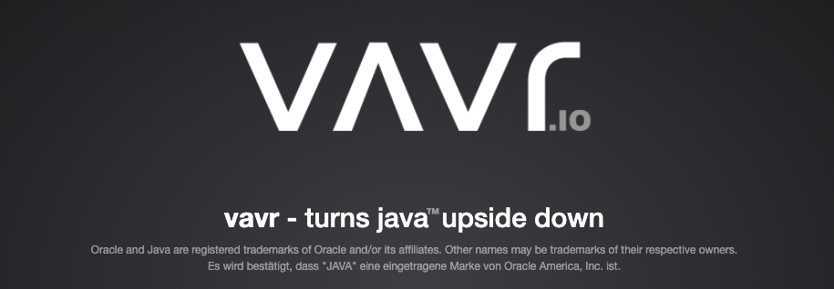
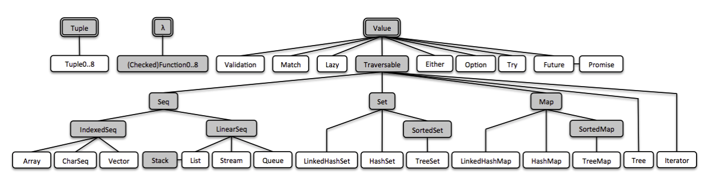
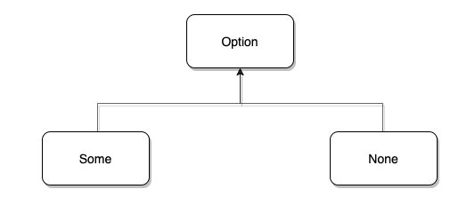
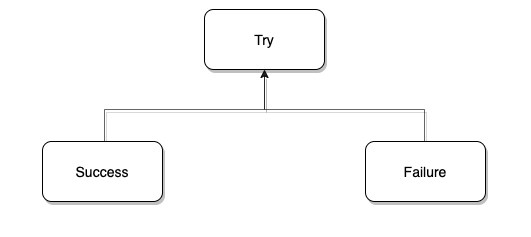

# VAVR：颠覆你的 Java 体验

## 何方神圣？

众所周知， Java8 在一定程度上支持了函数式编程，但标准库提供的函数式 API 不是很完备和友好。

为了更好的进行函数式编程，我们就不得不借助于第三方库，而 VAVR 就是这方面的佼佼者，它可以有效减少代码量并提高代码质量。

[VAVR](https://github.com/vavr-io/vavr) 可不是默默无闻之辈，它的前身是发布于 2014 年的 Javaslang，目前在 github 上有着近 4k 的 star。


看到这儿，很多人就说我标题党了，**一个 Java 库还来颠覆 Java**  ？

这可不不是我玩**震惊体**，打开 VAVR 的[官网](https://www.vavr.io/) ，它的首页就用加粗字体写着 「**vavr** - turns java**™** upside down」





这翻译过来不就是颠覆 Java 吗？


## 食用指南

阅读本文需要读者对 Java8 的 lambda 语法和常用 API 有一定的了解。

由于是一篇框架的介绍文（地推 ing），为了避免成为官方文档的翻译文，我会采取以下的一些原则

- 不会穷经所有特性和 API，仅做抛砖引玉
- 不会深入到源码细节

关于示例代码，基本会以单元测试的形式给出并保证运行通过

> 注：本文使用的 VAVR 版本为 0.10.3，JDK 版本为 11。


先来个概览



## 集合，全新的开始

不得不说 Java8 的集合库引入 Stream 以后确实很好用，但也正是因为需要使用了 Stream，不得不写很多样板代码，反而降低了不少体验。

```java
// of 方法是 Java9 开始提供的静态工厂
java.util.List.of(1, 2, 3, 4, 5)
                .stream()
                .filter(i -> i > 3)
  							.map(i -> i * 2)
                .collect(Collectors.toList());
```


再来看看 VAVR 的 List，更简洁，没有多余的 `stream` 和 `collect`。

```java
io.vavr.collection.List.of(1, 2, 3, 4, 5)
    .filter(i -> i > 3)
  	.map(i -> i * 2);
```


需要注意的是， VAVR 中的集合都是不可变的，创建完再执行修改操作都会返回一个新的集合

```java
var list = io.vavr.collection.List.of(1, 2)
var list2 = list
  .append(List.of(3, 4))
  .append(List.of(5, 6))
  .append(7);
// list = [1, 2]
// list2 = [1, 2, 3, 4, 5, 6]
```


VAVR 的集合库可以很方便的与 Java 标准集合库互转

```java
var javaList = java.util.List.of(1, 2, 3);
java.util.List<Integer> javaList2 = io.vavr.collection.List.ofAll(javaList)
    .filter(i -> i > 1)
    .map(i -> i * 2)
    .toJavaList();
```


再来看一个稍微复杂一点的例子，假设我现在有一批用户信息

- 只取年龄大于 18 岁的用户，并按年龄分组展示其姓名

  

```java
@Data
class User {
  private String name;
  private Integer age;
}
```

先来看看 Java 标准库的实现

```java
// users 的类型为 List<User>
users
  .stream()
  .filter(u -> u.getAge() >= 18)
  .collect(Collectors.groupingBy(User::getAge, Collectors.mapping(User::getName, Collectors.toList())));
```

再来看看 VAVR 的实现，是不是更简洁，更直观？

```java
users  
  .filter(u -> u.getAge() >= 18)
  .groupBy(User::getAge)
  .mapValues(usersGroup -> usersGroup.map(User::getName));
```

既然是集合库， 自然也少不了 Set、Queue、Map 等结构了，不过基本的 API 都差不多，就不再重复了。


## 元组，Java 缺失的结构

熟悉 Haskell、Scala 的同学肯定对「元组」这个数据结构不陌生，元组类似一个数组，不过可以存放不同类型的对象并维持其类型信息，这样在取值时就不用 cast 了。

```scala
// scala 的元组
val tup = (1, "ok", true)

// 按索引取值，执行对应类型的操作
val sum = tup._1 + 2
val world = "hello "+tup._2
val res = !tup._3
```

当然，Java 并没有原生的语法支持创建元组，不过 VAVR 利用泛型给我们实现了这一结构， 配合 Java10 的 var 语法简直不要太美好。

```java
import io.vavr.Tuple;

public TupleTest {
  
    @Test
    public void testTuple() {
        var oneTuple = Tuple.of("string");
        String oneTuple_1 = oneTuple._1;

        var twoTuple = Tuple.of("string", 1);
        String twoTuple_1 = twoTuple._1;
        Integer twoTuple_2 = twoTuple._2;

        var threeTuple = Tuple.of("string", 2, 1.2F, 2.4D, 'c');
        String threeTuple_1 = threeTuple._1;
        Integer threeTuple_2 = threeTuple._2;
        Float threeTuple_3 = threeTuple._3;
        Double threeTuple_4 = threeTuple._4;
        Character threeTuple_5 = threeTuple._5;
    }
}
```

看看不用 var 的情况下，元组的类型信息是怎么样的

```java
Tuple5<String, Integer, Float, Double, Character> tuple5 = Tuple.of("string", 2, 1.2F, 2.4D, 'c');
```

为了避免元组滥用，VAVR 的元组目前支持最多 8 个不同的类型。

再强调一下，元组使得我们可以组合不同类型的对象，尤其是在配合后面的「模式匹配」时，更是强大的一塌糊涂。

虽然现在提模式匹配有点早了，不过我们仍然可以提前感受一下

```java
var tup = Tuple.of("hello", 1);
Match(tup).of(
   Case($Tuple2($(is("hello")), $(is(1))), (t1, t2) -> run(() -> {})),
   Case($Tuple2($(), $()),(t1, t2) ->run(() -> {}))
);

// 等同于 if...else
if (tup._1.equalas("hello")  && tup._2 == 1) {
  // ... 
} else {
  // ...
}
```


## 除了 Option，还有 Try、Either、Future......


提到 Optional，Java 开发者们都很熟悉了，VAVR 也提供了类似的 Option，但除此之外，还有 Try、Either、Future 等函数式的结构，它们都是非常强大的工具。


### Option

`Option` 与 Java 标准库的 `Optional` 很相似，都代表着一个可选值，但是两者的设计却是大不相同的。（VAVR 的 Option 设计和 Scala 更接近）

在 VAVR 中，`Option` 是一个 interface，它的具体实现有 Some 和 None



- Some: 代表有值
- None: 代表没有值

你可以通过下面的单元测试进行验证

```java
@Test
public void testOption() {
    Assert.assertTrue(Option.of(null) instanceof Option.None);
    Assert.assertTrue(Option.of(1) instanceof Option.Some);
    Assert.assertTrue(Option.none() instanceof Option.Some);
    Assert.assertTrue(Option.some(1) instanceof Option.Some);
}

```


而 Java 的 Optional 则只有一个类型

```java
@Test
public void testOptional() {
    Assert.assertTrue(Optional.ofNullable(null) instanceof Optional);
    Assert.assertTrue(Optional.of(1) instanceof Optional);
    Assert.assertTrue(Optional.empty() instanceof Optional);
    Assert.assertTrue(Optional.ofNullable(1) instanceof Optional);
}
```


VAVR 为什么要这样设计呢？其实是为了避免**上下文切换**，这里的上下文指的就是 Option 这个值容器，那么切换又指的是什么呢？

先看一下下面的测试断言

```java
@Test
public void testContextSwitch() {
    // test java.util.Optional
    var javaOptionalResult = Optional.of("hello")
      .map(ok -> (String) null)
      .orElseGet(() -> "world");
    Assert.assertEquals("word", javaOptionalResult);

  	// test io.vavr.control.Option
    var vavrOptionResult = Option.of("hello")
      .map(ok -> (String) null)
      .getOrElse(() -> "world");
    Assert.assertNull(vavrOptionResult);
}
```

- javaOptionalResult = "world"
- vavrOptionResult = null

直接上结论：

​	因为在使用 `Optional.of("hello")` 的时候已经构造除了一个 Some 对象，即使调用了 `map(ok -> (String)null)` 也不会转为 None。 

 	如果 Some 变成了 None 就是上下文切换了，而 VAVR 是不允许这样的。

> 关于 Option 和 Optional 的内容我会再单独写一篇内容

除了设计上的区别，在使用上 io.vavr.control.Option 比 java.util.Optional 也要多出很多友好的 API

```java

@Test
public void testVavrOption() {
    List<String> result = Option.of("vavr hello world")
      .map(String::toUpperCase)
      .toJavaList();
    Assert.assertNotNull(result);
    Assert.assertEquals(1, result.size());
    Assert.assertEquals("vavr hello world", result.iterator().next());
  
    boolean exists = Option.of("ok").exists(str -> str.equals("ok"));
    Assert.assertTrue(exists);

    boolean contains = Option.of("ok").contains("ok");
    Assert.assertTrue(contains);
}

```


在兼容性方面，`io.vavr.control.Option` 可以很方便的转为 `java.util.Optional`

```java
Option.of("toJava").toJavaOptional();

Option.ofOptional(Optional.empty());
```


### Try

Try  和 Option 类似，也是一个「容器」，只不过它容纳的是可能出错的行为，你是不是想到了 try..catch ?

```java
try {
	//..
} catch (Throwable t) {
	//...
} finally {
  //....
}

```

现在先来热下身，用 VAVR 的 Try 来实现上面的结构了

```java
/**
* 输出
*	 failure: / by zero
*  finally
*/
Try.of(() -> 1 / 0)
    .andThen(r -> System.out.println("and then " + r))
    .onFailure(error -> System.out.println("failure" + error.getMessage()))
    .andFinally(() -> {
      System.out.println("finally");
    });
```

Try 也是个接口， 具体的实现是 Success  或 Failure

- Success：代表执行没有异常
- Failure：代表执行出现异常



可以通过单元测试验证一下

```java
@Test
public void testTryInstance() {
    var error = Try.of(() -> 0 / 0);
    Assert.assertTrue(error instanceof Try.Failure);

    var normal = Try.of(() -> 1 + 1);
    Assert.assertTrue(normal instanceof Try.Success);
}
```


了解了 Try 的大致结构以后，再来看看它的 API。

Try 可以通过  `recoverWith` 很优雅的提供异常情况下的降级

```java
@Test
public void testTryWithRecover() {
    Assert.assertEquals("NPE", testTryWithRecover(new NullPointerException()));
    Assert.assertEquals("IllegalState", testTryWithRecover(new IllegalStateException()));
    Assert.assertEquals("Unknown", testTryWithRecover(new RuntimeException()));
}

private String testTryWithRecover(Exception e) {
    return (String) Try.of(() -> {
      throw e;
    })
      .recoverWith(NullPointerException.class, Try.of(() -> "NPE"))
      .recoverWith(IllegalStateException.class, Try.of(() -> "IllegalState"))
      .recoverWith(RuntimeException.class, Try.of(() -> "Unknown"))
      .get();
}
```


还可以使用 map 对结果进行转换，并且与 Option 进行交互

```java
@Test
public void testTryMap() {
    String res = Try.of(() -> "hello world")
      .map(String::toUpperCase)
      .toOption()
      .getOrElse(() -> "default");
    Assert.assertEquals("HELLO WORLD", res);
}
```


### Future

这个 Future 可不是 `java.util.concurrent.Future`，但却都是对异步计算结果的一个抽象。

vavr 的 `Future` 提供了比 `java.util.concurrent.Future` 更友好的回调机制

- onFailure 失败的回调
- onSuccess 成功的回调

```java
@Test
public void testFutureFailure() {
    final var word = "hello world";
    io.vavr.concurrent.Future
      .of(Executors.newFixedThreadPool(1), () -> word)
      .onFailure(throwable -> Assert.fail("不应该走到 failure 分支"))
      .onSuccess(result -> Assert.assertEquals(word, result));
}

@Test
public void testFutureSuccess() {
    io.vavr.concurrent.Future
      .of(Executors.newFixedThreadPool(1), () -> {
          throw new RuntimeException();
      })
      .onFailure(throwable -> Assert.assertTrue(throwable instanceof RuntimeException))
      .onSuccess(result -> Assert.fail("不应该走到 success 分支"));
}
```


它也可以和 Java 的 CompleableFuture 互转

```java
Future.of(Executors.newFixedThreadPool(1), () -> "toJava").toCompletableFuture();

Future.fromCompletableFuture(CompletableFuture.runAsync(() -> {}));
```

### 其他

- Either 它表示某个值可能为两种类型中的一种，下面的 `compute()` 函数的 Either 返回值代表结构可能为 Exception 或 String。

  通常用 right 代表正确的值，一语双关（英文 right 有正确的意思）

  

  ```java
  public Either<Exception, String> compute() {
    //...
  }
  
  public void test() {
  	Either<Exception, String> either = compute();
    if (either.isLeft()) {
      Exception exception = compute().getLeft();
      throw new RuntimeException(exception);
    }
  
    if (either.isRight()) {
      String result = compute().get();
      // ...
    }
  }
  ```

  

- Lazy 也是一个容器，他可以延迟某个计算，知道该计算被首次调用，初次调用之后该结果会被缓存

  

  ```java
  Lazy<Double> lazy = Lazy.of(Math::random);
  lazy.isEvaluated(); // = false
  lazy.get();         // = 0.123 (random generated)
  lazy.isEvaluated(); // = true
  lazy.get();         // = 0.123 (memoized)
  ```

  

在 `io.vavr.API` 中提供了很多静态方法来模拟 Scala 的语法构造 Option、Try 这些结构，但是要结合 Java 的静态导入使用

```java
import static io.vavr.API.*;
```


这样我们就可以在代码中模拟 Scala 的语法构造了

```java
// 构造 Option
var some = Some(1);
var none = None();
  
// 构造 Future
var future = Future(() -> "ok");

// 构造 Try
var tryInit = Try(() -> "ok");
```


当然这个大写字母开头的函数名有点不符合 Java 的方法命名规范，不过对于 Scala 用户来说却是更加亲切一些。

关于更多细节的内容，有兴趣的可以去查阅[官网文档](https://www.vavr.io/vavr-docs/#_values)学习


## 模式匹配：if..else 的克星

这里的模式指的是**数据结构的组成模式**，先来看看 Scala 中的模式匹配是怎么样的吧

```scala
def testPatternMatch(nameOpt: Option[String],
                     nums: List[Int]) = {
	/**
	* 匹配 Option 的结构
	*/
  nameOpt match {
    case Some(name) => println(s"你好，$name")
    case None => println("无名之辈")
  }

  /**
  * 匹配 List 的结构
  */
  nums match {
    case Nil => println("空列表")
    case List(v) => println(s"size=1 $v")
    case List(v, v2) => println(s"size=2 $v、 $v2")
    case _ => println("size > 2")
  }
}
```

与 Scala 不一样，Java 目前还没有原生的语法支持模式匹配这样的特性，不过 VAVR 却用 OOP 的方式实现了了模式匹配，非常接近于 Scala 的体验。

> Java 在 [JEP 375: Pattern Matching for instanceof](https://openjdk.java.net/jeps/375) 提案中针对 instanceof 实现了一个模式匹配的特性（预计在 Java15 发布），不过我觉得该特性距离 Scala 的模式匹配还有一段距离


我们来实现一个将 BMI 值格式化成文字描述的需求，先用 Java 的命令式风格来实现

```java
public String bmiFormat(double height, double weight) {
  double bmi = weight / (height * height);
  String desc;
  if (bmi < 18.5) {
    desc = "有些许晃荡！";
  } else if (bmi < 25) {
    desc = "继续加油哦！";
  } else if (bmi < 30) {
    desc = "你是真的稳！";
  } else {
    desc = "难受！";
  }
  return desc;
}
```


接下来再用 VAVR 的模式匹配来重构吧，消灭这些 if..else。

为了让语法更加贴近于原生的体验，得先通过 `static import` 导入 API。

```java
import static io.vavr.API.*;
```

下面是重构后的代码段

```java
public String bmiFormat(double height, double weight) {
  double bmi = weight / (height * height);
  return Match(bmi).of(
    // else if (bmi < 18.5)
    Case($(v -> v < 18.5), () -> "有些许晃荡！"),
    // else if (bmi < 25)
    Case($(v -> v < 25), () -> "继续加油哦！"),
    // else if (bmi < 30)
    Case($(v -> v < 30), () -> "你是真的稳！"),
    // else
    Case($(), () -> "难受！")
  );

}
```

- Match(...)，Case(...)，$(...) 都是 `io.vavr.API` 的静态方法，用于模拟「模式匹配」的语法

- 最后一个 $() 表示匹配除了上面之外的所有情况

  

为了便于读者理解，我将各个方法的签名简单列了一下（Case 和 $ 方法有很多重载，就不全列了）

```java
public static <T> Match<T> Match(T value) {...}

public static <T, R> Case<T, R> Case(Pattern0<T> pattern, Function<? super T, ? extends R> f) {...}

public static <T> Pattern0<T> $(Predicate<? super T> predicate) {...}
```

`of` 是 Match 对象的方法

```java
public final <R> R of(Case<? extends T, ? extends R>... cases) {...}
```

来，再展示一下自创的语法记忆

```java
匹配一下（这个东西）的结构，是不是下面的情况之一
// Match(XXX).Of(

  - 结构和 A 一样，做点什么事情
  //Case(  $(A),   () -> doSomethingA()   ),
  
  - 结构和 B 一样，做点什么事情
  //Case(  $(B),   () -> doSomethingB()   ),
  - .....
  
  - 和上面的结构都不一样，也做点事情
  //Case(  $(),    () -> doSomethingOthers())
  //);
```

当模式匹配和前面提到的 Option、Try、Either、Tuple 结合时，那可是 1 + 1 > 3 的结合。

下面的代码展示了「模式匹配」是如何让 Option 如虎添翼的

```java
import static io.vavr.API.*;
import static io.vavr.Patterns.$None;
import static io.vavr.Patterns.$Some;

public class PatternMatchTest {
  
    @Test
    public void testMatchNone() {
      // 匹配 None
        var noneOpt = Option.none();
        Match(noneOpt).of(
                Case($None(), r -> {
                    Assert.assertEquals(Option.none(), r);
                    return true;
                }),
                Case($(), this::failed)
        );
    }

    @Test
    public void testMatchValue() {
      // 匹配某一个值为 Nice 的 Some
        var opt2 = Option.of("Nice");
        Match(opt2).of(
                Case($Some($("Nice")), r -> {
                    Assert.assertEquals("Nice", r);
                    return true;
                }),
                Case($(), this::failed)
        );
    }

    @Test
    public void testMatchAnySome() {
      // 匹配 Some，值任意
        var opt = Option.of("hello world");
        Match(opt).of(
                Case($None(), this::failed),
                Case($Some($()), r -> {
                    Assert.assertEquals("hello world", r);
                    return true;
                })
        );
    }

    private boolean failed() {
        Assert.fail("不应该执行该分支");
        return false;
    }
}    
```


还有 Try，顺便说一句，有时候 Case 没有返回值的时候， 第二个参数可以用 API.run() 替代

```java
import static io.vavr.API.*;
import static io.vavr.Patterns.*;
import static io.vavr.Predicates.instanceOf;

public class PatternMatchTest {

    @Test
    public void testMatchFailure() {
        var res = Try.of(() -> {
            throw new RuntimeException();
        });
        Match(res).of(
          // 匹配成功情况
                Case($Success($()), r -> run(Assert::fail)),
          // 匹配异常为 RuntimeException
                Case($Failure($(instanceOf(RuntimeException.class))), r -> true),
          // 匹配异常为 IllegalStateException
                Case($Failure($(instanceOf(IllegalStateException.class))), r -> run(Assert::fail)),
          // 匹配异常为 NullPointerException
                Case($Failure($(instanceOf(NullPointerException.class))), r -> run(Assert::fail)),
          // 匹配其余失败的情况
                Case($Failure($()), r -> run(Assert::fail))
        );
    }

    @Test
    public void testMatchSuccess() {
        var res = Try.of(() -> "Nice");
        Match(res).of(
          // 匹配任意成功的情况
                Case($Success($()), r -> run(() -> Assert.assertEquals("Nice", r))),
          // 匹配任意失败的情况
                Case($Failure($()), r -> run(Assert::fail))
        );
    }
}
```


现在再回头看看元组的代码，你可以尝试一下自己写写 三元组的模式匹配了。


## 其他

本文只介绍了一些常用的特性，而除此之外，VAVR 还支持 Curring、Memoization、 Partial application 等高级特性，如果想深入的学习可以前往官网了解。

最后，这块砖已经抛出去了，能不能引到你这块玉呢？


> **广告**：
>
> 如果你正在找基于 Java9+ 的项目用于学习新特性，我自荐一下 [PrettyZoo](https://github.com/vran-dev/PrettyZoo)，
>
> 这是一款基于 Java11开发的 zookeeper 桌面客户端，使用了模块化，var 等诸多新特性，欢迎 star、fork、issue。