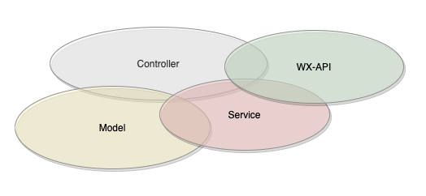
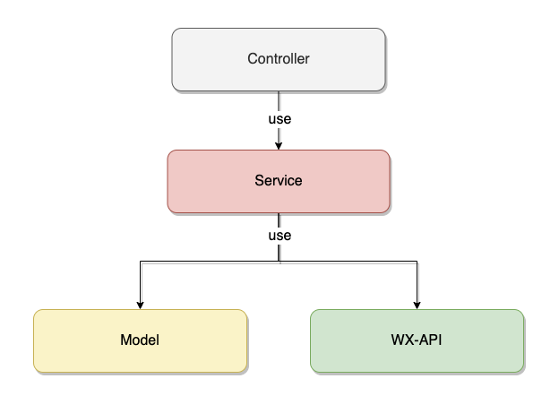
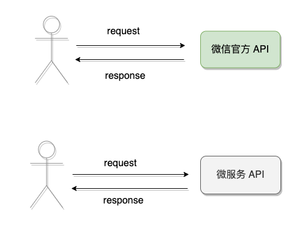
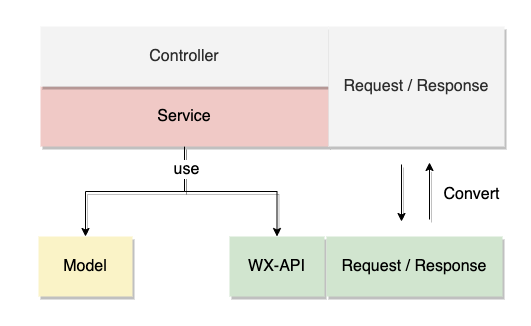
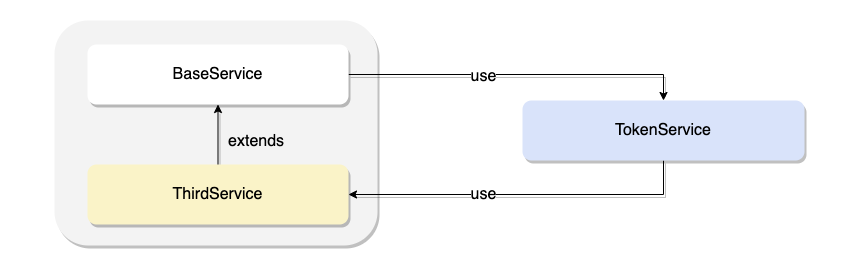
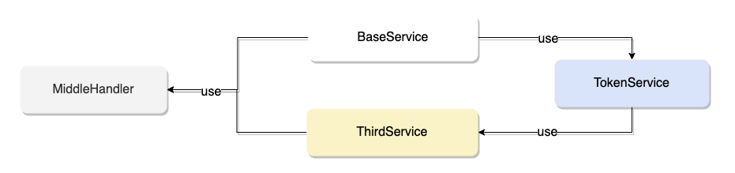

# 一次微服务的技术重构总结

## 为什么要重构

前段时间接手了一个新的服务，该服务的主要职责是封装「微信公众号」相关的 API ，然后提供整合后的能力给其他业务使用，算是一个很基础的服务。

该服务诞生已有些年头，陆陆续续的功能叠加使得该服务的设计已经背离了初衷，就像下图一样，虽然在努力奔跑着，但早已不堪重负......


那么是时候重构了，引用一下《重构：改善既有代码的设计》中对重构做的事情的描述

> 重构很像是在整理代码，你所做的就是让所有东西回到应处的位置上。
>
> 代码结构的流失是累积性的。越难看出代码所代表的设计意图，就越难保护其中设计，于是该设计就腐败得越快。


## 再划分层

该服务采用的是传统分层架构，分 3 层 共 4 个组件

- Controller：提供 restful API
- Service：业务核心逻辑
- Model：负责与 DB 交互
- WX-API: 代理微信的 API 调用

然而在软件的演化中，几个组件的边界却渐渐变得模糊，有融合的趋势




为了指导后续的重构，第一步就是重新划分分层（其实就是还原最开始的设计），当然这里的分层指的是技术分层。

下图就是理想中的分层设计



组件依赖方向是自上而下对的单向依赖，为什么会将第三方服务 `WX-API ` 放在底层呢？

这很好理解，应为要重构的服务就是基于微信提供的能力构建的。


## 组件模型独立

**共享模型对象**是造成各个组件耦合的原因之一，那么什么是共享模型对象呢？

`WX-API` 与微信官方 API 交互时有一套模型对象，`Controller` 与其他服务交互时也有一套模型对象，如果这两套模型对象实则是复用的同一套，那么这就是共享模型对象。



这里看似复用，实则违背了单一职责，因为从变化的根本原因来说，两者是截然不同的

- `WX-API` 的变更原因主要和微信官方 API 的升级有关
- `Controller`  的变更原因主要和其他服务或业务的需求相关

这就会导致共享的对象模型会因为不同的原因而产生变化，而这样的变化可能对某个组件产生破坏性的影响，抑或是使得两个组件的耦合性越来越强。

所以就必须得将组件的模型独立出来，不同的模型需要进行转换（Convert)




可以看出 `Controller` 和 `Service` 仍然共享了一套模型，这是一种权衡下的抉择，因为过于独立的模型会提高维护的成本。


## 代码坏味道

代码坏味道指的是任何可能导致深层次问题的代码，这也是重构需要解决的问题。

### 循环依赖

正常情况下，分层架构并没有限制同层内的依赖关系，但在严格分层模式下，同层内的依赖是被禁止的，这样可以有效的避免循环依赖。

而在该服务中，在 `Service` 组件内部由于继承的设计而隐式的带来了不少循环依赖，



解决循环依赖的思路很简单，只需要在循环依赖链路中取消一条依赖关系即可。

而具体的方案就有很多种了，这里提一下我的解决方案：加一层中间类，采用组合替代继承。

如下图所示，抽取 BaseService 和 ThirdService 共同依赖的行为到 MiddleHandler，然后两者共同依赖 MiddleHandler，再观察整个依赖图，没有循环链路了。



### 方法语义不清晰

在 `WX-API` 组件中，很多与微信官方接口交互的类中有着如下的方法定义

```java
@POST(WxServiceConfig.URL_SEND)
Call<ApiResult> sendMessage(@Query("access_token") String token,
                            @Body JSONObject object);

@POST(WxServiceConfig.URL_SEND_TEMPLATE)
Call<ApiResult> sendTemplateMessage(@Query("access_token") String token,
                                    @Body JSONObject object);
```

方法的参数直接使用了 fastJson 提供的 JSONObject 类，这有什么问题呢？

JSONObject 是对 JSON 值的抽象，用作业务参数会使得该方法缺乏描述性，换句话说就是它承载的信息量不够具体，随着时间的流逝，这个问题会越发的明显。

另外一个问题就是前面提到的单一职责了，JSONObject 的变更原因很显然与该方法的变更原因是不一致的。

所以非常有必要针对参数建模，而不要用过于抽象的类型替代

```java
@POST(WxServiceConfig.URL_SEND)
Call<ApiResponse> sendMessage(@Query("access_token") String token,
                              @Body VoiceMessage message);

@POST(WxServiceConfig.URL_SEND)
Call<ApiResponse> sendMessage(@Query("access_token") String token,
                              @Body ImageMessage message);

@POST(WxServiceConfig.URL_SEND)
Call<ApiResponse> sendMessage(@Query("access_token") String token,
                              @Body ArticleMessage message);

@POST(WxServiceConfig.URL_SEND_TEMPLATE)
Call<ApiResponse> sendTemplateMessage(@Query("access_token") String token,
                                      @Body TemplateMessageRequest request);
```


## 总结

Martin 在 《架构整洁之道》中提到软件的两个价值：行为价值和架构价值。

- 行为价值：指的就是正常运行并提供功能
- 架构价值：指的是软件的灵活性

而这次重构对于该服务的行为价值来说，几乎没有改变，而架构价值却有了质的提升。

好像也谈不上提升，只是回到了该有的样子


