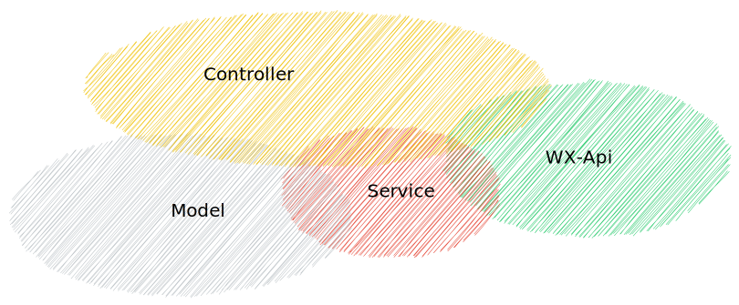
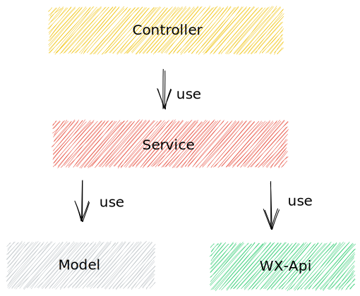
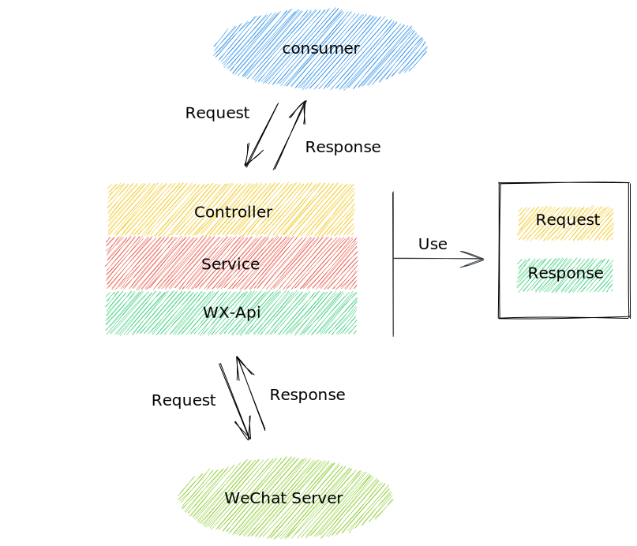
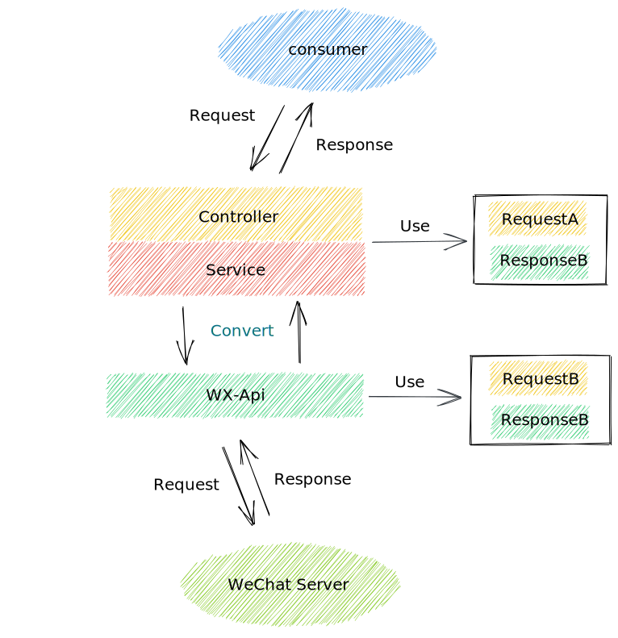
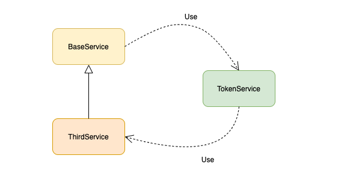

# 一次微服务重构总结 

## 背景

微信服务是我司内部的一个微服务，主要是接入并封装微信官方的一些能力供业务使用。

该服务诞生于 2016 年，至今已经有些年头了，而为了符合公司新的项目结构，需要对其项目结构进行一定的改造。

然而当对该服务进行一个简单的了解以后，我感觉它已经有点 ”腐朽“ 了 ，是时候进行重构了......

PS：虽然你看它不顺眼，但是它就是能运行


> 重构很像是在整理代码，你所做的就是让所有东西回到应处的位置上。
>
> 代码结构的流失是累积性的。越难看出代码所代表的设计意图，就越难保护其中设计，于是该设计就腐败得越快。
>
> 《重构》


## 分层结构的流失

该服务采用的是传统的分层架构，但实际结构已经演化成如下图这样了




几乎看不出组件之间的层次了，各个组件之间两两相交，这是一个典型的累积型代码结构流失。

而为了解决这样的情况，首先就得明确组件各自的关注点（职责）

- **controller** 负责提供 REST API
- **service** 负责核心业务逻辑
- **model** 提供与 DB 交互的能力
- **wx-api** 提供于微信官方服务交互的能力

  然后就是明确依赖规则

- 依赖方向只允许单向流动
- 禁止跨层依赖
- model 和 wx-api 放到同一层，但是禁止相互依赖

最终，就可以得到一个新的分层结构



组件之间的职责和依赖关系确定好了，但是在该服务中还有一个问题：**从 Controller 到 WX-Api 的流转中，共用了一部分模型对象**。

而这就又引发了下面的问题 -- 不恰当的模型共用

## 不恰当的模型共用

在该服务中，有一套模型对象，它既是 WX-Api 组件用于和微信官方进行交互的对象，又是服务暴露给业务方（消费者）的对象，参见下图




当设计人员认为该服务的某个接口就是简单的转发给微信时，就极有可能出现这样的对象共享。

这样做的好处很明显

- 减少类型定义和转换，节省研发时间

但坏处也同样明显，违反了**单一职责**

> 单一职责：一个类应该只有一个发生变化的原因

从变更原因来看， WX-Api 和 Controller / Service 是截然不同的

- WX-Api 的变更原因主要和微信官方 API 的升级有关
- Controller / Service 的变更原因主要和公司业务相关

而这就会出现这样的场景：Controller 因为业务发展需要对模型进行增改字段，但是因为和 WX-Api 组件共享了对象模型， Controller 组件就不得不考虑变更对 WX-Api 的影响了，业务发展就变得捉襟见肘。

所以，不同组件之间的模型对象也应该对立开来，同时考虑到重构成本，并不打算为每个组件都独立模型，最终方案如下

- WX-Api  使用独立的模型
- Controller / Service 使用同一套模型，但独立于 WX-Api

这样的话，WX-Api 与 Service 之间的交互就多了模型转换（Convert）这一个过程，交互图大概就变成了下面这样



而且模型对象独立以后，层与层之间的边界也更清晰了。

解决了组件之间的分层与交互，接下来我们再来看一个组件内的循环依赖重构。


## 隐式的循环依赖

一般的分层架构并没有限制同层内的依赖关系，但是严格分层模式是禁止同层依赖的，因为这可以避免循环依赖。

什么是循环依赖就不再解释了，这在代码中是一个非常典型的坏味道。

而在该服务中，Service 组件内由于继承关系而隐式的带来了不少的循环依赖，先来看看原先的设计

- BaseService 是一个抽象类，封装了处理微信官方接口响应异常的一些方法
- TokenService 是主要封装了微信官方认证功能的类
- ThirdService  主要封装了微信第三方平台的业务能力

再来看看它们之间的关系

- ThirdService 继承了 BaseService,  而 BaseService 依赖了 TokenService
- TokenService 依赖了 ThirdService

参见下图



oh ！No ！明显的循环依赖，为什么要这样设计？

因为在 BaseService 中有这样一段代码，这是造成循环依赖的罪魁祸首

```java
/**
* 该方法主要是判断调用微信接口时响应的 code 是否在 TOKEN_ERROR_CODES 中
* 如果是的话就重新刷新 token
* （TOKEN_ERROR_CODES 是一个 List<Integer>）
*/
public <T> T  handleResult(ApiResponse response) {
    if (TOKEN_ERROR_CODES.contains(response.getCode())) {
  		tokenServices.refreshToken(appId);
  		throw new DomainException();
	}
    // .... ignore
}

```

如何在满足前面定义的分层依赖原则的同时，又避免循环依赖，还要不破坏其业务功能呢？（这是一个基于 SpringBoot 的 Java 项目）

从业务实际情况出发，让 TokenService 不去依赖 ThirdService 是有一定的改动成本的，那么就只有让 BaseService 不去依赖 TokenService 了。


而 BaseService 依赖 TokenService 只是为了在异常情况下重新刷新 token，那么我们可以借助 Spring 的 Advice 来重构它。

首先定义一个新的异常

```java
@Data
@NoArgsConstructor
@AllArgsConstructor
public class WeChatTokenInvalidException {
  
  private WeixinAppId auth;
  // ...
}
```

再将 BaseService 对 TokenService 的依赖去除，以前调用 `tokenService.refreshToken()` 的地方直接抛出新定义的异常

```java
public <T> T  handleResult(ApiResponse response) {
    if (TOKEN_ERROR_CODES.contains(response.getCode())) {
  		throw new WeChatTokenInvalidException(response.getAppId())
	}
    // .... ignore
}
```

再在 Controller 组件中定义 Advice 来处理 `WeChatTokenInvalidException`，Controller 组件是允许依赖 Service 组件的。

```java
@ControllerAdvice
public class ApiExceptionHandler {
  
  	@Autowired
  	private TokenService tokenService;
  
  
    @ExceptionHandler(Throwable.class)
    @ResponseBody
    public JsonResult handleAllException(HttpServletRequest request,
                                         HttpServletResponse response,
                                         Throwable error) {
        if (error instanceof WeChatTokenErrorException) {
            tokenServices.refreshToken(exception.getWeixinAppId());
        	return JsonResult.error();
        }

        // 忽略其他代码
    }
}
```

嗯，这样就解决了循环依赖的问题，还遵循了组件的之间的依赖原则。


## 偷懒的方法签名

以下是我摘自服务中的一段方法定义，你觉得有什么问题吗？

- sendMessage 是接入的微信客服消息发送接口
- sendTemplate 是接入的微信模板消息发送接口

```java
@POST(WxServiceConfig.URL_SEND)
Call<ApiResult> sendMessage(@Query("access_token") String token,
                            @Body JSONObject object);
                                
@POST(WxServiceConfig.URL_SEND_TEMPLATE)
Call<ApiResult> sendTemplateMessage(@Query("access_token") String token,
                                    @Body JSONObject object);

```

两个方法的参数都用到了一个 JSONObject 对象，在这里，它绝对不是一个合适的参数类型

- 抽象程度太高，不合适的抽象等于没有抽象，JSONObject 仅仅比 Object 好一点点
- 方法定义缺乏自我描述性，尤其是随着人员和时间的流逝，它所蕴含的知识也跟着流逝了。

所以方法参数需要重新定义和抽象，其实这个并不难

```java
@POST(WxServiceConfig.URL_SEND)
Call<ApiResponse> sendMessage(@Query("access_token") String token, @Body VoiceMessage message);

@POST(WxServiceConfig.URL_SEND)
Call<ApiResponse> sendMessage(@Query("access_token") String token, @Body ImageMessage message);

@POST(WxServiceConfig.URL_SEND)
Call<ApiResponse> sendMessage(@Query("access_token") String token, @Body ArticleMessage message);

@POST(WxServiceConfig.URL_SEND_TEMPLATE)
Call<ApiResponse> sendTemplateMessage(@Query("access_token") String token,
                                      @Body TemplateMessageRequest request);
```


## 总结

重构前和重构后，该服务的**行为价值**并没有显著的改变，都能正常运行并提供相同的功能。

但是该项目的**架构价值**却有了质的提升，让渐渐流失的设计重新得以维持。


当然，这离我想象中的设计还有一定的距离，所以重构没有完成时，始终都是进行时。

