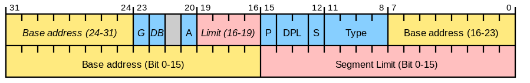

# 操作系统之保护模式简谈
## 前言

如果你想学习或者自己尝试写一个操作系统**内核**，[保护模式](https://zh.wikipedia.org/wiki/%E4%BF%9D%E8%AD%B7%E6%A8%A1%E5%BC%8F)是你绕不开的一个话题。

这篇文章的主要目的是让你了解保护模式个东西，以及它的作用。

> 不会涉及到如何进入保护模式，以及保护模式的一些细节我也会有意略过， 

希望你在读这篇文章的时候，能了解计算机的组成， 对CPU的寄存器体系有一定的了解。

## 历史

**保护模式**是CPU的一种运行模式，出现在[80286](https://zh.wikipedia.org/wiki/80286)及之后的X86架构的CPU下。

> 这里说的**CPU运行模式**主要体现在**CPU**在内存寻址的区别。

在[80286](https://zh.wikipedia.org/wiki/80286)之前只有一种运行模式， 由于**保护模式**和这种模式有非常大的区别， 为了便于区分，便将以前的运行模式称之为**实模式**， CPU默认是工作在**实模式**下的。

### 实模式

最开始的**8086**最大寻址空间为`1MB`(即2^20), 但是**8086**的内部寄存器只有16位，那么如何能够做到`1MB`的内存寻址呢？Intel采用了以下的方式

> 内存地址 = 16位段寄存器 << 4 + 16位通用寄存器保存的地址偏移

这样也会出现一个问题：即最终计算的内存地址会大于2^20 , 此时回产生内存回卷

> 回卷就是把溢出的最高位1和低16位做加法运算。例如：原本是（1）0100101011000001，回卷就是0100101011000001+1=0100101011000010

这个就是CPU默认的运行模式--实模式的最大特点了。

### 保护模式

[80286](https://zh.wikipedia.org/wiki/80286)之后出现的保护模式，不仅仅改变了内存的寻址方式，还增加了[存储器保护](https://zh.wikipedia.org/wiki/%E8%A8%98%E6%86%B6%E9%AB%94%E4%BF%9D%E8%AD%B7)，[标签页](https://zh.wikipedia.org/wiki/%E5%88%86%E9%A0%81)系统以及硬件支持的[虚拟内存](https://zh.wikipedia.org/wiki/%E8%99%9A%E6%8B%9F%E5%86%85%E5%AD%98)等特性。

 为了兼容， 该模式默认是关闭的， 要由程序（通常是系统内核）主动切换。

为什么要有保护模式呢？因为[80286](https://zh.wikipedia.org/wiki/80286)的内存寻址空间达到`16MB`， 而[80386](https://zh.wikipedia.org/wiki/Intel_80386)更是达到了`4GB`, 实模式没法满足寻址的要求了。

下面我们就来讲一下**保护模式**是如何实现以上特性的。

在我们切换到**保护模式**之前我们要准备一个数据结构**[全局描述符表](https://zh.wikipedia.org/wiki/%E5%85%A8%E5%B1%80%E6%8F%8F%E8%BF%B0%E7%AC%A6%E8%A1%A8)**， 它的本质是一个数组， 数组中的每一个元素称为**全局描述符**， 这是一个64位的数据结构。

> 数据结构看着有点怪是不是？这其实是历史原因

**全局描述符**包含可访问的内存的基址， 最大长度， 以及其他的一些权限位。

这个全局描述符的地址被放在了一个称之为` GDTR`的寄存器中

现在的段寄存器存储的就是**全局描述符表的**索引， 我们一般称之为**段选择子**

> 实际上段选择子的高13位存储的是索引， 低3位用来存储和权限相关的bit, 可以参考下图

这样的话我们的寻址方式就变成了以下流程了

1. 从GDTR取得全局描述符表的地址
2. 从段选择子取得索引 **idx**， 然后用 `idx * 64 + 全局描述符的地址` 得到 一个全局描述符的地址（前面我们讲过一个描述符是64bit的数据结构）
3. 从全局描述符我们可以拿到内存的`BaseAddress`, 用`BaseAddress + 16位通用寄存器的偏移` 就可以得到最终的物理内存地址 

注意， 我有意跳过了相关的权限检查的流程， 参考下图(目前得到的线性地址-Linear address 就是物理内存地址)

## 总结

**保护模式**不仅仅是寻址的改变， 其实它还有一个核心就是**保护**， 这里的保护值得就是权限的校验等等。

还有一点就是保护模式是实现**页式内存管理**的基础， 而**内存分页**又是**虚拟内存的**基础， 所以**保护模式**在操作系统层次还是有举足轻重的地位的。
